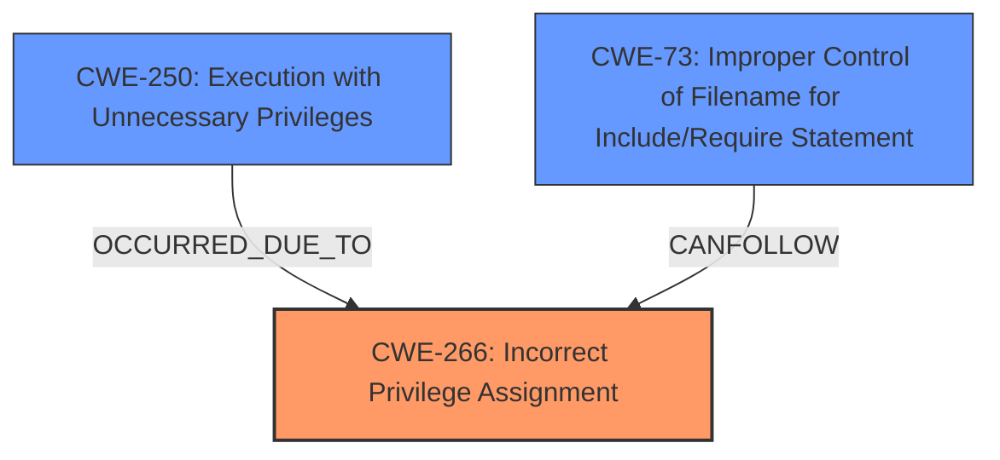

# Final Resolution for CVE-2021-1572

# Summary
| CWE ID | CWE Name | Confidence | CWE Abstraction Level | CWE Vulnerability Mapping Label | CWE-Vulnerability Mapping Notes |
|---|---|---|---|---|---|
| CWE-266 | Incorrect Privilege Assignment | 0.9 | Base | Allowed | Primary CWE |
| CWE-250 | Execution with Unnecessary Privileges | 0.7 | Base | Allowed | Secondary CWE |
| CWE-73 | Improper Control of Filename for Include/Require Statement in PHP Program ('PHP Remote File Inclusion') | 0.6 | Base | Allowed | Secondary CWE |

## Evidence and Confidence

*   **Confidence Score:** 0.8
*   **Evidence Strength:** MEDIUM

## Relationship Analysis
The primary **weakness** is CWE-266, which directly leads to CWE-250 because the incorrect privilege assignment causes the SFTP service to run with unnecessary privileges. The potential for file operations via SFTP to be influenced by user input (e.g., filenames) could lead to CWE-73 if the application isn't properly handling those inputs.

## Vulnerability Chain
The vulnerability chain starts with the **ROOTCAUSE** of **incorrect privilege assignment** (CWE-266). This leads to the SFTP service running with unnecessary privileges (CWE-250), amplifying the impact. If filenames or paths from user input are not correctly handled, this creates a possibility of file manipulation and path traversal issues (CWE-73). Without the **incorrect privilege assignment**, the impact would be far less.

## Summary of Analysis
The initial analysis correctly identifies CWE-266 as the primary **weakness**. The criticism correctly points out that CWE-78 is weakly justified. Based on the criticism, and considering other potential CWEs, I am replacing CWE-78 with CWE-73. Here's the reasoning:

*   **CWE-266 (Incorrect Privilege Assignment):** This remains the primary **ROOTCAUSE**, with high confidence (0.9). The vulnerability description states, "The vulnerability exists because the affected software incorrectly runs the SFTP user service at the privilege level of the account that was running when the ConfD built-in Secure Shell (SSH) server for CLI was enabled."
*   **CWE-250 (Execution with Unnecessary Privileges):** This is a valid secondary **weakness** (confidence 0.7) as the SFTP service is running with elevated privileges because of the **incorrect privilege assignment**.
*   **CWE-73 (Improper Control of Filename for Include/Require Statement):** The criticism of CWE-78 is valid. There's no solid evidence of command injection. However, the attacker is "issuing a series of commands at the SFTP interface," which often involves filenames. If these filenames are not properly validated and are used in file system operations (even basic ones like reading or writing files), it could lead to issues described by CWE-73. It is a more likely scenario than CWE-78.

The evidence "issuing a series of commands at the SFTP interface" suggests filenames are involved, and thus CWE-73 can occur. This is not a strong justification, hence, confidence of 0.6.

CWE-20 was considered, but it is too broad. CWE-73 is a more specific child of CWE-20 and thus more appropriate. CWE-22 (Path Traversal) could also be considered as a child of CWE-73, but there isn't enough information to say that the path is not properly restricted, so CWE-73 is more appropriate.