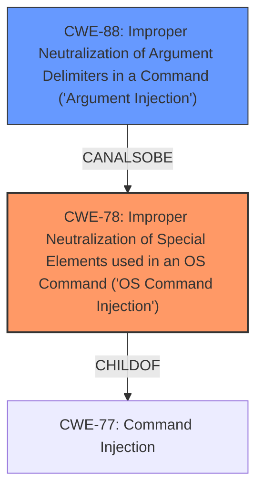

# Final Resolution for CVE-2021-1581

# Summary
| CWE ID | CWE Name | Confidence | CWE Abstraction Level | CWE Vulnerability Mapping Label | CWE-Vulnerability Mapping Notes |
|---|---|---|---|---|---|
| CWE-78 | Improper Neutralization of Special Elements used in an OS Command ('OS Command Injection') | 0.95 | Base | Primary | Allowed |
| CWE-88 | Improper Neutralization of Argument Delimiters in a Command ('Argument Injection') | 0.65 | Base | Secondary Candidate | Allowed |

## Evidence and Confidence

*   **Confidence Score:** 0.90
*   **Evidence Strength:** MEDIUM

## Relationship Analysis
The primary relationship that impacted the decision was the parent-child relationship between CWE-77 (Command Injection) and CWE-78 (Improper Neutralization of Special Elements used in an OS Command). CWE-78 is a specific type of command injection and thus a more precise classification than CWE-77.

CWE-88 (Improper Neutralization of Argument Delimiters in a Command) was considered as a secondary CWE. It is a peer of CWE-78 (CanAlsoBe). It represents a specific way **command injection** can occur, making it a good secondary candidate.

The abstraction levels influenced the selection by preferring base-level CWEs (CWE-78 and CWE-88) over class-level CWEs (like the initially proposed CWE-20), aligning with the goal of achieving optimal specificity.

## Vulnerability Chain
The vulnerability chain starts with the lack of proper input neutralization.
- The **ROOTCAUSE** is the failure to properly neutralize special elements in user-supplied input.
- A **WEAKNESS**, CWE-78, arises when this un-neutralized input is used to construct an OS command.
- A second **WEAKNESS**, CWE-88, might also arise if argument delimiters are not properly handled when constructing the OS command.
- The final impact is the execution of unintended OS commands, leading to potential system compromise.

## Summary of Analysis
The initial analysis correctly identified CWE-78 as the primary weakness due to the explicit mention of "**command injection**" in the vulnerability description. The criticism highlighted the weakness of including CWE-20 due to its high-level nature and the lack of a direct link in the description. It also correctly identified that CWE-425 was not directly related.

The final decision reflects the criticism by removing CWE-425 and replacing CWE-20 with CWE-88. This change is based on the possibility that the **command injection** occurs due to improper handling of argument delimiters, which aligns with the concept of injecting additional arguments into the command being executed.

The selected CWEs are at the optimal level of specificity because they directly address the core issue of **command injection** (CWE-78) and a potential mechanism (CWE-88), while avoiding overly broad classifications. The decision is justified by the vulnerability description, the relationship analysis, and the mapping guidance. Specifically, CWE-78 is chosen because the vulnerability description explicitly states "command injection". CWE-88 is added as a secondary weakness because it could be an exploitation vector for command injection by injecting unintended arguments.