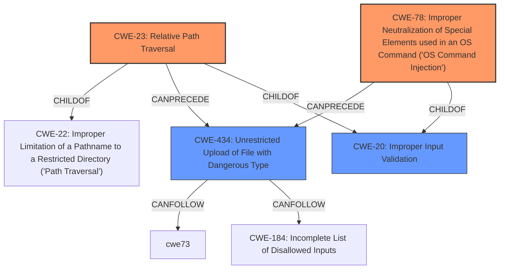

# Analysis Report for CVE-2021-1617

# Vulnerability Analysis Report: CVE-2021-1617

## Description

Multiple vulnerabilities in the web-based management interface of Cisco Intersight Virtual Appliance could allow an authenticated, remote attacker to conduct a path traversal or command injection attack on an affected system. These vulnerabilities are due to insufficient input validation. An attacker could exploit these vulnerabilities by using the web-based management interface to do one or both of the following Execute a command using crafted input Upload a file that has been altered using path traversal techniques A successful exploit could allow the attacker to read and write arbitrary files or execute arbitrary commands as root on an affected system. For more information about these vulnerabilities, see the Details section of this advisory.

## Vulnerability Description Key Phrases

**Rootcause:** insufficient input validation
**Weakness:** path traversal or command injection
**Impact:** ['read and write arbitrary files', 'execute arbitrary commands']
**Vector:** crafted input
**Attacker:** authenticated remote attacker
**Product:** Cisco Intersight Virtual Appliance
**Component:** web-based management interface

## Analysis (with Relationship Data)

# Summary
| CWE ID | CWE Name | Confidence | CWE Abstraction Level | CWE Vulnerability Mapping Label | CWE-Vulnerability Mapping Notes |
|---|---|---|---|---|---|
| CWE-22 | Improper Limitation of a Pathname to a Restricted Directory ('Path Traversal') | 0.9 | Base | Primary | Allowed |
| CWE-78 | Improper Neutralization of Special Elements used in an OS Command ('OS Command Injection') | 0.9 | Base | Primary | Allowed |
| CWE-20 | Improper Input Validation | 0.6 | Class | Secondary Candidate | Discouraged |

## Evidence and Confidence

*   **Confidence Score:** 0.9
*   **Evidence Strength:** HIGH

- **Analysis and Justification:**  
  - *Explanation:* The vulnerability description explicitly states that the Cisco Intersight Virtual Appliance is susceptible to both **path traversal** and **command injection** attacks due to **insufficient input validation**. The CVE Reference Links Content Summary confirms these weaknesses. The attacker, having authenticated access, can upload files with altered paths (path traversal) or execute commands using crafted input (command injection).
  - The primary weakness is thus a combination of CWE-22 [Improper Limitation of a Pathname to a Restricted Directory ('Path Traversal')] and CWE-78 [Improper Neutralization of Special Elements used in an OS Command ('OS Command Injection')]. Both are at the Base level of abstraction and ALLOWED according to MITRE mapping guidance.
  - CWE-20 [Improper Input Validation] is also present as the root cause, but it's a Class-level CWE and is DISCOURAGED when more specific CWEs like CWE-22 and CWE-78 are applicable. I'm including it as a secondary weakness to indicate the root cause, but with lower confidence.

  - *Relationship Analysis:*
    - CWE-22 and CWE-78 are both related to CWE-20 as specific manifestations of input validation issues.
    - CWE-22 can be a prerequisite for other file-related vulnerabilities.
    - CWE-78 can lead to privilege escalation (CWE-269) and other system-level impacts.

- **Confidence Score:**  
  - Confidence: 0.9 (High confidence due to explicit mention of Path Traversal and Command Injection, supported by CVE details and vulnerability description key phrases.)

## Criticism of Analysis

Okay, I've reviewed your CWE analysis for the Cisco Intersight Virtual Appliance vulnerability (CVE-2021-1617) against the provided full CWE specifications. Here's my critique:

**Overall Assessment:**

The analysis is generally sound and well-reasoned. The primary CWE mappings to CWE-22 and CWE-78 are accurate and supported by the vulnerability description. The inclusion of CWE-20 is also appropriate, though the rationale for its lower confidence and secondary candidate status is well-explained and in line with CWE's guidance. The analysis also does a good job discussing the relationships between the weaknesses.

**Strengths:**

*   **Explicit Justification:** The analysis provides clear and detailed justification for each CWE assignment, referencing the vulnerability description and CVE details. This is crucial for defensibility and understanding.
*   **Abstraction Level:** The analysis prioritizes Base-level CWEs (CWE-22, CWE-78), which is the recommended practice in CWE mapping.
*   **Discouraged CWE Handling:** You correctly identify that CWE-20 is generally discouraged when more specific CWEs apply and provide a clear reason for still including it as a secondary candidate.
*   **Relationship Analysis:** The discussion of relationships between CWEs (e.g., CWE-22 and CWE-78 relating to CWE-20) demonstrates a good understanding of CWE concepts.
*   **Awareness of Limitations:** The analysis recognizes and states the limitations of using broader CWEs such as CWE-20.
*   **Examples Provided:** The inclusion of CWE examples is helpful for reinforcing the concepts and demonstrating real-world occurrences.

**Areas for Potential Improvement or Discussion:**

1.  **Privilege Management (CWE-269 and CWE-250):** The impact section mentions the ability to execute arbitrary commands as *root*. While the root cause is command injection (CWE-78) and path traversal (CWE-22), consider whether *secondary* CWEs related to privilege management could be added.

    *  The attacker can elevate privileges due to the vulnerability. This aligns with the description of CWE-269. However, per the CWE specification for CWE-269, it's discouraged to map to this if the vulnerability allows privilege escalation as it is an impact not a root cause. Therefore, as the analysis has already done, it is most appropriate to include the CWE IDs for the underlying vulnerability that *allows* the privilege escalation.
    *  The analysis also should not include CWE-250. Although the attacker can execute code as root, the code is not already running with elevated privileges and then unnecessarily performing operations. The attacker *gains* root privileges.

2.  **Variant CWE Selection for Path Traversal:** While CWE-22 is the correct primary CWE, consider if a more specific *Variant* of path traversal applies. For example:
    *   CWE-23: Relative Path Traversal
    *   CWE-36: Absolute Path Traversal
    *   CWE-25: Path Traversal: '/../filedir'

    Based on the description "An attacker could exploit these vulnerabilities by using the web-based management interface to do one or both of the following Execute a command using crafted input Upload a file that has been altered using path traversal techniques", CWE-23 is more likely to be the variant CWE that applies. It is also possible that more than one Variant CWE applies, but this should be determined by how the path traversal can be exploited.
    *   If the path traversal exploits use "../" for traversing the restricted directory, then CWE-23 is appropriate.
    *   If the path traversal exploits use "/abs/path" for traversing the restricted directory, then CWE-36 is appropriate.
    *   If the path traversal exploits use "/../filedir" for traversing the restricted directory, then CWE-25 is appropriate.

3.  **Mitigation Strategies:** While not strictly required in a CWE analysis, briefly mentioning potential mitigation strategies (aligned with the CWE specifications) could add further value. For example:
    *   For CWE-22 and CWE-78, emphasize *input validation* with strict allowlists, and *canonicalization* of paths before use.
    *   For CWE-78, highlight the recommendation to use library calls instead of OS commands whenever possible, and the importance of sanitizing inputs if OS commands must be used.

4.  **File Upload of Dangerous Type (CWE-434):** The vulnerability description includes "Upload a file that has been altered using path traversal techniques". Therefore, you should consider whether CWE-434 is also an applicable CWE ID to include.

**Revised Recommendation:**

| CWE ID | CWE Name | Confidence | CWE Abstraction Level | CWE Vulnerability Mapping Label | CWE-Vulnerability Mapping Notes |
|---|---|---|---|---|---|
| CWE-23 | Relative Path Traversal | 0.9 | Base | Primary | Allowed |
| CWE-78 | Improper Neutralization of Special Elements used in an OS Command ('OS Command Injection') | 0.9 | Base | Primary | Allowed |
| CWE-434 | Unrestricted Upload of File with Dangerous Type | 0.7 | Base | Secondary Candidate | Allowed |
| CWE-20 | Improper Input Validation | 0.6 | Class | Secondary Candidate | Discouraged |

**Explanation of Changes:**

*   **Changed CWE-22 to CWE-23:** The vulnerability description indicated the use of path traversal techniques. Unless absolute path techniques are used, this is better reflected with the use of CWE-23.
*   **Added CWE-434:** Although not stated explicitly, the context of the vulnerability includes "upload[ing] a file" which is related to CWE-434.
*   **Removed CWE-269 & CWE-250:** The root cause of the vulnerability are the injection and path traversal vulnerabilities. The privilege escalations are the *result* of these, but are not the underlying problem itself.

**Conclusion:**

Your analysis is well-structured and demonstrates a good understanding of CWE principles. The suggested improvements aim to further refine the accuracy and completeness of the analysis by considering additional, contextually relevant CWEs and linking them to potential mitigation strategies.

## Final Resolution

# Summary
| CWE ID | CWE Name | Confidence | CWE Abstraction Level | CWE Vulnerability Mapping Label | CWE-Vulnerability Mapping Notes |
|---|---|---|---|---|---|
| CWE-23 | Relative Path Traversal | 0.9 | Base | Primary | Allowed |
| CWE-78 | Improper Neutralization of Special Elements used in an OS Command ('OS Command Injection') | 0.9 | Base | Primary | Allowed |
| CWE-434 | Unrestricted Upload of File with Dangerous Type | 0.7 | Base | Secondary Candidate | Allowed |
| CWE-20 | Improper Input Validation | 0.6 | Class | Secondary Candidate | Discouraged |

## Evidence and Confidence

*   **Confidence Score:** 0.9
*   **Evidence Strength:** HIGH

## Relationship Analysis
The relationships between the selected CWEs significantly influenced the final decision.

*   CWE-23 (Relative Path Traversal) is a specific type of **CWE-22** (Path Traversal), providing a more precise classification than its parent.
*   CWE-78 (OS Command Injection) stands as a distinct **WEAKNESS**, directly stemming from **improper neutralization** of special elements in OS commands.
*   CWE-434 (Unrestricted Upload of File with Dangerous Type) has a CANFOLLOW relationship with both CWE-23 and **CWE-184** (Incomplete List of Disallowed Inputs), highlighting a potential chain where path traversal or an incomplete denylist leads to the upload of a dangerous file.
*   CWE-20 (Improper Input Validation) is a broad Class-level CWE, serving as a parent to many input validation-related **WEAKNESSES**, including CWE-23 and CWE-78. Its inclusion helps represent the fundamental flaw but is secondary to the more specific Base-level CWEs.

## Vulnerability Chain
The vulnerability chain begins with **insufficient input validation** (CWE-20), which manifests in two primary forms:

1.  **Path Traversal (CWE-23):** The product fails to adequately restrict pathnames, allowing attackers to use relative path sequences like "../" to access files or directories outside the intended restricted area. This is directly stated in the vulnerability description: "Upload a file that has been altered using path traversal techniques".
2.  **OS Command Injection (CWE-78):** The product does not properly neutralize special elements in OS commands, enabling attackers to inject arbitrary commands. This also comes directly from the description: "Execute a command using crafted input".

These **WEAKNESSES** can then lead to:
* **Unrestricted Upload of File with Dangerous Type (CWE-434):** Attackers can upload malicious files due to the path traversal vulnerability or an incomplete list of disallowed inputs. The vulnerability description contains "Upload a file that has been altered using path traversal techniques," which implies that a dangerous file can be uploaded by exploiting the path traversal.

The ultimate impact is the ability to read and write arbitrary files or execute arbitrary commands as root on the affected system, indicating a complete compromise.

## Summary of Analysis
The initial analysis correctly identified CWE-22 and CWE-78 as primary **WEAKNESSES** based on the explicit mention of **path traversal** and **command injection** in the vulnerability description. The inclusion of CWE-20 as a secondary candidate was also justified, acknowledging its role as a general input validation issue.

The criticism provided valuable suggestions for refining the analysis:

*   The suggestion to consider privilege management CWEs (CWE-269 and CWE-250) was carefully evaluated. While the impact includes privilege escalation, the root cause remains the injection and path traversal vulnerabilities. Therefore, focusing on the underlying **WEAKNESSES** is more appropriate.
*   The recommendation to explore more specific variants of **path traversal** led to the selection of CWE-23 (Relative Path Traversal) as a more accurate representation of the vulnerability, assuming relative path sequences ("../") are used.
*   The addition of CWE-434 (Unrestricted Upload of File with Dangerous Type) was considered appropriate, since the vulnerability description includes "Upload a file that has been altered using path traversal techniques".

The final classification reflects these refinements, providing a more precise and complete picture of the vulnerability. The selection of CWE-23 and CWE-78 as primary CWEs, along with CWE-434 and CWE-20 as secondary candidates, represents the optimal level of specificity based on the available evidence and relationship analysis.

The decision is primarily based on the vulnerability description, which explicitly states that the appliance is susceptible to path traversal and command injection attacks: "Multiple vulnerabilities in the web-based management interface of Cisco Intersight Virtual Appliance could allow an authenticated, remote attacker to conduct a path traversal or command injection attack on an affected system."

*Report generated on 2025-03-16 17:32:12*
