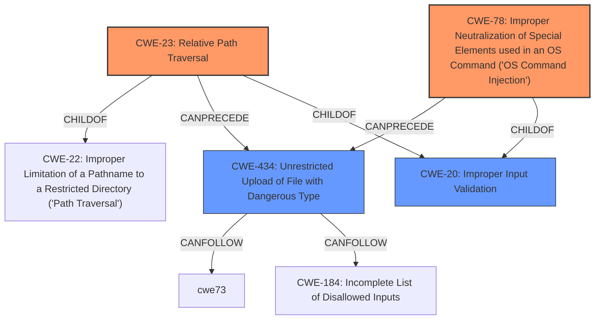

# Final Resolution for CVE-2021-1617

# Summary
| CWE ID | CWE Name | Confidence | CWE Abstraction Level | CWE Vulnerability Mapping Label | CWE-Vulnerability Mapping Notes |
|---|---|---|---|---|---|
| CWE-23 | Relative Path Traversal | 0.9 | Base | Primary | Allowed |
| CWE-78 | Improper Neutralization of Special Elements used in an OS Command ('OS Command Injection') | 0.9 | Base | Primary | Allowed |
| CWE-434 | Unrestricted Upload of File with Dangerous Type | 0.7 | Base | Secondary Candidate | Allowed |
| CWE-20 | Improper Input Validation | 0.6 | Class | Secondary Candidate | Discouraged |

## Evidence and Confidence

*   **Confidence Score:** 0.9
*   **Evidence Strength:** HIGH

## Relationship Analysis
The relationships between the selected CWEs significantly influenced the final decision.

*   CWE-23 (Relative Path Traversal) is a specific type of **CWE-22** (Path Traversal), providing a more precise classification than its parent.
*   CWE-78 (OS Command Injection) stands as a distinct **WEAKNESS**, directly stemming from **improper neutralization** of special elements in OS commands.
*   CWE-434 (Unrestricted Upload of File with Dangerous Type) has a CANFOLLOW relationship with both CWE-23 and **CWE-184** (Incomplete List of Disallowed Inputs), highlighting a potential chain where path traversal or an incomplete denylist leads to the upload of a dangerous file.
*   CWE-20 (Improper Input Validation) is a broad Class-level CWE, serving as a parent to many input validation-related **WEAKNESSES**, including CWE-23 and CWE-78. Its inclusion helps represent the fundamental flaw but is secondary to the more specific Base-level CWEs.

## Vulnerability Chain
The vulnerability chain begins with **insufficient input validation** (CWE-20), which manifests in two primary forms:

1.  **Path Traversal (CWE-23):** The product fails to adequately restrict pathnames, allowing attackers to use relative path sequences like "../" to access files or directories outside the intended restricted area. This is directly stated in the vulnerability description: "Upload a file that has been altered using path traversal techniques".
2.  **OS Command Injection (CWE-78):** The product does not properly neutralize special elements in OS commands, enabling attackers to inject arbitrary commands. This also comes directly from the description: "Execute a command using crafted input".

These **WEAKNESSES** can then lead to:
* **Unrestricted Upload of File with Dangerous Type (CWE-434):** Attackers can upload malicious files due to the path traversal vulnerability or an incomplete list of disallowed inputs. The vulnerability description contains "Upload a file that has been altered using path traversal techniques," which implies that a dangerous file can be uploaded by exploiting the path traversal.

The ultimate impact is the ability to read and write arbitrary files or execute arbitrary commands as root on the affected system, indicating a complete compromise.

## Summary of Analysis
The initial analysis correctly identified CWE-22 and CWE-78 as primary **WEAKNESSES** based on the explicit mention of **path traversal** and **command injection** in the vulnerability description. The inclusion of CWE-20 as a secondary candidate was also justified, acknowledging its role as a general input validation issue.

The criticism provided valuable suggestions for refining the analysis:

*   The suggestion to consider privilege management CWEs (CWE-269 and CWE-250) was carefully evaluated. While the impact includes privilege escalation, the root cause remains the injection and path traversal vulnerabilities. Therefore, focusing on the underlying **WEAKNESSES** is more appropriate.
*   The recommendation to explore more specific variants of **path traversal** led to the selection of CWE-23 (Relative Path Traversal) as a more accurate representation of the vulnerability, assuming relative path sequences ("../") are used.
*   The addition of CWE-434 (Unrestricted Upload of File with Dangerous Type) was considered appropriate, since the vulnerability description includes "Upload a file that has been altered using path traversal techniques".

The final classification reflects these refinements, providing a more precise and complete picture of the vulnerability. The selection of CWE-23 and CWE-78 as primary CWEs, along with CWE-434 and CWE-20 as secondary candidates, represents the optimal level of specificity based on the available evidence and relationship analysis.

The decision is primarily based on the vulnerability description, which explicitly states that the appliance is susceptible to path traversal and command injection attacks: "Multiple vulnerabilities in the web-based management interface of Cisco Intersight Virtual Appliance could allow an authenticated, remote attacker to conduct a path traversal or command injection attack on an affected system."