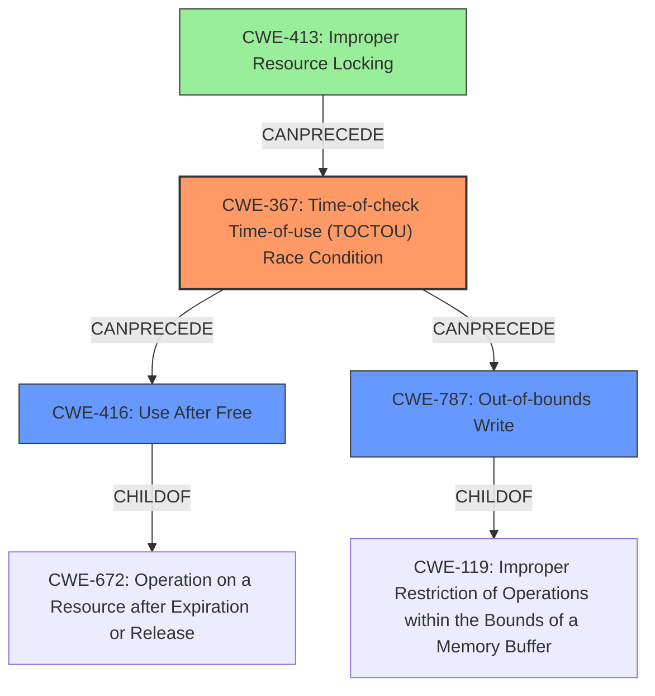

# Analysis Report for CVE-2021-1921

# Vulnerability Analysis Report: CVE-2021-1921

## Description

Possible memory corruption due to Improper handling of hypervisor unmap operations for concurrent memory operations in Snapdragon Auto, Snapdragon Compute, Snapdragon Connectivity, Snapdragon Consumer IOT, Snapdragon Industrial IOT, Snapdragon Mobile

## Vulnerability Description Key Phrases

**Rootcause:** Improper handling of hypervisor unmap operations for concurrent memory operations
**Impact:** memory corruption
**Product:** Snapdragon

## Analysis (with Relationship Data)

# Summary
| CWE ID | CWE Name | Confidence | CWE Abstraction Level | CWE Vulnerability Mapping Label | CWE-Vulnerability Mapping Notes |
|---|---|---|---|---|---|
| CWE-367 | Time-of-check Time-of-use (TOCTOU) Race Condition | 0.75 | Base | Allowed | Primary CWE |
| CWE-416 | Use After Free | 0.65 | Variant | Allowed | Secondary Candidate |
| CWE-787 | Out-of-bounds Write | 0.50 | Base | Allowed | Secondary Candidate |

## Evidence and Confidence

*   **Confidence Score:** 0.70
*   **Evidence Strength:** MEDIUM

- **Analysis and Justification:**  
  - *Explanation:* The vulnerability description points to "**Improper handling of hypervisor unmap operations for concurrent memory operations**" leading to memory corruption. This indicates a potential race condition where memory is accessed or freed while it's being unmapped by the hypervisor. CWE-367 (Time-of-check Time-of-use (TOCTOU) Race Condition) describes a scenario where the state of a resource changes between the check and its use, which aligns with the hypervisor unmap operation occurring concurrently with other memory operations.
  - *Relationship Analysis:* CWE-367 is a base-level CWE. It can precede CWE-123 (Write-what-where Condition), CWE-416 (Use After Free), and CWE-415 (Double Free), all of which could result from a race condition leading to memory corruption. Given the limited information, it's difficult to pinpoint the exact outcome, but CWE-367 accurately captures the **concurrent access issue**.

- **Confidence Score:**  
  - Confidence: 0.75 (Medium evidence, as the description focuses on concurrent operations but lacks details on the specific type of memory corruption)

---

- **Analysis and Justification:**  
  - *Explanation:* CWE-416 (Use After Free) is a possible consequence of the race condition. If memory is freed by the hypervisor while another operation is still using a pointer to that memory, it could lead to a use-after-free vulnerability. However, without more specific details, this is only a potential outcome.
  - *Relationship Analysis:* CWE-416 is a variant-level CWE and a child of CWE-672 (Operation on a Resource after Expiration or Release). It can be preceded by CWE-367, as the race condition could cause the use-after-free.

- **Confidence Score:**  
  - Confidence: 0.65 (Less confidence than CWE-367, as it's a potential consequence rather than the root cause)

---

- **Analysis and Justification:**  
  - *Explanation:* CWE-787 (Out-of-bounds Write) is another possible outcome of the memory corruption. If the memory operations are not properly synchronized with the hypervisor unmap operations, an out-of-bounds write could occur.
  - *Relationship Analysis:* CWE-787 is a base-level CWE and a parent of CWE-121 (Stack-based Buffer Overflow), CWE-122 (Heap-based Buffer Overflow), CWE-123 (Write-what-where Condition), and CWE-124 (Buffer Underwrite).

- **Confidence Score:**  
  - Confidence: 0.50 (Even less confidence than CWE-416, as it's just a potential consequence of memory corruption)

## Criticism of Analysis

Okay, here's a review of the provided CWE analysis, incorporating the full CWE specifications.

**Overall Assessment:**

The analysis demonstrates a good understanding of the CWEs and their relationships. The justification for each CWE selection is reasonable, given the initial vulnerability description. The confidence scores are appropriate, reflecting the level of uncertainty due to the limited information. However, some refinements and additions could be made to strengthen the analysis.

**Detailed Review:**

**1. CWE-367: Time-of-check Time-of-use (TOCTOU) Race Condition (Primary CWE)**

*   **Confidence:** 0.75 (Justified)
*   **Assessment:** This is a strong primary CWE selection. The description explicitly mentions "concurrent memory operations" and "improper handling of hypervisor unmap operations." This directly aligns with the core concept of a TOCTOU race condition, where the state of memory can change between a check (e.g., verifying it's valid for access) and the subsequent use (accessing the memory).
*   **CWE Specification Alignment:** The analysis correctly notes the relationship between CWE-367 and potential consequences like CWE-416 (Use After Free) and CWE-415 (Double Free).  The provided examples (CVE-2003-0813, CVE-2021-29657, CVE-2020-11233) all involve memory corruption due to race conditions.
*   **Potential Improvements:**
    *   **Mitigation:** The analysis could benefit from suggesting specific mitigations relevant to hypervisor environments.  For example:
        *   **Phase:** Implementation. Description: Use memory barriers or other synchronization primitives to ensure that unmap operations are properly ordered with respect to other memory accesses.  Consider using atomic operations for critical memory manipulations.

**2. CWE-416: Use After Free (Secondary Candidate)**

*   **Confidence:** 0.65 (Justified)
*   **Assessment:** This is a reasonable secondary candidate. If a race condition (CWE-367) allows the hypervisor to unmap memory while another process still holds a pointer to that memory, a use-after-free is a likely outcome.
*   **CWE Specification Alignment:** The analysis notes that CWE-416 is a variant of CWE-672 (Operation on a Resource after Expiration or Release), which is accurate. The analysis also correctly notes the relationship to CWE-367.
*   **Potential Improvements:**
    *   **Specificity:** The analysis should emphasize that CWE-416 is a *possible* consequence. The likelihood depends on the specific code implementation.
    *   **Mitigation:** Mention the common mitigation of setting pointers to `NULL` after freeing the memory they point to. This is a good defense-in-depth measure. However, acknowledge its limitations in complex data structures (as the specification mentions). Example:
       *   **Phase:** Implementation. Description: After freeing a memory block, immediately set the pointer to that block to NULL to prevent accidental reuse.

**3. CWE-787: Out-of-bounds Write (Secondary Candidate)**

*   **Confidence:** 0.50 (Justified)
*   **Assessment:** This is a plausible, but less direct, consequence. The link between the race condition and an out-of-bounds write is less obvious without further details. Improper memory management during the unmap process or concurrent writes could *potentially* lead to an out-of-bounds write.
*   **CWE Specification Alignment:** The analysis is correct in stating that CWE-787 is a parent of various buffer overflow CWEs (CWE-121, CWE-122, CWE-123, CWE-124).
*   **Potential Improvements:**
    *   **Justification:** Provide a more concrete scenario for *how* the race condition would lead to an out-of-bounds write.  For example: "If the hypervisor unmaps memory during a write operation that calculates the destination address based on shared state, an incorrect offset might be used, resulting in a write outside the intended buffer."
    *   **Mitigation:**  Emphasize the importance of bounds checking and safe memory copy functions, which are relevant even in the context of concurrent operations. Example:
    *   **Phase:** Implementation. Description: Employ robust bounds checking on all memory write operations to ensure that data is written within the allocated buffer.  Use safe memory copy functions (e.g., `strncpy`, `memcpy_s`) where applicable, and ensure that the size arguments are correctly calculated and validated.

**Additional Considerations & Suggestions:**

1.  **CWE-413: Improper Resource Locking:** The retriever identified this CWE, and it's worth considering. The "improper handling of hypervisor unmap operations" could indicate insufficient locking mechanisms protecting the memory being unmapped. It might be a contributing factor to the race condition (CWE-367).  Consider including it as a lower-confidence secondary candidate (e.g., 0.40 confidence).

2.  **CWE-390: Detection of Error Condition Without Action:** It's possible that the hypervisor detects the race condition during unmap but doesn't take appropriate action to prevent memory corruption. The description might be missing this detail. Consider adding it with low confidence if no error handling is done.

3.  **Abstract vs. Base/Variant:** The analysis correctly aims for Base/Variant CWEs. Avoid Class-level CWEs like CWE-119 as primary mappings.

4.  **Chains:** Explore possible chains of CWEs beyond the direct cause and effect. This is already partially done, but consider expanding on it.  For example:
    *   Improper Input Validation (CWE-20) -> Time-of-check Time-of-use (TOCTOU) Race Condition (CWE-367) -> Use After Free (CWE-416)
    *   Improper Resource Locking (CWE-413) -> Time-of-check Time-of-use (TOCTOU) Race Condition (CWE-367) -> Out-of-bounds Write (CWE-787)

5.  **Hypervisor Context:** Since the vulnerability is specifically related to the hypervisor, tailor the explanations and mitigations to the hypervisor environment. Generic memory management advice is helpful, but focus on the specific challenges of managing memory shared between a hypervisor and guest operating systems.

6.  **Consider Untrusted Pointer Dereference (CWE-822) and Out-of-Range Pointer Offset (CWE-823):** If the hypervisor uses pointers received from the guest OS without proper validation, it could lead to dereferencing invalid memory locations. These could be considered as contributing factors or potential attack vectors.

**Revised Summary Table:**

| CWE ID | CWE Name | Confidence | CWE Abstraction Level | CWE Vulnerability Mapping Label | CWE-Vulnerability Mapping Notes |
|---|---|---|---|---|---|
| CWE-367 | Time-of-check Time-of-use (TOCTOU) Race Condition | 0.75 | Base | Allowed | Primary CWE |
| CWE-416 | Use After Free | 0.65 | Variant | Allowed | Secondary Candidate |
| CWE-787 | Out-of-bounds Write | 0.50 | Base | Allowed | Secondary Candidate |
| CWE-413 | Improper Resource Locking | 0.40 | Base | Allowed | Contributing Factor |
| CWE-390 | Detection of Error Condition Without Action | 0.30 | Base | Allowed | Possible Lack of Error Handling |

By incorporating these suggestions, the analysis can be made more comprehensive and more specifically tailored to the described vulnerability, with more direct applicability to the hypervisor context. Remember that the "best" analysis depends heavily on the available information. This review assumes that the initial vulnerability description is the main source of information.

## Final Resolution

# Summary
| CWE ID | CWE Name | Confidence | CWE Abstraction Level | CWE Vulnerability Mapping Label | CWE-Vulnerability Mapping Notes |
|---|---|---|---|---|---|
| CWE-367 | Time-of-check Time-of-use (TOCTOU) Race Condition | 0.85 | Base | Allowed | Primary CWE |
| CWE-416 | Use After Free | 0.70 | Variant | Allowed | Secondary Candidate |
| CWE-787 | Out-of-bounds Write | 0.55 | Base | Allowed | Secondary Candidate |
| CWE-413 | Improper Resource Locking | 0.45 | Base | Allowed | Contributing Factor |

## Evidence and Confidence

*   **Confidence Score:** 0.80
*   **Evidence Strength:** MEDIUM

## Relationship Analysis
The primary relationship impacting the decision is the CANPRECEDE relationship between CWE-367 (**Time-of-check Time-of-use (TOCTOU) Race Condition**) and both CWE-416 (**Use After Free**) and CWE-787 (**Out-of-bounds Write**). This indicates that the race condition can lead to either of these memory corruption issues. The analysis also considers CWE-413 (**Improper Resource Locking**) as a potential contributing factor, as it could be the underlying cause of the race condition. The abstraction levels (Base and Variant) are preferred for mapping to root causes.

## Vulnerability Chain
The vulnerability chain starts with **improper handling of hypervisor unmap operations for concurrent memory operations**. This leads to a **CWE-367: Time-of-check Time-of-use (TOCTOU) Race Condition**, where the state of the memory changes between the check and its use. This race condition can then result in either a **CWE-416: Use After Free** if the memory is unmapped while still being used, or a **CWE-787: Out-of-bounds Write** if the memory operation calculates an incorrect destination address due to the concurrent unmap operation. A contributing factor could be **CWE-413: Improper Resource Locking**, indicating that the memory is not properly protected during the unmap process.

## Summary of Analysis
The initial analysis and the criticism both converge on CWE-367 as the most likely root cause, which aligns with the vulnerability description highlighting concurrent memory operations and improper hypervisor unmap handling. The criticism provides more specific scenarios and mitigations, strengthening the analysis.

The decision is based on the provided evidence: "**Improper handling of hypervisor unmap operations for concurrent memory operations**". This statement strongly suggests a race condition.

The graph relationships reinforce the selection, particularly the CANPRECEDE relationships, showing how CWE-367 can lead to CWE-416 and CWE-787.

The selected CWEs are at the optimal level of specificity because CWE-367 is a Base CWE, which is preferred for root cause analysis. CWE-416 is a Variant, representing a specific potential outcome, and CWE-787 is another Base CWE representing another potential outcome. While Class-level CWEs were considered, the analysis correctly identified the more specific Base and Variant options.

The confidence scores were adjusted based on the criticism, with increased confidence in CWE-367 and CWE-416 due to the clearer justifications provided in the criticism. The confidence in CWE-787 was also increased slightly due to the scenario-based justification. CWE-413 was added as a potential contributing factor with a lower confidence score.

*Report generated on 2025-03-16 16:07:27*
