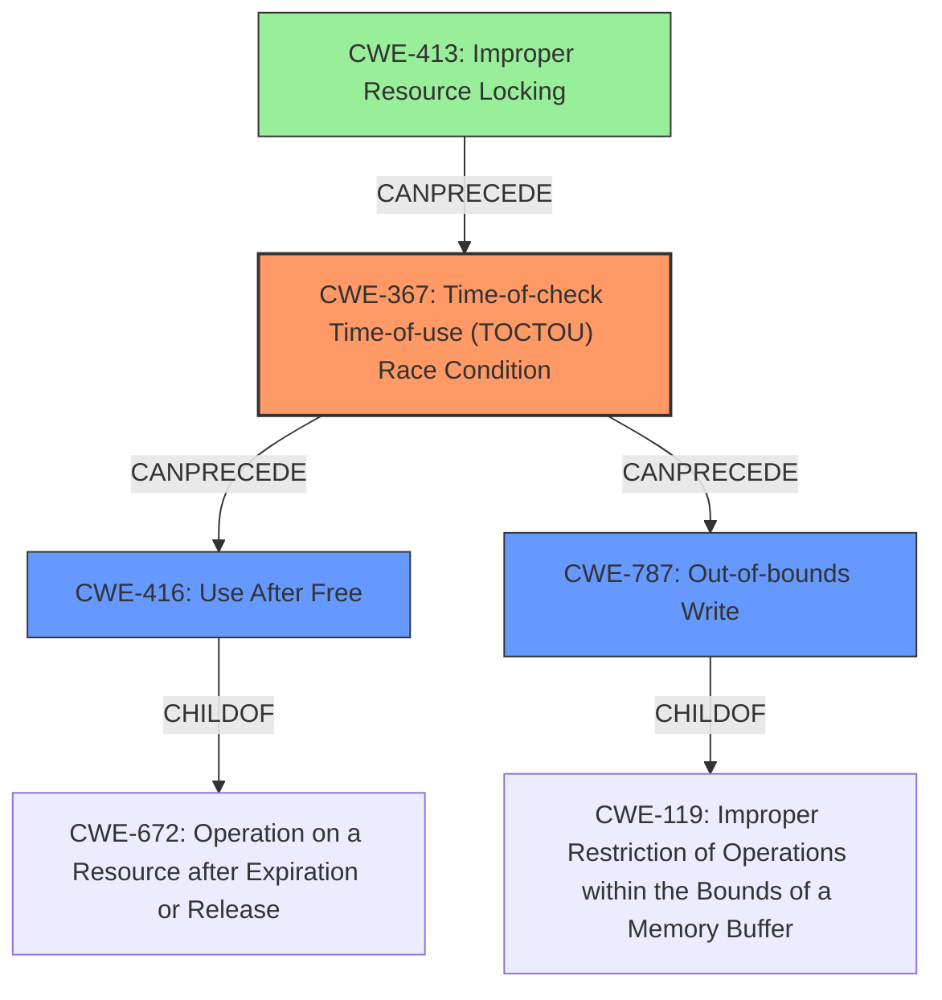

# Final Resolution for CVE-2021-1921

# Summary
| CWE ID | CWE Name | Confidence | CWE Abstraction Level | CWE Vulnerability Mapping Label | CWE-Vulnerability Mapping Notes |
|---|---|---|---|---|---|
| CWE-367 | Time-of-check Time-of-use (TOCTOU) Race Condition | 0.85 | Base | Allowed | Primary CWE |
| CWE-416 | Use After Free | 0.70 | Variant | Allowed | Secondary Candidate |
| CWE-787 | Out-of-bounds Write | 0.55 | Base | Allowed | Secondary Candidate |
| CWE-413 | Improper Resource Locking | 0.45 | Base | Allowed | Contributing Factor |

## Evidence and Confidence

*   **Confidence Score:** 0.80
*   **Evidence Strength:** MEDIUM

## Relationship Analysis
The primary relationship impacting the decision is the CANPRECEDE relationship between CWE-367 (**Time-of-check Time-of-use (TOCTOU) Race Condition**) and both CWE-416 (**Use After Free**) and CWE-787 (**Out-of-bounds Write**). This indicates that the race condition can lead to either of these memory corruption issues. The analysis also considers CWE-413 (**Improper Resource Locking**) as a potential contributing factor, as it could be the underlying cause of the race condition. The abstraction levels (Base and Variant) are preferred for mapping to root causes.

## Vulnerability Chain
The vulnerability chain starts with **improper handling of hypervisor unmap operations for concurrent memory operations**. This leads to a **CWE-367: Time-of-check Time-of-use (TOCTOU) Race Condition**, where the state of the memory changes between the check and its use. This race condition can then result in either a **CWE-416: Use After Free** if the memory is unmapped while still being used, or a **CWE-787: Out-of-bounds Write** if the memory operation calculates an incorrect destination address due to the concurrent unmap operation. A contributing factor could be **CWE-413: Improper Resource Locking**, indicating that the memory is not properly protected during the unmap process.

## Summary of Analysis
The initial analysis and the criticism both converge on CWE-367 as the most likely root cause, which aligns with the vulnerability description highlighting concurrent memory operations and improper hypervisor unmap handling. The criticism provides more specific scenarios and mitigations, strengthening the analysis.

The decision is based on the provided evidence: "**Improper handling of hypervisor unmap operations for concurrent memory operations**". This statement strongly suggests a race condition.

The graph relationships reinforce the selection, particularly the CANPRECEDE relationships, showing how CWE-367 can lead to CWE-416 and CWE-787.

The selected CWEs are at the optimal level of specificity because CWE-367 is a Base CWE, which is preferred for root cause analysis. CWE-416 is a Variant, representing a specific potential outcome, and CWE-787 is another Base CWE representing another potential outcome. While Class-level CWEs were considered, the analysis correctly identified the more specific Base and Variant options.

The confidence scores were adjusted based on the criticism, with increased confidence in CWE-367 and CWE-416 due to the clearer justifications provided in the criticism. The confidence in CWE-787 was also increased slightly due to the scenario-based justification. CWE-413 was added as a potential contributing factor with a lower confidence score.