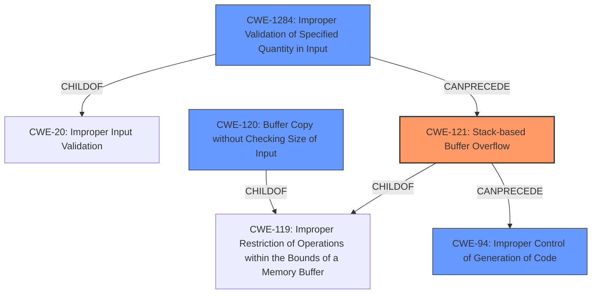

# Analysis Report for CVE-2021-20038

# Vulnerability Analysis Report: CVE-2021-20038

## Description

A Stack-based buffer overflow vulnerability in SMA100 Apache httpd server's mod_cgi module environment variables allows a remote unauthenticated attacker to potentially execute code as a 'nobody' user in the appliance. This vulnerability affected SMA 200, 210, 400, 410 and 500v appliances firmware 10.2.0.8-37sv, 10.2.1.1-19sv, 10.2.1.2-24sv and earlier versions.

## Vulnerability Description Key Phrases

**Rootcause:** Stack-based buffer overflow
**Impact:** potentially execute code as a 'nobody' user
**Attacker:** remote unauthenticated attacker
**Product:** SMA100 Apache httpd server
**Version:** firmware 10.2.0.8-37sv, 10.2.1.1-19sv, 10.2.1.2-24sv and earlier versions
**Component:** mod_cgi module environment variables

## Analysis (with Relationship Data)

# Summary
| CWE ID | CWE Name | Confidence | CWE Abstraction Level | CWE Vulnerability Mapping Label | CWE-Vulnerability Mapping Notes |
|---|---|---|---|---|---|
| CWE-121 | Stack-based Buffer Overflow | 0.95 | Variant | Allowed | Primary CWE |
| CWE-120 | Buffer Copy without Checking Size of Input ('Classic Buffer Overflow') | 0.70 | Base | Allowed-with-Review | Secondary Candidate |
| CWE-78 | Improper Neutralization of Special Elements used in an OS Command ('OS Command Injection') | 0.60 | Base | Allowed | Secondary Candidate |

## Evidence and Confidence

*   **Confidence Score:** 0.90
*   **Evidence Strength:** HIGH

- **Analysis and Justification:**  
  - *Explanation:* "The vulnerability description explicitly states a **Stack-based buffer overflow** exists. This aligns directly with CWE-121, which is a Variant-level CWE specifically addressing stack-based overflows. The CVE reference summary provides further details: the vulnerability occurs due to a lack of bounds checking in the `cgi_build_command` function, where `strcat` is used to append environment variables onto a stack-based buffer without any size validation. This allows a malicious attacker to overflow the buffer by generating an overly long `QUERY_STRING`, overwriting the stack and potentially executing code. Given the explicit mention of stack allocation and overflow, CWE-121 is the most accurate and specific classification. The MITRE mapping guidance for CWE-121 indicates this is ALLOWED for stack-based buffer overflow vulnerabilities."
  
  - *Relationship Analysis:* "CWE-121 is a variant of CWE-119 (Improper Restriction of Operations within the Bounds of a Memory Buffer). While CWE-119 is a broader class, CWE-121 provides the necessary specificity regarding the location of the buffer (stack). There isn't a direct chain relationship evident from the description itself, although buffer overflows can potentially lead to other vulnerabilities such as privilege escalation (CWE-269)."

- **Confidence Score:**  
  - Confidence: 0.95 (High evidence from the explicit vulnerability description and CVE reference details.)

---
- **Analysis and Justification:**  
  - *Explanation:* "CWE-120 (Buffer Copy without Checking Size of Input) is also a relevant consideration. The vulnerability involves the use of `strcat` to copy data into a buffer without proper bounds checking. However, CWE-121 is more precise because it explicitly mentions the stack allocation of the buffer. While the root cause involves copying data without checking the input size, the location on the stack is a critical detail. CWE-120 is listed as Allowed-with-Review which mentions it can be misused if other more specific CWEs apply.
  
  - *Relationship Analysis:* "CWE-120 is a base level CWE and child of CWE-119. While CWE-120 could be considered, CWE-121 is a variant of CWE-119 and provides greater specificity."

- **Confidence Score:**  
  - Confidence: 0.70 (Supporting evidence from the buffer copy operation, but less specific than CWE-121.)

---

- **Analysis and Justification:**  
  - *Explanation:* "CWE-78 (Improper Neutralization of Special Elements used in an OS Command ('OS Command Injection')) is a potential secondary CWE because the attacker can potentially execute code as a 'nobody' user. The CVE reference summary shows that arbitrary code execution is possible because of the buffer overflow leading to command execution.
  
  - *Relationship Analysis:* "CWE-78 is a child of CWE-77 (Command Injection) and is related to CWE-74 (Improper Neutralization of Special Elements). The graph relationships show CWE-78 CanPrecede CWE-269 (Privilege Management) since command injection often leads to privilege escalation. While relevant to the exploit's ultimate impact, it is a consequence of the overflow, not the primary weakness."

- **Confidence Score:**  
  - Confidence: 0.60 (Reasonable consideration due to potential for code execution, but not the primary weakness.)

## Criticism of Analysis

Okay, I've reviewed the provided analysis against the complete CWE specifications. Here's my critique, focusing on the accuracy of the CWE assignments and the supporting justifications.

**Overall Assessment:**

The analysis is generally good, providing reasonable justifications for its CWE selections. The confidence scores are also appropriate. However, there are a few points where the analysis could be strengthened or where alternative CWEs might be considered. The key is to focus on the root cause of the vulnerability rather than the impact.

**Detailed Review:**

1.  **CWE-121: Stack-based Buffer Overflow (Primary CWE) - Confidence: 0.95**

    *   **Assessment:** Correct and well-justified. The vulnerability description explicitly states a stack-based buffer overflow. The CVE reference further confirms this with the `cgi_build_command` function and `strcat` usage without bounds checking on a stack-allocated buffer.
    *   **Justification Strength:** HIGH. Explicit statement of stack-based overflow.
    *   **Suggestions:** None. This is the most accurate CWE.
    *   **CWE Specification Alignment:** The analysis correctly points out the usage guidance for CWE-121, which *allows* it for stack-based overflows. It also correctly mentions that CWE-121 is a *Variant* of CWE-119, which is a good point of detail.

2.  **CWE-120: Buffer Copy without Checking Size of Input ('Classic Buffer Overflow') - Confidence: 0.70**

    *   **Assessment:** Reasonable as a secondary CWE, but not as precise as CWE-121. The lack of bounds checking during the buffer copy operation is certainly a factor.
    *   **Justification Strength:** MEDIUM. Accurately describes the 'classic buffer overflow' scenario.
    *   **Suggestions:**  The analysis acknowledges that CWE-121 is more specific. The analysis is good, but perhaps the confidence score can be lowered even further given that it is a secondary candidate.
    *   **CWE Specification Alignment:** The analysis correctly notes the "Allowed-with-Review" usage. The comments from the specification: *"This CWE entry is only appropriate for "Buffer Copy" operations (not buffer reads), in which where there is no "Checking [the] Size of Input", and (by implication of the copy) writing past the end of the buffer."* This is accurate.
    *   **Alternative Candidates:** None. Given the context of the buffer overflow, the selection is reasonable.

3.  **CWE-78: Improper Neutralization of Special Elements used in an OS Command ('OS Command Injection') - Confidence: 0.60**

    *   **Assessment:** The selection of CWE-78 is somewhat of a stretch, as it is a *consequence* and not the root cause. While the attacker can ultimately execute code, it is a result of exploiting the buffer overflow. The exploit in the CVE summary does note that there is an attempt to perform command execution, but that comes *after* the overflow.
    *   **Justification Strength:** LOW. The chain of events is: buffer overflow -> code execution -> (potentially) command injection if the attacker chooses to inject commands.
    *   **Suggestions:** It may be more appropriate to *omit* CWE-78, or significantly lower the confidence score. Command Injection is more of a potential *impact* of the vulnerability. Another alternative is to map to the more general CWE-94 (Improper Control of Generation of Code), since the overflow is *generating* the code that gets executed. The CWE-94 specification also correctly mentions that code execution alone is not an indicator of the CWE itself.
    *   **CWE Specification Alignment:** The "Mapping Guidance" for CWE-78 states, *"Carefully read both the name and description to ensure that this mapping is an appropriate fit. Do not try to 'force' a mapping to a lower-level Base/Variant simply to comply with this preferred level of abstraction."* The analysis might be "forcing" a fit here. The analysis also needs to consider the mitigations for CWE-78, and whether the mitigations apply to this situation.
    *   **Alternative Candidates:**
        *   **CWE-94: Improper Control of Generation of Code ('Code Injection')**: As mentioned before, this captures the fact that the *overflow is generating code* rather than directly injecting shell commands.

**Additional Considerations and Potential Improvements:**

*   **CWE-1284: Improper Validation of Specified Quantity in Input:** This CWE might be considered as a more accurate root cause than even CWE-120 in this specific case. The attacker is crafting a long `QUERY_STRING` which represents a *quantity of data* that isn't validated. This leads to the buffer overflow. It's a more direct explanation of the root cause. If input validation of the `QUERY_STRING` size existed, the overflow would not be possible.

*   **Privilege Escalation:** The vulnerability description mentions the ability to escalate privileges to root. While CWE-269 (Improper Privilege Management) is *discouraged* as a root cause, the notes mention that "If an error or mistake allows privilege escalation, then use the CWE ID for that mistake." However, in this case, the privilege escalation is a *consequence* of successful command execution after exploiting the stack buffer overflow. The root cause weakness is the buffer overflow.

**Revised CWE Mapping Suggestions:**

| CWE ID  | CWE Name                                                                               | Confidence | Notes                                                                                    |
| :------ | :------------------------------------------------------------------------------------- | :-------- | :--------------------------------------------------------------------------------------- |
| CWE-121 | Stack-based Buffer Overflow                                                            | 0.95      | Primary CWE, very well supported.                                                      |
| CWE-120 | Buffer Copy without Checking Size of Input ('Classic Buffer Overflow')                 | 0.60      | Secondary CWE, describes the underlying operation. Lower confidence.                    |
| CWE-1284| Improper Validation of Specified Quantity in Input                                    | 0.60      | Secondary CWE, describes the lack of validation of the query string size                  |
| CWE-94   | Improper Control of Generation of Code ('Code Injection')                             | 0.40 | Weakly related, the goal of the attacker is to execute code.                   |
| *(Omit)*   | *CWE-78 Improper Neutralization of Special Elements used in an OS Command*            |  -         | Impact, *not* a root cause.                                                             |

**In summary, the analysis is mostly correct, but the suggested revisions aim for greater precision in identifying the *root cause* weaknesses, focusing on the direct programming errors rather than downstream consequences like command injection or privilege escalation. Adding CWE-1284 helps to highlight the lack of validation of the size of the malicious input**

## Final Resolution

# Summary
| CWE ID | CWE Name | Confidence | CWE Abstraction Level | CWE Vulnerability Mapping Label | CWE-Vulnerability Mapping Notes |
|---|---|---|---|---|---|
| CWE-121 | Stack-based Buffer Overflow | 0.95 | Variant | Allowed | Primary CWE |
| CWE-1284 | Improper Validation of Specified Quantity in Input | 0.70 | Base | Allowed | Secondary Candidate |
| CWE-120 | Buffer Copy without Checking Size of Input ('Classic Buffer Overflow') | 0.60 | Base | Allowed-with-Review | Secondary Candidate |
| CWE-94 | Improper Control of Generation of Code ('Code Injection') | 0.40 | Base | Allowed-with-Review | Secondary Candidate |

## Evidence and Confidence

*   **Confidence Score:** 0.90
*   **Evidence Strength:** HIGH

## Relationship Analysis
The primary relationship is the hierarchical connection between CWE-121 as a variant of the more general CWE-119 (**Improper Restriction of Operations within the Bounds of a Memory Buffer**). CWE-120 is also a child of CWE-119. CWE-1284 is a child of CWE-20 (**Improper Input Validation**). The chain relationship shows that **improper input validation** can precede a **buffer overflow**, which can lead to **improper control of code generation**. The abstraction levels influenced the selection by prioritizing the most specific CWE (CWE-121) while considering other contributing factors at the Base level (CWE-1284, CWE-120, and CWE-94).

## Vulnerability Chain
The vulnerability chain starts with **CWE-1284: Improper Validation of Specified Quantity in Input**, where the size of the `QUERY_STRING` is not validated. This leads to **CWE-121: Stack-based Buffer Overflow** when `strcat` copies the overly long string into a stack-allocated buffer. The overflow allows an attacker to overwrite parts of the stack, potentially injecting and executing arbitrary code (**CWE-94: Improper Control of Generation of Code**). The final impact is the ability to execute code as the 'nobody' user.

## Summary of Analysis
The initial analysis correctly identified **CWE-121 (Stack-based Buffer Overflow)** as the primary **WEAKNESS**, which is supported by the vulnerability description explicitly stating a stack-based buffer overflow. The analysis also considered **CWE-120 (Buffer Copy without Checking Size of Input)** and **CWE-78 (Improper Neutralization of Special Elements used in an OS Command)**.

The criticism highlighted the importance of focusing on the **ROOTCAUSE** and suggested the inclusion of **CWE-1284 (Improper Validation of Specified Quantity in Input)**. The criticism also correctly identified **CWE-78** as more of an impact than a root cause, suggesting its omission or replacement with **CWE-94 (Improper Control of Generation of Code)**.

Based on the evidence and relationship analysis, I agree with the initial assessment of **CWE-121** as the primary **WEAKNESS**. The inclusion of **CWE-1284** as a secondary **WEAKNESS** strengthens the analysis by highlighting the lack of input validation. I also concur with lowering the confidence in **CWE-78** and replacing it with **CWE-94**, as it more accurately reflects the potential for code execution resulting from the overflow. **CWE-120** remains a valid secondary candidate as the buffer copy operation without size checking is a contributing factor.

The final classification reflects the optimal level of specificity by prioritizing the Variant-level **CWE-121** while also considering the Base-level **CWE-1284, CWE-120, and CWE-94** to provide a more complete picture of the vulnerability.

*Report generated on 2025-03-17 22:47:22*
