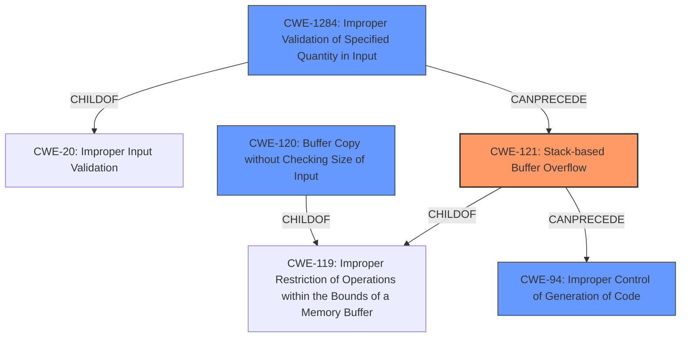

# Final Resolution for CVE-2021-20038

# Summary
| CWE ID | CWE Name | Confidence | CWE Abstraction Level | CWE Vulnerability Mapping Label | CWE-Vulnerability Mapping Notes |
|---|---|---|---|---|---|
| CWE-121 | Stack-based Buffer Overflow | 0.95 | Variant | Allowed | Primary CWE |
| CWE-1284 | Improper Validation of Specified Quantity in Input | 0.70 | Base | Allowed | Secondary Candidate |
| CWE-120 | Buffer Copy without Checking Size of Input ('Classic Buffer Overflow') | 0.60 | Base | Allowed-with-Review | Secondary Candidate |
| CWE-94 | Improper Control of Generation of Code ('Code Injection') | 0.40 | Base | Allowed-with-Review | Secondary Candidate |

## Evidence and Confidence

*   **Confidence Score:** 0.90
*   **Evidence Strength:** HIGH

## Relationship Analysis
The primary relationship is the hierarchical connection between CWE-121 as a variant of the more general CWE-119 (**Improper Restriction of Operations within the Bounds of a Memory Buffer**). CWE-120 is also a child of CWE-119. CWE-1284 is a child of CWE-20 (**Improper Input Validation**). The chain relationship shows that **improper input validation** can precede a **buffer overflow**, which can lead to **improper control of code generation**. The abstraction levels influenced the selection by prioritizing the most specific CWE (CWE-121) while considering other contributing factors at the Base level (CWE-1284, CWE-120, and CWE-94).

## Vulnerability Chain
The vulnerability chain starts with **CWE-1284: Improper Validation of Specified Quantity in Input**, where the size of the `QUERY_STRING` is not validated. This leads to **CWE-121: Stack-based Buffer Overflow** when `strcat` copies the overly long string into a stack-allocated buffer. The overflow allows an attacker to overwrite parts of the stack, potentially injecting and executing arbitrary code (**CWE-94: Improper Control of Generation of Code**). The final impact is the ability to execute code as the 'nobody' user.

## Summary of Analysis
The initial analysis correctly identified **CWE-121 (Stack-based Buffer Overflow)** as the primary **WEAKNESS**, which is supported by the vulnerability description explicitly stating a stack-based buffer overflow. The analysis also considered **CWE-120 (Buffer Copy without Checking Size of Input)** and **CWE-78 (Improper Neutralization of Special Elements used in an OS Command)**.

The criticism highlighted the importance of focusing on the **ROOTCAUSE** and suggested the inclusion of **CWE-1284 (Improper Validation of Specified Quantity in Input)**. The criticism also correctly identified **CWE-78** as more of an impact than a root cause, suggesting its omission or replacement with **CWE-94 (Improper Control of Generation of Code)**.

Based on the evidence and relationship analysis, I agree with the initial assessment of **CWE-121** as the primary **WEAKNESS**. The inclusion of **CWE-1284** as a secondary **WEAKNESS** strengthens the analysis by highlighting the lack of input validation. I also concur with lowering the confidence in **CWE-78** and replacing it with **CWE-94**, as it more accurately reflects the potential for code execution resulting from the overflow. **CWE-120** remains a valid secondary candidate as the buffer copy operation without size checking is a contributing factor.

The final classification reflects the optimal level of specificity by prioritizing the Variant-level **CWE-121** while also considering the Base-level **CWE-1284, CWE-120, and CWE-94** to provide a more complete picture of the vulnerability.