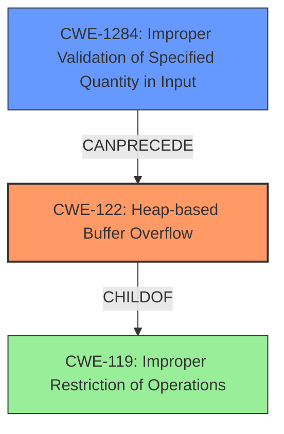

# Final Resolution for CVE-2021-20043

# Summary
| CWE ID | CWE Name | Confidence | CWE Abstraction Level | CWE Vulnerability Mapping Label | CWE-Vulnerability Mapping Notes |
|---|---|---|---|---|---|
| CWE-122 | Heap-based Buffer Overflow | 1.0 | Variant | Allowed | Primary CWE |
| CWE-1284 | Improper Validation of Specified Quantity in Input | 0.6 | Base | Allowed | Secondary Candidate |

## Evidence and Confidence

*   **Confidence Score:** 0.9
*   **Evidence Strength:** MEDIUM

## Relationship Analysis
The primary relationship impacting the decision is the parent-child relationship between CWE-119 (Improper Restriction of Operations within the Bounds of a Memory Buffer) and CWE-122. CWE-122 is a variant of CWE-119, providing a more specific classification for heap-based buffer overflows. While other CWEs like CWE-190 (Integer Overflow) or CWE-1284 (Improper Validation of Specified Quantity in Input) could potentially precede the overflow, the provided vulnerability description focuses on the heap overflow itself. The base CWE of CWE-1284 can be a root cause for the heap overflow, so I am adding it as a secondary candidate.

## Vulnerability Chain
The vulnerability chain starts with a potential **improper validation of input (CWE-1284)**, leading to an incorrect size calculation or insufficient bounds checking. This then results in a **heap-based buffer overflow (CWE-122)** when data is written beyond the allocated buffer's boundaries. The final impact is the potential execution of arbitrary code as the nobody user on the appliance.

## Summary of Analysis
The initial analysis correctly identifies CWE-122 as the primary CWE, given the explicit mention of a "Heap-based buffer overflow" in the vulnerability description. The criticism correctly points out that other CWEs could be contributing factors.

*   **Evidence:** The vulnerability description states: "A Heap-based buffer overflow vulnerability in SonicWall SMA100 getBookmarks method allows a remote authenticated attacker to potentially execute code as the nobody user in the appliance."
*   **Graph Relationships:** The parent-child relationship between CWE-119 and CWE-122 reinforces the selection of the more specific CWE-122. The potential for CWE-1284 to precede CWE-122 suggests a possible vulnerability chain.
*   **Justification:** CWE-122 is the optimal choice because it directly reflects the described vulnerability. While other CWEs like CWE-190 (Integer Overflow) or CWE-1284 (Improper Validation of Specified Quantity in Input) are possible contributing factors, they are not explicitly mentioned in the vulnerability description. Given the information available, CWE-122 provides the most accurate and specific classification.
*   I am adding CWE-1284 as a secondary candidate because it can lead to a heap overflow. This is an **Improper Validation of Specified Quantity in Input**, and the `getBookmarks` method receives input that specifies a quantity (the bookmarks), but it does not validate that the quantity has the required properties.