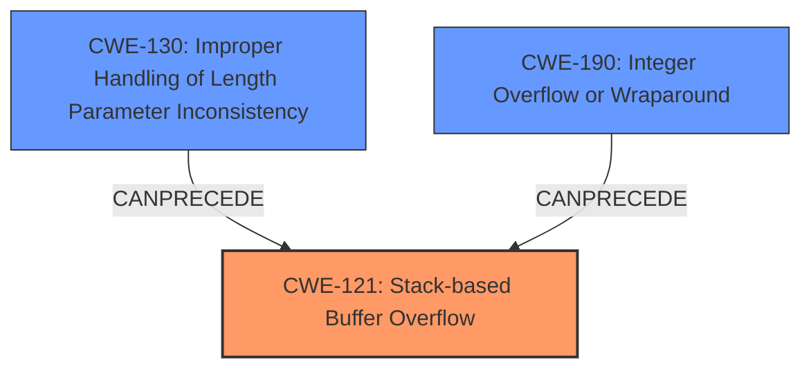

# Analysis Report for CVE-2021-20046

# Vulnerability Analysis Report: CVE-2021-20046

## Description

A Stack-based buffer overflow in the SonicOS HTTP Content-Length response header allows a remote authenticated attacker to cause Denial of Service (DoS) and potentially results in code execution in the firewall. This vulnerability affected SonicOS Gen 5, Gen 6 and Gen 7 firmware versions.

## Vulnerability Description Key Phrases

**Rootcause:** Stack-based buffer overflow
**Impact:** Denial of Service (DoS) and potentially results in code execution
**Attacker:** remote authenticated attacker
**Product:** SonicOS
**Version:** Gen 5, Gen 6 and Gen 7 firmware versions
**Component:** HTTP Content-Length response header

## Analysis (with Relationship Data)

# Summary
| CWE ID | CWE Name | Confidence | CWE Abstraction Level | CWE Vulnerability Mapping Label | CWE-Vulnerability Mapping Notes |
|---|---|---|---|---|---|
| CWE-121 | Stack-based Buffer Overflow | 0.9 | Variant | Primary | Allowed |
| CWE-119 | Improper Restriction of Operations within the Bounds of a Memory Buffer | 0.6 | Class | Secondary | Discouraged |

## Evidence and Confidence

*   **Confidence Score:** 0.75
*   **Evidence Strength:** MEDIUM

- **Analysis and Justification:**  
  - *Explanation:* The vulnerability description clearly states a "**Stack-based buffer overflow**" occurs in the SonicOS HTTP Content-Length response header. This directly aligns with CWE-121 (Stack-based Buffer Overflow), which is a variant of buffer overflows where the buffer is allocated on the stack. CWE-121 is also listed in the retriever results and is ALLOWED. The impact is Denial of Service (DoS) and potential code execution, typical consequences of buffer overflows. Although CWE-119 (Improper Restriction of Operations within the Bounds of a Memory Buffer) is a parent class, CWE-121 is more specific.
  
  - *Relationship Analysis:* CWE-121 is a variant of CWE-119 (Improper Restriction of Operations within the Bounds of a Memory Buffer). CWE-787 (Out-of-bounds Write) is a parent of CWE-121.

- **Confidence Score:**  
  - Confidence: 0.9 (High confidence due to direct mention of "Stack-based buffer overflow" and alignment with CWE-121 description.)

---

## Criticism of Analysis

Okay, I've reviewed the provided analysis against the full CWE specifications. Here's my critique:

**Overall Assessment:**

The analysis is generally good, particularly the primary CWE mapping to `CWE-121: Stack-based Buffer Overflow`. The reasoning is clear, and the confidence level is appropriately high. The inclusion of `CWE-119` as a secondary mapping, however, is less ideal given the CWE's discouraged usage and the availability of more specific mappings.

**Detailed Breakdown:**

*   **CWE-121: Stack-based Buffer Overflow (Primary Mapping)**
    *   **Correctness:** The identification of `CWE-121` is accurate and well-justified. The vulnerability description explicitly states "Stack-based buffer overflow," making this a direct match. The description of `CWE-121` in the CWE specification aligns perfectly with this scenario: "A stack-based buffer overflow condition is a condition where the buffer being overwritten is allocated on the stack (i.e., is a local variable or, rarely, a parameter to a function)." The description, impact, and attacker details all support this classification.
    *   **Abstraction Level:** The mapping is at the *Variant* level, which is the preferred level for root cause analysis according to CWE guidelines.
    *   **Confidence:** The confidence score of 0.9 is warranted given the explicit mention of "Stack-based buffer overflow" in the vulnerability description.
    *   **Mitigations:** The analysis doesn't explicitly mention mitigations, but the CWE specifications for `CWE-121` offer good starting points. These include:
        *   Using compiler extensions for automatic buffer overflow detection (e.g., /GS flag in Visual Studio, FORTIFY\_SOURCE in GCC).
        *   Using abstraction libraries to mitigate risky APIs.
        *   Implementing bounds checking on input.

*   **CWE-119: Improper Restriction of Operations within the Bounds of a Memory Buffer (Secondary Mapping)**
    *   **Correctness:** While technically *correct* (a stack-based buffer overflow *is* a case of improper restriction of operations within a memory buffer), the mapping to `CWE-119` is *less ideal* than it could be and goes against CWE recommendations.
    *   **Abstraction Level:** `CWE-119` is a *Class* level CWE, which is a higher level of abstraction. The CWE specification explicitly *discourages* the use of `CWE-119`: "CWE-119 is commonly misused in low-information vulnerability reports when lower-level CWEs could be used instead, or when more details about the vulnerability are available."
    *   **Mapping Guidance:** The CWE specification recommends: "Look at CWE-119's children and consider mapping to CWEs such as CWE-787: Out-of-bounds Write, CWE-125: Out-of-bounds Read, or others." Since the analysis already correctly identified `CWE-121`, including `CWE-119` adds little value and goes against the principle of using the most specific CWE available.
    *   **Alternative Mappings & Relationships:** `CWE-787` is the direct parent for `CWE-121`, and even `CWE-787` would be a preferable choice here since the primary is already a great match.
    *   **Confidence:** The confidence score for this mapping is 0.6, which is okay as a *secondary* mapping, but it should be lowered or removed.
    *   **Mitigations:** The Mitigations listed for CWE-119 are accurate but generic and less helpful than the ones for CWE-121.

**Retriever Results Analysis**
The retriever results provided several CWEs with high combined scores which should be considered.
*CWE-130 Improper Handling of Length Parameter Inconsistency*: This is a good candidate to be considered to be chained to the overflow, the content-length header is part of the HTTP protocol, as such a length inconsistency in this header could be possible, and could lead to a BOF. This is a good candidate to be added to the analysis.
*CWE-190 Integer Overflow or Wraparound*: This is a good candidate to be considered to be chained to the overflow, since size parameters are commonly used, and could be the root cause of a buffer overflow.

**Recommendations:**

1.  **Remove or Demote CWE-119:** Given the explicit "Stack-based buffer overflow" root cause, and the availability of `CWE-121`, remove `CWE-119` entirely or greatly reduce its confidence and make it tertiary/informational only.
2. **Add CWE-130 and/or CWE-190**: Consider adding `CWE-130` and/or `CWE-190` if there is a malformed HTTP Content-Length Header with an inconsistent length parameter.
3.  **Mitigations:** Expand the analysis to include potential mitigations. Specifically, list mitigations from the `CWE-121` specification, focusing on compiler-level defenses, input validation, and safe string handling functions.
4.  **Relationship Analysis:** Make the relationship analysis focus on the *chain* of events. For example: an attacker provides an oversized value in the HTTP Content-Length header (potentially CWE-130) leading to an out-of-bounds write on the stack (CWE-121). Or a numeric calculation is performed that results in an integer overflow (CWE-190) which is then used as the size of the buffer, which then causes the stack-based buffer overflow (CWE-121).

By implementing these recommendations, the analysis will be more accurate, more specific, and more useful for remediation efforts.

## Final Resolution

# Summary
| CWE ID | CWE Name | Confidence | CWE Abstraction Level | CWE Vulnerability Mapping Label | CWE-Vulnerability Mapping Notes |
|---|---|---|---|---|---|
| CWE-121 | Stack-based Buffer Overflow | 0.9 | Variant | Primary | Allowed |
| CWE-130 | Improper Handling of Length Parameter Inconsistency | 0.7 | Base | Secondary | Allowed |
| CWE-190 | Integer Overflow or Wraparound | 0.6 | Base | Secondary | Allowed |

## Evidence and Confidence

*   **Confidence Score:** 0.8
*   **Evidence Strength:** MEDIUM

## Relationship Analysis
The primary weakness is CWE-121, a variant of buffer overflows occurring on the stack. CWE-121 is a child of CWE-787 (**Out-of-bounds Write**) which is a child of CWE-119 (**Improper Restriction of Operations**). However, since CWE-121 is the more specific classification and the vulnerability description mentions "**Stack-based buffer overflow**", it is the best choice.

CWE-130 and CWE-190 are added as secondary weaknesses. A malformed HTTP Content-Length Header with an inconsistent length parameter (CWE-130) can precede CWE-121. Similarly, an integer overflow (CWE-190) can be used as the size of the buffer, which then causes the stack-based buffer overflow (CWE-121).

## Vulnerability Chain
The vulnerability chain starts with a potentially malformed HTTP Content-Length header (CWE-130) or an integer overflow (CWE-190). This leads to a **stack-based buffer overflow** (CWE-121) because of an incorrect calculation or handling of the length field. The overflow can cause Denial of Service (DoS) and potentially code execution.

## Summary of Analysis
The initial analysis correctly identified CWE-121 as the primary weakness. The criticism suggested removing CWE-119 and adding CWE-130 and CWE-190 as secondary weaknesses, which is a valid suggestion.

The decision to include CWE-130 and CWE-190 is based on the possibility of an inconsistent length parameter in the HTTP Content-Length header or an integer overflow when calculating the buffer size. These weaknesses can precede and cause the **stack-based buffer overflow** (CWE-121).

The selected CWEs are at the optimal level of specificity. CWE-121 is a variant that directly matches the "**Stack-based buffer overflow**" described in the vulnerability description. CWE-130 and CWE-190 are base level CWEs that describe potential root causes.

*Report generated on 2025-03-17 22:48:44*
