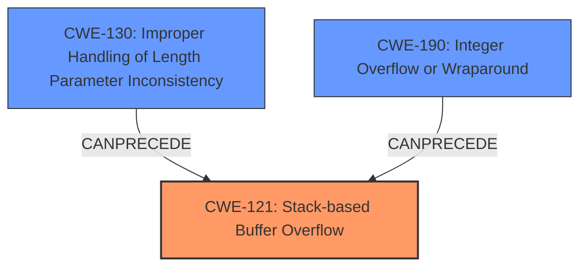

# Final Resolution for CVE-2021-20046

# Summary
| CWE ID | CWE Name | Confidence | CWE Abstraction Level | CWE Vulnerability Mapping Label | CWE-Vulnerability Mapping Notes |
|---|---|---|---|---|---|
| CWE-121 | Stack-based Buffer Overflow | 0.9 | Variant | Primary | Allowed |
| CWE-130 | Improper Handling of Length Parameter Inconsistency | 0.7 | Base | Secondary | Allowed |
| CWE-190 | Integer Overflow or Wraparound | 0.6 | Base | Secondary | Allowed |

## Evidence and Confidence

*   **Confidence Score:** 0.8
*   **Evidence Strength:** MEDIUM

## Relationship Analysis
The primary weakness is CWE-121, a variant of buffer overflows occurring on the stack. CWE-121 is a child of CWE-787 (**Out-of-bounds Write**) which is a child of CWE-119 (**Improper Restriction of Operations**). However, since CWE-121 is the more specific classification and the vulnerability description mentions "**Stack-based buffer overflow**", it is the best choice.

CWE-130 and CWE-190 are added as secondary weaknesses. A malformed HTTP Content-Length Header with an inconsistent length parameter (CWE-130) can precede CWE-121. Similarly, an integer overflow (CWE-190) can be used as the size of the buffer, which then causes the stack-based buffer overflow (CWE-121).

## Vulnerability Chain
The vulnerability chain starts with a potentially malformed HTTP Content-Length header (CWE-130) or an integer overflow (CWE-190). This leads to a **stack-based buffer overflow** (CWE-121) because of an incorrect calculation or handling of the length field. The overflow can cause Denial of Service (DoS) and potentially code execution.

## Summary of Analysis
The initial analysis correctly identified CWE-121 as the primary weakness. The criticism suggested removing CWE-119 and adding CWE-130 and CWE-190 as secondary weaknesses, which is a valid suggestion.

The decision to include CWE-130 and CWE-190 is based on the possibility of an inconsistent length parameter in the HTTP Content-Length header or an integer overflow when calculating the buffer size. These weaknesses can precede and cause the **stack-based buffer overflow** (CWE-121).

The selected CWEs are at the optimal level of specificity. CWE-121 is a variant that directly matches the "**Stack-based buffer overflow**" described in the vulnerability description. CWE-130 and CWE-190 are base level CWEs that describe potential root causes.