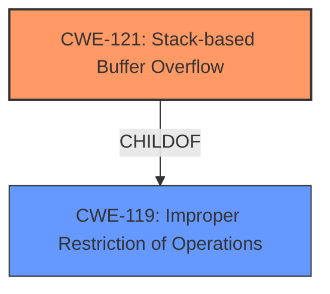

# Final Resolution for CVE-2021-20048

# Summary 
| CWE ID | CWE Name | Confidence | CWE Abstraction Level | CWE Vulnerability Mapping Label | CWE-Vulnerability Mapping Notes |
|---|---|---|---|---|---|
| CWE-121 | Stack-based Buffer Overflow | 0.95 | Variant | Allowed | Primary CWE |

## Evidence and Confidence

*   **Confidence Score:** 0.95
*   **Evidence Strength:** HIGH

## Relationship Analysis
The primary relationship considered was the parent-child relationship between CWE-121 (Stack-based Buffer Overflow) and its parent CWE-119 (Improper Restriction of Operations within the Bounds of a Memory Buffer). Since the vulnerability description explicitly mentions "Stack-based buffer overflow," CWE-121 was chosen for its higher specificity. No chain relationships were identified based on the provided information.

## Vulnerability Chain
The vulnerability chain starts with a flaw that allows a remote authenticated attacker to send a crafted HTTP request. This leads to a **CWE-121 (Stack-based Buffer Overflow)** when the SonicOS processes the SessionID HTTP response header. The overflow can cause a Denial of Service (DoS) and potentially code execution.

## Summary of Analysis
The initial analysis and criticism both agree that **CWE-121 (Stack-based Buffer Overflow)** is the most appropriate primary CWE. The vulnerability description explicitly mentions "Stack-based buffer overflow," which directly aligns with the CWE name and description. The selection of CWE-121 is further supported by its Variant abstraction level, which provides greater specificity than its parent CWE, **CWE-119 (Improper Restriction of Operations within the Bounds of a Memory Buffer)**.

The decision is primarily based on the explicit statement in the vulnerability description: "A Stack-based buffer overflow in the SonicOS SessionID HTTP response header...". This statement provides direct evidence for classifying the vulnerability as CWE-121.

The graph relationships confirm that CWE-121 is a child of CWE-119, but the higher specificity of CWE-121 makes it a more suitable choice. The provided evidence does not suggest any vulnerability chains or alternative classifications. Therefore, **CWE-121 (Stack-based Buffer Overflow)** is the optimal classification based on the available evidence and relationship analysis.