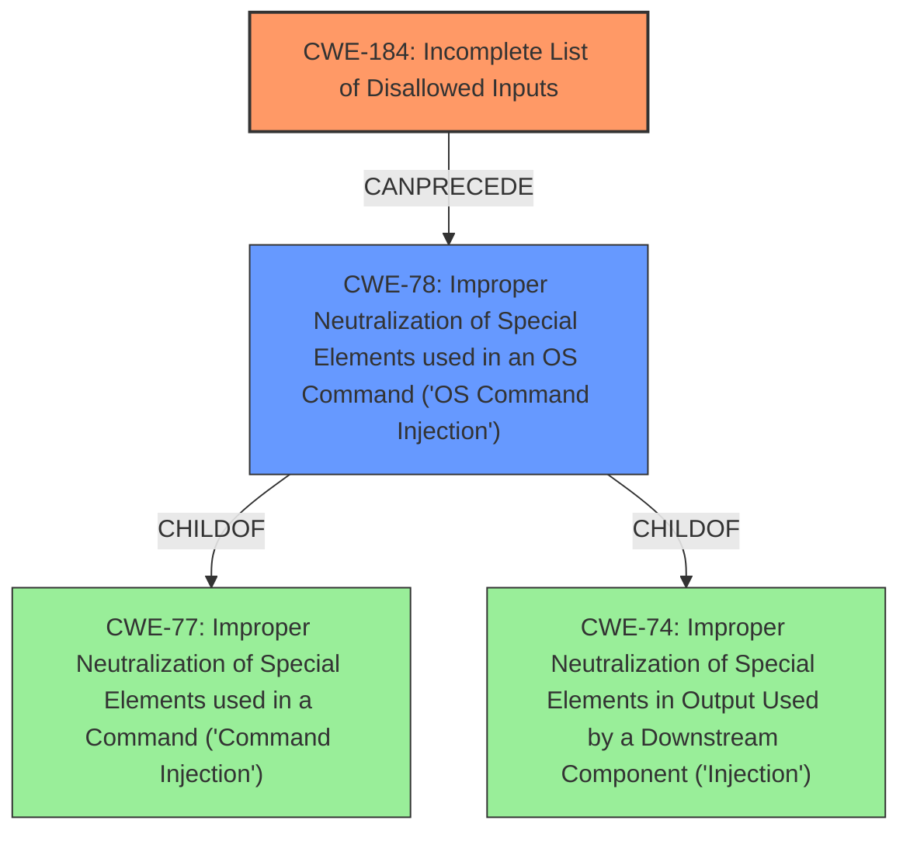

# Final Resolution for CVE-2021-20081

# Summary
| CWE ID | CWE Name | Confidence | CWE Abstraction Level | CWE Vulnerability Mapping Label | CWE-Vulnerability Mapping Notes |
|---|---|---|---|---|---|
| CWE-184 | Incomplete List of Disallowed Inputs | 0.95 | Base | Allowed | Primary CWE. Core issue is incomplete input sanitization. |
| CWE-78 | Improper Neutralization of Special Elements used in an OS Command ('OS Command Injection') | 0.75 | Base | Allowed | Secondary Candidate. Exploitation of CWE-184 enables OS command injection. |

## Evidence and Confidence

*   **Confidence Score:** 0.90
*   **Evidence Strength:** HIGH

## Relationship Analysis
The primary relationship is that CWE-184 (**Incomplete List of Disallowed Inputs**) *CanPrecede* CWE-78 (**Improper Neutralization of Special Elements used in an OS Command**). The incomplete input validation allows the attacker to inject OS commands, which are then executed due to the improper neutralization.

## Vulnerability Chain
The vulnerability chain starts with the **incomplete list of disallowed inputs** (CWE-184). This allows an attacker to bypass the intended restrictions and inject malicious commands. The injected commands are then executed as OS commands due to the **improper neutralization of special elements** (CWE-78), leading to arbitrary command execution with SYSTEM privileges.

## Summary of Analysis
The initial analysis and criticism are well-justified. The selection of CWE-184 as the primary weakness and CWE-78 as a secondary weakness is appropriate based on the provided evidence. The vulnerability description clearly states "Incomplete List of Disallowed Inputs...allows a remote, authenticated attacker to execute arbitrary commands...". The CVE Reference Links Content Summary also supports this by stating "The vulnerability stems from an insufficient input sanitization implementation...Attackers can bypass this restriction by using other delimiters."

The graph relationships confirm the vulnerability chain. The *CanPrecede* relationship between CWE-184 and CWE-78 accurately reflects how the incomplete input validation leads to OS command injection.

The selected CWEs are at the optimal level of specificity. CWE-184 is a Base level CWE that accurately describes the **root cause** of the vulnerability, and CWE-78 is a Base level CWE that accurately describes the resulting OS command injection.