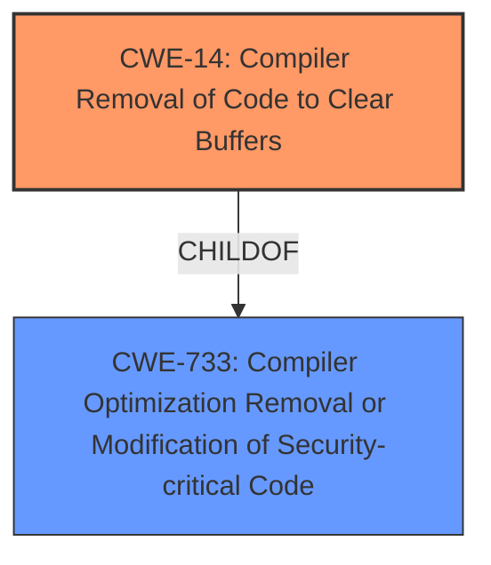

# Final Resolution for CVE-2021-20313

# Summary
| CWE ID | CWE Name | Confidence | CWE Abstraction Level | CWE Vulnerability Mapping Label | CWE-Vulnerability Mapping Notes |
|---|---|---|---|---|---|
| CWE-14 | Compiler Removal of Code to Clear Buffers | 0.95 | Variant | Allowed | Primary CWE |
| CWE-733 | Compiler Optimization Removal or Modification of Security-critical Code | 0.7 | Base | Allowed | Secondary Candidate |

## Evidence and Confidence

*   **Confidence Score:** 0.9
*   **Evidence Strength:** HIGH

## Relationship Analysis
The primary relationship influencing the decision is the hierarchical connection between CWE-733 (Compiler Optimization Removal or Modification of Security-critical Code) and CWE-14 (Compiler Removal of Code to Clear Buffers). CWE-14 is a specific instance (Variant) of the more general class of compiler optimization issues described by CWE-733 (Base). Although the description focuses on CWE-14 because of its specificity, it's important to acknowledge CWE-733 as context.

## Vulnerability Chain
The vulnerability chain involves the compiler removing the `memset` call, resulting in sensitive cipher data remaining in memory. This can then lead to a **cipher leak**, potentially enabling further attacks.
  - **ROOTCAUSE**: Compiler optimization removes security-critical code (CWE-733)
  - **WEAKNESS**: Sensitive memory is not cleared (CWE-14)
  - **IMPACT**: Cipher leak, potential for further exploitation.

## Summary of Analysis
The initial analysis correctly identified CWE-14 (Compiler Removal of Code to Clear Buffers) as the primary **WEAKNESS**. The criticism raised valid points about considering the broader context of CWE-733 (Compiler Optimization Removal or Modification of Security-critical Code) and explicitly addressing why CWE-1240 (Use of a Cryptographic Primitive with a Risky Implementation) is not the best fit.

The vulnerability description states: "A flaw was found in ImageMagick in versions before 7.0.11. A potential **cipher leak** when the calculate signatures in TransformSignature is possible." The CVE Reference Links Content Summary confirms this, stating that the issue was addressed by replacing `memset` with `ResetMagickMemory` and defining `ResetMagickMemory` using a volatile pointer to prevent compiler optimizations. This evidence supports the selection of CWE-14, as it directly relates to the compiler's optimization interfering with security-sensitive memory clearing.

While CWE-1240 involves risky cryptographic implementations, the vulnerability here does not stem from an inherently flawed cryptographic primitive. Instead, the issue arises from the compiler's removal of the memory-clearing operation surrounding the cryptographic function. Therefore, CWE-14 more accurately represents the **ROOTCAUSE**.

CWE-733 is added as a secondary candidate to represent that the compiler optimization is the broader context of the **WEAKNESS**.

The final decision is based on a combination of direct evidence from the vulnerability description, relationship analysis (specifically the child-of relationship between CWE-14 and CWE-733), and adherence to CWE mapping guidance. The selected CWEs provide the optimal level of specificity, with CWE-14 representing the direct cause and CWE-733 providing context.