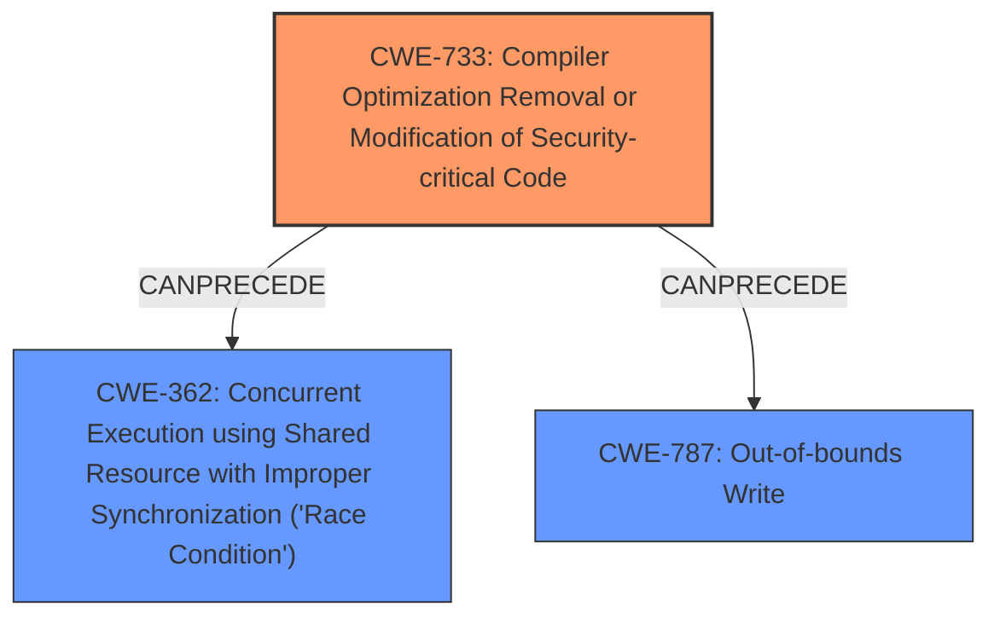

# Final Resolution for CVE-2021-20320

# Summary
| CWE ID | CWE Name | Confidence | CWE Abstraction Level | CWE Vulnerability Mapping Label | CWE-Vulnerability Mapping Notes |
|---|---|---|---|---|---|
| CWE-733 | Compiler Optimization Removal or Modification of Security-critical Code | 0.85 | Base | Allowed | Primary CWE |
| CWE-362 | Concurrent Execution using Shared Resource with Improper Synchronization ('Race Condition') | 0.45 | Class | Allowed-with-Review | Secondary Candidate |
| CWE-787 | Out-of-bounds Write | 0.35 | Base | Allowed | Secondary Candidate |

## Evidence and Confidence

*   **Confidence Score:** 0.8
*   **Evidence Strength:** MEDIUM

## Relationship Analysis
The primary **weakness** is rooted in CWE-733, where the compiler's optimization removes or modifies security-critical code. This can lead to a bypass of the verifier. Concurrently, if multiple threads are using the JIT compiler, **CWE-362** (Race Condition) could arise, where the miscompilation affects verifier behavior across different threads. The modification of the code can result in **CWE-787** (Out-of-bounds Write), which arises from the initial compiler issue.

## Vulnerability Chain
The **vulnerability chain** starts with **CWE-733**, the **miscompilation** of security-critical code. If this occurs in a concurrent environment, it can lead to **CWE-362**, a race condition affecting the verifier. The compiler optimization can also lead to memory corruption, causing **CWE-787**, resulting in potential privilege escalation by the local attacker.

## Summary of Analysis
Based on the initial analysis and the criticism, **CWE-733** is the most appropriate primary **weakness** due to the direct evidence in the vulnerability description regarding compiler optimization issues. The criticism suggested that **CWE-362** could be a possible secondary candidate, which has been incorporated due to the concurrent nature of JIT compilers. **CWE-787** is also considered since **miscompilation** can lead to memory corruption.

The provided evidence from the CVE summary, stating that "a local attacker with special user privilege can circumvent the verifier and may lead to a confidentiality problem," supports the selection of **CWE-733** as the root cause.

The selected CWEs are at an optimal level of specificity because they are either at the Base (**CWE-733** and **CWE-787**) or Class (**CWE-362**) level, providing a clear and actionable representation of the underlying security flaws.