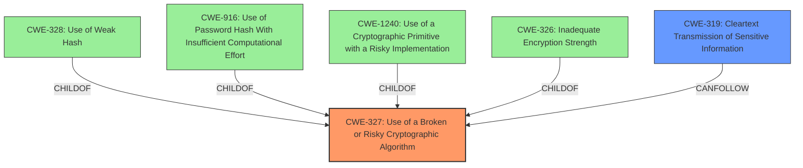

# Final Resolution for CVE-2021-20360

# Summary
| CWE ID  | CWE Name                                                  | Confidence | CWE Abstraction Level | CWE Vulnerability Mapping Label | CWE-Vulnerability Mapping Notes |
| :-------- | :-------------------------------------------------------- | :--------- | :-------------------- | :------------------------------ | :------------------------------ |
| CWE-327 | Use of a Broken or Risky Cryptographic Algorithm          | 0.75       | Class                 | Allowed-with-Review             | Primary CWE                    |
| CWE-319 | Cleartext Transmission of Sensitive Information          | 0.70       | Base                  | Allowed                         | Secondary Candidate             |

## Evidence and Confidence

*   **Confidence Score:** 0.75
*   **Evidence Strength:** MEDIUM

## Relationship Analysis
The primary relationship impacting the decision is the hierarchical relationship between CWE-327 and its potential child CWEs, specifically CWE-328, CWE-916, CWE-1240 and CWE-326. The analysis considered whether the provided information was specific enough to justify a more precise classification. The inclusion of CWE-319 as a secondary issue highlights a potential vulnerability chain where weak cryptography (CWE-327) can lead to sensitive information being transmitted in cleartext.

## Vulnerability Chain
The vulnerability chain starts with the **ROOTCAUSE** of using weaker than expected cryptographic algorithms (CWE-327). This weakness allows an attacker to potentially decrypt highly sensitive information. The use of insecure HTTP communications then leads to the transmission of sensitive information in cleartext (CWE-319), exacerbating the risk.

## Summary of Analysis
The initial analysis and criticism both agree that CWE-327 (Use of a Broken or Risky Cryptographic Algorithm) is a reasonable primary classification, given the vulnerability description's explicit mention of "weaker than expected cryptographic algorithms." The confidence level has been adjusted to 0.75 to reflect the lack of specific details about the algorithms used. The inclusion of CWE-319 (Cleartext Transmission of Sensitive Information) is supported by the evidence indicating "**Insecure HTTP communications are used**" (CVE Reference Links Content Summary).

The graph relationships influenced the decision by highlighting the need to consider more specific child CWEs of CWE-327. However, without further information on the specific algorithms or their weaknesses, remaining at the Class level is deemed appropriate.

The selected CWEs are at the optimal level of specificity based on the available evidence. While more specific Base or Variant CWEs might exist, the current description doesn't provide enough detail to justify a more precise classification.