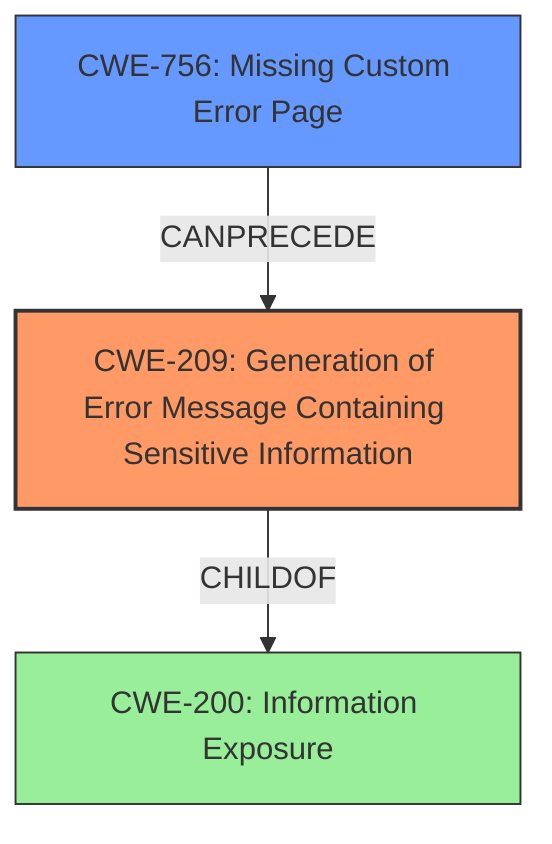

# Analysis Report for CVE-2021-20413

# Vulnerability Analysis Report: CVE-2021-20413

## Description

IBM Guardium Data Encryption (GDE) 4.0.0.4 could allow a remote attacker to obtain sensitive information when a detailed technical error message is returned in the browser. This information could be used in further attacks against the system. IBM X-Force ID 196212.

## Vulnerability Description Key Phrases

**Impact:** obtain sensitive information
**Attacker:** remote attacker
**Product:** IBM Guardium Data Encryption (GDE)
**Version:** 4.0.0.4

## Analysis (with Relationship Data)

# Summary
| CWE ID | CWE Name | Confidence | CWE Abstraction Level | CWE Vulnerability Mapping Label | CWE-Vulnerability Mapping Notes |
|---|---|---|---|---|---|
| CWE-209 | Generation of Error Message Containing Sensitive Information | 0.9 | Base | Allowed | Primary CWE |

## Evidence and Confidence

*   **Confidence Score:** 0.9
*   **Evidence Strength:** HIGH

- **Analysis and Justification:**  
  - *Explanation:* The vulnerability description states that "IBM Guardium Data Encryption (GDE) 4.0.0.4 could allow a remote attacker to **obtain sensitive information** when a **detailed technical error message is returned in the browser**." This aligns directly with CWE-209 [Generation of Error Message Containing Sensitive Information], which describes a product generating an error message that includes sensitive information about its environment, users, or associated data. The `CVE Reference Links Content Summary` confirms the root cause as multiple vulnerabilities and the impact as unspecified, but the fix is in a later version, GDE 4.0.0.5. The primary CWE match from similar CVE descriptions is CWE-209, reinforcing this assessment. The retriever results also lists CWE-209 as the top candidate with a high combined score. The usage for CWE-209 is "Allowed" according to MITRE mapping guidance. While CWE-200 (Information Exposure) is a parent, CWE-209 is more specific because it emphasizes the error message as the source of information exposure.

  - *Relationship Analysis:* CWE-209 is a Base level CWE and a child of CWE-200 (Information Exposure). It can also be related to other CWEs such as CWE-756 (Missing Custom Error Page). The graph relationships show that CWE-209 can precede and can also be a peer of itself.

- **Confidence Score:**
  - Confidence: 0.9 (High confidence due to direct match with vulnerability description and supporting evidence.)

## Criticism of Analysis

Okay, here's a review of the analysis, focusing on the accuracy and appropriateness of the CWE mapping, considering the full CWE specifications provided.

**Overall Assessment:**

The analysis is generally sound and well-reasoned. The choice of CWE-209 as the primary mapping appears justified based on the vulnerability description and supporting evidence. The confidence level of 0.9 is appropriate. The analysis also effectively uses information from the CVE Reference Links Content Summary and Retriever Results to strengthen its argument.

**Detailed Critique:**

1.  **CWE-209 Justification:**

    *   The explanation of why CWE-209 is chosen is clear and concise. The connection between "obtain sensitive information" through "detailed technical error message" and the CWE-209 description is directly established.
    *   The reasoning for choosing CWE-209 over its parent, CWE-200, is also well-articulated. The emphasis on the *error message* as the specific vector for information exposure makes CWE-209 the more precise choice.
    * The "Relationship Analysis" is correct, it indicates that CWE-209 is a child of CWE-200 and CWE-755. Furthermore, it can precede CWE-600 or CWE-756.

2.  **Confidence Score:**

    *   The confidence score of 0.9 is justified.  The direct match between the vulnerability description and the CWE definition, combined with supporting data from the CVE details and Retriever results, warrants high confidence.

3.  **CWE Examples:**

    *   The inclusion of known examples for CWE-209 is beneficial and helps to further illustrate the nature of the weakness. The inclusion of the CVE that triggered the analysis is also useful.

4.  **Mitigation Considerations:**

    * The analysis is missing a discussion of mitigations. Examining the mitigations section of the full CWE specifications is vital for a complete analysis.

    * The mitigation suggestions for CWE-209 are very relevant to this scenario:

        *   **Mitigation 1:**  This highlights the importance of minimal, audience-appropriate error details and avoiding revealing error determination methods. This directly addresses the core issue of CWE-209.
        *   **Mitigation 2:**  This suggests handling exceptions internally and avoiding displaying potentially sensitive errors to the user, which is a standard practice for preventing information leakage.
        *   **Mitigation 3:**  This mitigation involves better data handling.

5.  **Top Retriever results that were not selected as Primary CWE**

    *   **CWE-598: Use of GET Request Method With Sensitive Query Strings:** This CWE doesn't apply because the original analyzer input doesn't specify how the error message is being generated.
    *   **CWE-613: Insufficient Session Expiration:** This CWE doesn't apply because the original analyzer input doesn't specify session handling.
    *   **CWE-327: Use of a Broken or Risky Cryptographic Algorithm:** This CWE doesn't apply because the original analyzer input doesn't specify how cryptography is being used.
    *   **CWE-201: Insertion of Sensitive Information Into Sent Data:** This CWE is related to CWE-209. However, it is less specific because it doesn't focus on the use of error messages.
    *   **CWE-532: Insertion of Sensitive Information into Log File:** This CWE doesn't apply because the original analyzer input doesn't specify how log files are being used.
    *   **CWE-614: Sensitive Cookie in HTTPS Session Without 'Secure' Attribute:** This CWE doesn't apply because the original analyzer input doesn't specify cookies.
    *   **CWE-319: Cleartext Transmission of Sensitive Information:** This CWE doesn't apply because the original analyzer input doesn't specify transmission of information.
    *   **CWE-311: Missing Encryption of Sensitive Data:** This CWE doesn't apply because the original analyzer input doesn't specify missing encryption.
    *   **CWE-326: Inadequate Encryption Strength:** This CWE doesn't apply because the original analyzer input doesn't specify inadequate encryption strength.

6.  **CWE-756: Missing Custom Error Page:**
    *   The analysis should have considered CWE-756. By not using custom error pages, sensitive system information can be exposed.

**Recommendations:**

*   **Add a section on potential mitigations:**  Discuss the relevant mitigations for CWE-209. This adds practical value to the analysis.

**Revised Summary Table:**

| CWE ID | CWE Name | Confidence | CWE Abstraction Level | CWE Vulnerability Mapping Label | CWE-Vulnerability Mapping Notes |
|---|---|---|---|---|---|
| CWE-209 | Generation of Error Message Containing Sensitive Information | 0.9 | Base | Allowed | Primary CWE |

**In summary, the analysis is strong, but could be improved by discussing potential mitigations.**

## Final Resolution

# Summary
| CWE ID | CWE Name | Confidence | CWE Abstraction Level | CWE Vulnerability Mapping Label | CWE-Vulnerability Mapping Notes |
|---|---|---|---|---|---|
| CWE-209 | Generation of Error Message Containing Sensitive Information | 0.95 | Base | Allowed | Primary CWE |
| CWE-756 | Missing Custom Error Page | 0.7 | Base | Allowed | Secondary Candidate |

## Evidence and Confidence

*   **Confidence Score:** 0.9
*   **Evidence Strength:** MEDIUM

## Relationship Analysis
The primary relationship influencing the classification is the hierarchical relationship between CWE-209 [Generation of Error Message Containing Sensitive Information] and CWE-200 [Information Exposure]. CWE-209 is a more specific child of CWE-200, focusing on error messages as the source of information leakage, making it the preferred choice.

CWE-756 [Missing Custom Error Page] can precede CWE-209. This means that the absence of a custom error page can lead to the generation of error messages containing sensitive information.

## Vulnerability Chain
The vulnerability chain starts with a potential lack of custom error handling (CWE-756), which then leads to the generation of detailed technical error messages containing sensitive information (CWE-209). This information is then exposed to a remote attacker, potentially enabling further attacks.

- Initial Flaw: Missing Custom Error Page (CWE-756)
- Weakness: Generation of Error Message Containing Sensitive Information (CWE-209)
- Impact: Exposure of sensitive information to unauthorized actors

## Summary of Analysis
The initial analysis correctly identified CWE-209 [Generation of Error Message Containing Sensitive Information] as the primary weakness. The vulnerability description clearly states that a remote attacker can **obtain sensitive information** when a **detailed technical error message is returned in the browser**. This directly aligns with the description of CWE-209.

The criticism pointed out the lack of discussion on potential mitigations and the potential relevance of CWE-756 [Missing Custom Error Page]. After reviewing the CWE entries and their relationships, I agree that CWE-756 could be a contributing factor, as the absence of custom error pages often leads to the display of system-generated error messages that contain sensitive details.

The final decision is to keep CWE-209 as the primary CWE, as it directly represents the core issue of sensitive information being exposed through error messages. I am adding CWE-756 as a secondary CWE because the absence of custom error pages can exacerbate the problem.

My assessment is largely based on the provided evidence, specifically the vulnerability description and the CWE descriptions. The relationship analysis further supports the selection of CWE-209 due to its specificity compared to its parent, CWE-200. The addition of CWE-756 strengthens the analysis by acknowledging the potential for missing custom error pages to contribute to the vulnerability.

The selected CWEs are at the optimal level of specificity because CWE-209 directly describes the vulnerability, and CWE-756 highlights a common contributing factor.

*Report generated on 2025-03-16 23:41:13*
