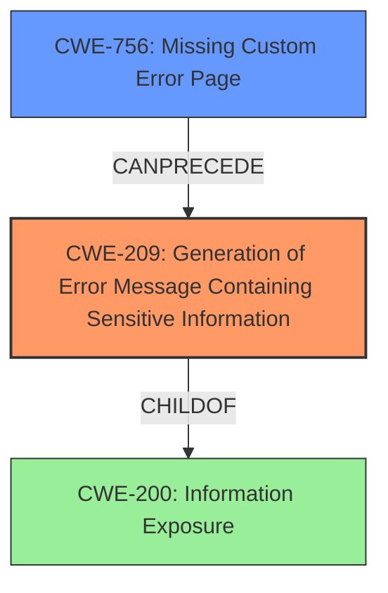

# Final Resolution for CVE-2021-20413

# Summary
| CWE ID | CWE Name | Confidence | CWE Abstraction Level | CWE Vulnerability Mapping Label | CWE-Vulnerability Mapping Notes |
|---|---|---|---|---|---|
| CWE-209 | Generation of Error Message Containing Sensitive Information | 0.95 | Base | Allowed | Primary CWE |
| CWE-756 | Missing Custom Error Page | 0.7 | Base | Allowed | Secondary Candidate |

## Evidence and Confidence

*   **Confidence Score:** 0.9
*   **Evidence Strength:** MEDIUM

## Relationship Analysis
The primary relationship influencing the classification is the hierarchical relationship between CWE-209 [Generation of Error Message Containing Sensitive Information] and CWE-200 [Information Exposure]. CWE-209 is a more specific child of CWE-200, focusing on error messages as the source of information leakage, making it the preferred choice.

CWE-756 [Missing Custom Error Page] can precede CWE-209. This means that the absence of a custom error page can lead to the generation of error messages containing sensitive information.

## Vulnerability Chain
The vulnerability chain starts with a potential lack of custom error handling (CWE-756), which then leads to the generation of detailed technical error messages containing sensitive information (CWE-209). This information is then exposed to a remote attacker, potentially enabling further attacks.

- Initial Flaw: Missing Custom Error Page (CWE-756)
- Weakness: Generation of Error Message Containing Sensitive Information (CWE-209)
- Impact: Exposure of sensitive information to unauthorized actors

## Summary of Analysis
The initial analysis correctly identified CWE-209 [Generation of Error Message Containing Sensitive Information] as the primary weakness. The vulnerability description clearly states that a remote attacker can **obtain sensitive information** when a **detailed technical error message is returned in the browser**. This directly aligns with the description of CWE-209.

The criticism pointed out the lack of discussion on potential mitigations and the potential relevance of CWE-756 [Missing Custom Error Page]. After reviewing the CWE entries and their relationships, I agree that CWE-756 could be a contributing factor, as the absence of custom error pages often leads to the display of system-generated error messages that contain sensitive details.

The final decision is to keep CWE-209 as the primary CWE, as it directly represents the core issue of sensitive information being exposed through error messages. I am adding CWE-756 as a secondary CWE because the absence of custom error pages can exacerbate the problem.

My assessment is largely based on the provided evidence, specifically the vulnerability description and the CWE descriptions. The relationship analysis further supports the selection of CWE-209 due to its specificity compared to its parent, CWE-200. The addition of CWE-756 strengthens the analysis by acknowledging the potential for missing custom error pages to contribute to the vulnerability.

The selected CWEs are at the optimal level of specificity because CWE-209 directly describes the vulnerability, and CWE-756 highlights a common contributing factor.