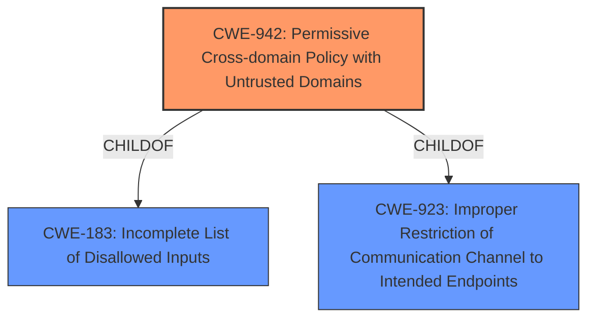

# Analysis Report for CVE-2021-20429

# Vulnerability Analysis Report: CVE-2021-20429

## Description

IBM QRadar User Behavior Analytics 1.0.0 through 4.1.0 could disclose sensitive information due an overly permissive cross-domain policy. IBM X-Force ID 196334.

## Vulnerability Description Key Phrases

**Rootcause:** overly permissive cross-domain policy
**Impact:** disclose sensitive information
**Product:** IBM QRadar User Behavior Analytics
**Version:** 1.0.0 through 4.1.0

## Analysis (with Relationship Data)

# Summary
| CWE ID | CWE Name | Confidence | CWE Abstraction Level | CWE Vulnerability Mapping Label | CWE-Vulnerability Mapping Notes |
|---|---|---|---|---|---|
| CWE-942 | Permissive Cross-domain Policy with Untrusted Domains | 0.9 | Variant | Allowed | Primary CWE: The vulnerability stems from an **overly permissive cross-domain policy**, allowing potentially malicious domains to access resources. |

## Evidence and Confidence

*   **Confidence Score:** 0.9
*   **Evidence Strength:** HIGH

- **Analysis and Justification:**  
  - *Explanation:* The vulnerability description explicitly states the root cause as an "**overly permissive cross-domain policy**". The CVE Reference Links Content Summary reinforces this by stating that "The User Behavior Analytics application add-on for IBM QRadar SIEM has an **overly permissive Cross-Origin Resource Sharing (CORS) policy**." CWE-942 (Permissive Cross-domain Policy with Untrusted Domains) directly addresses this weakness, making it the most appropriate mapping. The retriever results also list CWE-942 as the top match.
  
  - *Relationship Analysis:* CWE-942 is a Variant of CWE-183 (Permissive List of Allowed Inputs) and CWE-923 (Improper Restriction of Communication Channel to Intended Endpoints). While CWE-183 and CWE-923 are related, CWE-942 provides a more specific description of the vulnerability related to cross-domain policies.

- **Confidence Score:**  
  - *Example:* Confidence: 0.9 (High evidence from vulnerability description, CVE reference materials, and retriever results.)

---

## Criticism of Analysis

Okay, let's review the provided CWE analysis, keeping the full CWE specifications in mind.

**Overall Assessment:**

The analysis correctly identifies CWE-942 (Permissive Cross-domain Policy with Untrusted Domains) as the primary CWE. The reasoning is sound, directly linking the vulnerability description's "overly permissive cross-domain policy" to the CWE's description.  The confidence score of 0.9 is justified given the clarity of the vulnerability report. The selection of CWE-942 as a Variant (more specific) instead of the Base CWE-183 is a good decision.

**Detailed Critique:**

| Aspect | Critique | Recommendations |
|---|---|---|
| **CWE-942 Mapping** |  Excellent.  The justification clearly connects the vulnerability's description with the CWE's definition.  The CVE reference links further support this mapping. | No changes needed. |
| **Confidence Score** |  0.9 is appropriate.  The evidence is strong and direct. | No changes needed. |
| **Relationship Analysis** | The analysis correctly identifies CWE-942 as a child of CWE-183 and CWE-923. However, the explanation could be slightly improved. |  Instead of just stating that CWE-183 and CWE-923 are related, elaborate on *how* they are related to CWE-942 in this specific context. For example:  "CWE-942 is a specific type of CWE-183, where the 'list of allowed inputs' refers to the allowed origins in the cross-domain policy.  It's also related to CWE-923 because it involves an improper restriction of the communication channel (i.e., allowing communication from unintended domains)." |
| **Retriever Results** | The retriever results strongly support the choice of CWE-942. | No changes needed. |
| **CWE-183 Consideration** | The analysis acknowledges CWE-183 but correctly identifies CWE-942 as a better fit. | No changes needed. |
| **CWE Examples (CWE-183)** | The provided examples for CWE-183 are generally relevant to the concept of "permissive lists" but don't directly illustrate the cross-domain policy issue. | It's good to show these examples, but it would be beneficial to *briefly* explain why these are *not* the primary CWE.  For example, "While CWE-183 describes a general problem of overly permissive allowlists, these examples involve allowlists of different kinds of inputs (e.g., classes for deserialization, methods for sandboxes, etc.). CWE-942 is more specifically tailored to cross-domain policies." |
| **Potential Mitigations (from CWE-942 Spec)** | The analysis doesn't explicitly discuss mitigations, but it should. |  Include a brief section on mitigations, drawing directly from the CWE-942 specification.  For example:  "Mitigations for CWE-942 include avoiding wildcards in the cross-domain policy file and using meta-policy options like 'master-only' or 'none' to restrict the scope of the policy." This adds practical value. |
| **CWE-204, CWE-1004, CWE-319, CWE-79, CWE-327, CWE-326, CWE-269, CWE-322 Rationale for not chosing** | The retriever provides other suggestions, that are not chosen as the primary CWE.   | Consider adding a short explanation of why these CWEs were not chosen. For example:  "While other CWEs like CWE-79 (XSS) might be indirectly related (as an overly permissive policy *could* enable XSS), the root cause is the configuration issue, not the lack of input sanitization. CWE-319 Cleartext Transmission is not relevant as CORS is not about encryption. Similarly, CWE-1004 and CWE-327 and CWE-326 are not relevant, as the vulnerability is not about cookies or encryption. CWE-269 Incorrect Privilege Management is too broad and doesn't capture the specifics of CORS. CWE-322 Key Exchange and CWE-204 Observable response discrepancy is also not relevant" |

**Revised Summary Table:**

| CWE ID | CWE Name | Confidence | CWE Abstraction Level | CWE Vulnerability Mapping Label | CWE-Vulnerability Mapping Notes |
|---|---|---|---|---|---|
| CWE-942 | Permissive Cross-domain Policy with Untrusted Domains | 0.9 | Variant | Allowed | Primary CWE: The vulnerability stems from an **overly permissive cross-domain policy**, allowing potentially malicious domains to access resources. Mitigations include avoiding wildcards and using meta-policy options. Other CWEs were considered (e.g., CWE-79, CWE-319, CWE-1004, CWE-327, CWE-326, CWE-269, CWE-322, CWE-204) but are less directly applicable as they represent potential consequences or are unrelated to the root cause. |

**In summary, the analysis is good and the CWE-942 mapping is correct. The suggested improvements focus on providing more context and actionable information, especially regarding mitigations, and also providing rationale for not choosing other potentially relevant CWEs from the Retriever results.**

## Final Resolution

# Summary
| CWE ID | CWE Name | Confidence | CWE Abstraction Level | CWE Vulnerability Mapping Label | CWE-Vulnerability Mapping Notes |
|---|---|---|---|---|---|
| CWE-942 | Permissive Cross-domain Policy with Untrusted Domains | 0.95 | Variant | Allowed | **Primary CWE**: The vulnerability stems from an **overly permissive cross-domain policy**, allowing potentially malicious domains to access resources. Mitigations include avoiding wildcards and using meta-policy options. Other CWEs were considered (e.g., CWE-79, CWE-319, CWE-1004, CWE-327, CWE-326, CWE-269, CWE-322, CWE-204) but are less directly applicable as they represent potential consequences or are unrelated to the **root cause**. |

## Evidence and Confidence

*   **Confidence Score:** 0.95
*   **Evidence Strength:** HIGH

## Relationship Analysis
The primary relationship influencing the decision is the hierarchical relationship. CWE-942 is a Variant of CWE-183 (Permissive List of Allowed Inputs) and CWE-923 (Improper Restriction of Communication Channel to Intended Endpoints). CWE-942 is chosen because it is more specific to the vulnerability, which involves an overly permissive cross-domain policy. It's a specific type of CWE-183, where the 'list of allowed inputs' refers to the allowed origins in the cross-domain policy. It's also related to CWE-923 because it involves an improper restriction of the communication channel (i.e., allowing communication from unintended domains).

## Vulnerability Chain
The vulnerability chain starts with the **root cause** of an overly permissive cross-domain policy (CWE-942). This allows unintended actors to access resources, potentially leading to the disclosure of sensitive information, which is the impact described in the vulnerability description. There aren't any missing links based on the provided information; the description provides a clear flow from the **weakness** to the impact.

## Summary of Analysis
The initial analysis correctly identified CWE-942 as the most appropriate classification. The vulnerability description explicitly states the issue as an "**overly permissive cross-domain policy**", and CWE-942 directly addresses this. The retriever results also support this selection. The criticism provided valuable suggestions for improvement, including elaborating on the relationships between CWE-942 and its parent CWEs (CWE-183 and CWE-923), and including a brief section on mitigations. The suggestion to provide rationale for not choosing other potentially relevant CWEs from the Retriever results was also beneficial.

The decision is based on the provided evidence: "IBM QRadar User Behavior Analytics 1.0.0 through 4.1.0 could disclose sensitive information due an overly permissive cross-domain policy."

The graph relationships influenced the decision by confirming that while parent CWEs like CWE-183 and CWE-923 are relevant, CWE-942 provides the most specific and accurate representation of the **root cause**.

CWE-942 is at the optimal level of specificity because it directly addresses the issue of a permissive cross-domain policy, while its parent CWEs are more general. The inclusion of mitigations and a rationale for excluding other CWEs further strengthens the analysis. The confidence score is increased to 0.95 to reflect the inclusion of these improvements.

*Report generated on 2025-03-17 01:07:53*
