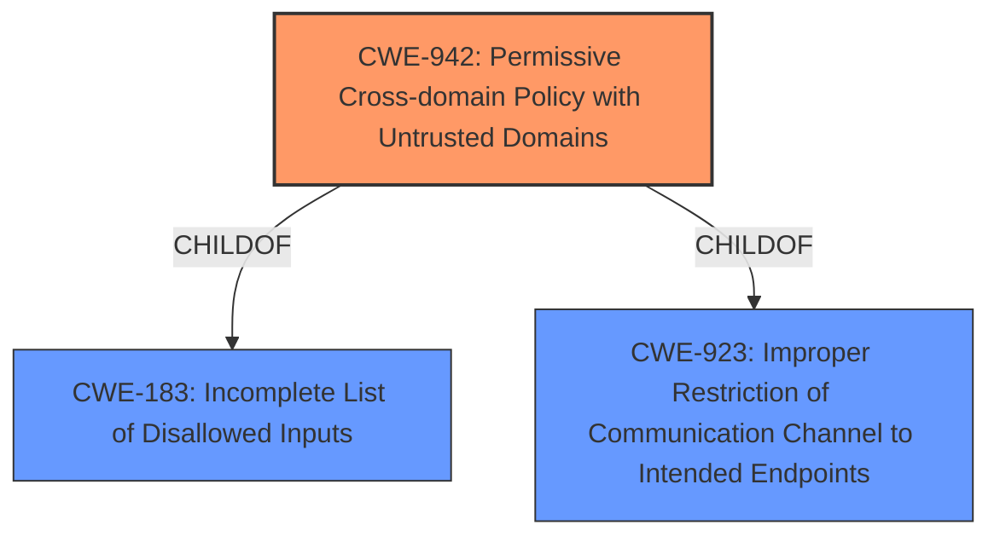

# Final Resolution for CVE-2021-20429

# Summary
| CWE ID | CWE Name | Confidence | CWE Abstraction Level | CWE Vulnerability Mapping Label | CWE-Vulnerability Mapping Notes |
|---|---|---|---|---|---|
| CWE-942 | Permissive Cross-domain Policy with Untrusted Domains | 0.95 | Variant | Allowed | **Primary CWE**: The vulnerability stems from an **overly permissive cross-domain policy**, allowing potentially malicious domains to access resources. Mitigations include avoiding wildcards and using meta-policy options. Other CWEs were considered (e.g., CWE-79, CWE-319, CWE-1004, CWE-327, CWE-326, CWE-269, CWE-322, CWE-204) but are less directly applicable as they represent potential consequences or are unrelated to the **root cause**. |

## Evidence and Confidence

*   **Confidence Score:** 0.95
*   **Evidence Strength:** HIGH

## Relationship Analysis
The primary relationship influencing the decision is the hierarchical relationship. CWE-942 is a Variant of CWE-183 (Permissive List of Allowed Inputs) and CWE-923 (Improper Restriction of Communication Channel to Intended Endpoints). CWE-942 is chosen because it is more specific to the vulnerability, which involves an overly permissive cross-domain policy. It's a specific type of CWE-183, where the 'list of allowed inputs' refers to the allowed origins in the cross-domain policy. It's also related to CWE-923 because it involves an improper restriction of the communication channel (i.e., allowing communication from unintended domains).

## Vulnerability Chain
The vulnerability chain starts with the **root cause** of an overly permissive cross-domain policy (CWE-942). This allows unintended actors to access resources, potentially leading to the disclosure of sensitive information, which is the impact described in the vulnerability description. There aren't any missing links based on the provided information; the description provides a clear flow from the **weakness** to the impact.

## Summary of Analysis
The initial analysis correctly identified CWE-942 as the most appropriate classification. The vulnerability description explicitly states the issue as an "**overly permissive cross-domain policy**", and CWE-942 directly addresses this. The retriever results also support this selection. The criticism provided valuable suggestions for improvement, including elaborating on the relationships between CWE-942 and its parent CWEs (CWE-183 and CWE-923), and including a brief section on mitigations. The suggestion to provide rationale for not choosing other potentially relevant CWEs from the Retriever results was also beneficial.

The decision is based on the provided evidence: "IBM QRadar User Behavior Analytics 1.0.0 through 4.1.0 could disclose sensitive information due an overly permissive cross-domain policy."

The graph relationships influenced the decision by confirming that while parent CWEs like CWE-183 and CWE-923 are relevant, CWE-942 provides the most specific and accurate representation of the **root cause**.

CWE-942 is at the optimal level of specificity because it directly addresses the issue of a permissive cross-domain policy, while its parent CWEs are more general. The inclusion of mitigations and a rationale for excluding other CWEs further strengthens the analysis. The confidence score is increased to 0.95 to reflect the inclusion of these improvements.