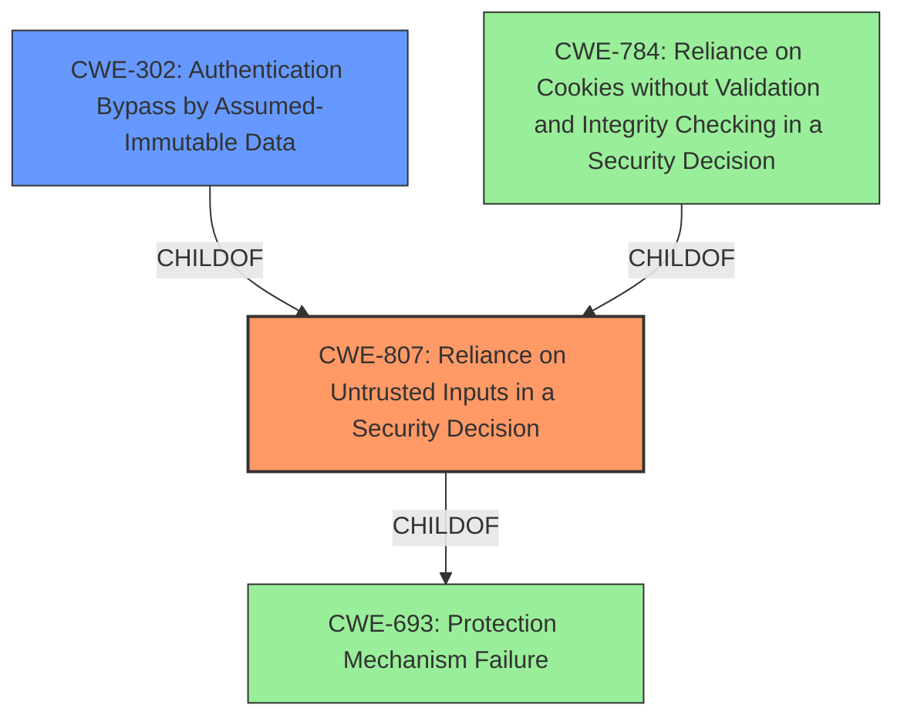

# Final Resolution for CVE-2021-20565

# Summary
| CWE ID | CWE Name | Confidence | CWE Abstraction Level | CWE Vulnerability Mapping Label | CWE-Vulnerability Mapping Notes |
|---|---|---|---|---|---|
| CWE-807 | Reliance on Untrusted Inputs in a Security Decision | 0.9 | Base | Allowed | Primary CWE. The description explicitly states the vulnerability relies on the existence or values of an input that can be modified by an untrusted actor, which bypasses the protection mechanism. |
| CWE-302 | Authentication Bypass by Assumed-Immutable Data | 0.6 | Base | Allowed | Secondary CWE. Relevant if the input is assumed to be immutable but isn't. |

## Evidence and Confidence

*   **Confidence Score:** 0.8
*   **Evidence Strength:** MEDIUM

## Relationship Analysis
The primary CWE is CWE-807 (**Reliance on Untrusted Inputs in a Security Decision**). Its parent is CWE-693 (**Protection Mechanism Failure**), a high-level *Pillar*. CWE-807's children, CWE-302 (**Authentication Bypass by Assumed-Immutable Data**) and CWE-784 (**Reliance on Cookies without Validation and Integrity Checking in a Security Decision**) are relevant if the specific scenario aligns.

I am adding CWE-302 as a secondary concern because if the *input* is assumed to be immutable but isn't, then CWE-302 becomes relevant.

## Vulnerability Chain
The vulnerability chain starts with the **ROOTCAUSE** being the use of a **protection mechanism** that relies on the existence or values of an input. The **WEAKNESS** is that this input can be modified by an untrusted actor. The consequence is that the protection mechanism can be bypassed. If the bypassed protection mechanism is authentication and the modified input was assumed to be immutable, the chain extends to involve CWE-302.

## Summary of Analysis
The initial analysis correctly identified CWE-807 (**Reliance on Untrusted Inputs in a Security Decision**) as the primary CWE, with a high confidence score of 0.9. The vulnerability description explicitly states that the **weakness** relies on the existence or values of an input that can be modified by an untrusted actor, which bypasses the **protection mechanism**. This aligns almost perfectly with the CWE-807 description.

The criticism provided valuable suggestions, particularly in enhancing the relationship analysis and considering specific mitigations. Based on the additional information and analysis, I am keeping CWE-807 as the primary **ROOTCAUSE**.

I am also adding CWE-302 (**Authentication Bypass by Assumed-Immutable Data**) as a secondary CWE, contingent on the input being assumed immutable. This provides a more specific classification if the vulnerability aligns with this additional characteristic.

The final decision is based on the provided evidence and the relationships between CWEs. The selected CWEs are at the optimal level of specificity, reflecting the root cause and potential contributing factors to the vulnerability.