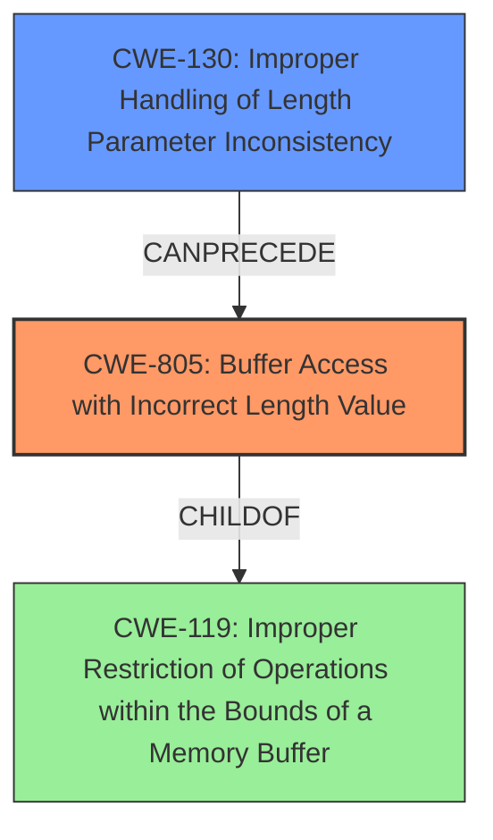

# Analysis Report for CVE-2021-20589

# Vulnerability Analysis Report: CVE-2021-20589

## Description

Buffer access with incorrect length value vulnerability in GOT2000 series GT27 model communication driver versions 01.19.000 through 01.38.000, GT25 model communication driver versions 01.19.000 through 01.38.000, GT23 model communication driver versions 01.19.000 through 01.38.000 and GT21 model communication driver versions 01.21.000 through 01.39.000, GOT SIMPLE series GS21 model communication driver versions 01.21.000 through 01.39.000, GT SoftGOT2000 versions 1.170C through 1.250L and Tension Controller LE7-40GU-L Screen package data for MODBUS/TCP V1.00 allows a remote unauthenticated attacker to stop the communication function of the products via specially crafted packets.

## Vulnerability Description Key Phrases

**Weakness:** buffer access with incorrect length value
**Impact:** stop the communication function
**Vector:** specially crafted packets
**Attacker:** remote unauthenticated attacker
**Product:** ['GOT2000 series GT27 model', 'GT25 model', 'GT23 model', 'GT21 model', 'GOT SIMPLE series GS21 model', 'GT SoftGOT2000', 'Tension Controller LE7-40GU-L Screen']
**Version:** ['01.19.000 through 01.38.000', '01.19.000 through 01.38.000', '01.19.000 through 01.38.000', '01.21.000 through 01.39.000', '01.21.000 through 01.39.000', '1.170C through 1.250L']
**Component:** ['communication driver', 'communication driver', 'communication driver', 'communication driver', 'communication driver', 'Screen package data for MODBUS/TCP']

## Analysis (with Relationship Data)

# Summary
| CWE ID  | CWE Name                                       | Confidence | CWE Abstraction Level | CWE Vulnerability Mapping Label | CWE-Vulnerability Mapping Notes |
|---------|------------------------------------------------|------------|-----------------------|---------------------------------|-------------------------------|
| CWE-805 | Buffer Access with Incorrect Length Value       | 1.00       | Base                  | Primary                         | Allowed                       |
| CWE-130 | Improper Handling of Length Parameter Inconsistency | 0.75       | Base                  | Secondary                       | Allowed                       |

## Evidence and Confidence

*   **Confidence Score:** 0.90
*   **Evidence Strength:** HIGH

- **Analysis and Justification:**  
  - *Explanation:* "The vulnerability is due to a **buffer access with incorrect length value**, as stated in the vulnerability description and confirmed by the CVE reference summary. The summary explicitly mentions 'The vulnerability stems from a buffer access with an incorrect length value (CWE-805) within the MODBUS/TCP slave communication function'. This aligns directly with CWE-805 (Buffer Access with Incorrect Length Value), which describes a scenario where a product uses a sequential operation to read or write a buffer but uses an incorrect length value that causes it to access memory that is outside of the bounds of the buffer. The MITRE mapping guidance for CWE-805 indicates this is ALLOWED."
  
  - *Relationship Analysis:* "CWE-805 is a Base level CWE, which is the preferred level. The Retriever results also list CWE-805 as the top candidate. While CWE-119 (Improper Restriction of Operations within the Bounds of a Memory Buffer) is a parent, CWE-805 provides a more specific description of the **incorrect length value** being the root cause. The CVE Reference Summary also mentions the vulnerability is within the MODBUS/TCP slave communication function."

- **Confidence Score:**  
  - *Example:* Confidence: 1.00 (Direct evidence from the vulnerability description and CVE reference materials)

---

- **Analysis and Justification:**  
  - *Explanation:* "The vulnerability involves improper handling of length values within MODBUS/TCP packets. The CVE reference summary mentions 'Improper handling of length values when processing MODBUS/TCP packets.' This directly relates to CWE-130 (Improper Handling of Length Parameter Inconsistency) since the product parses a formatted message or structure, but it does not handle or incorrectly handles a length field that is inconsistent with the actual length of the associated data. This is a contributing factor in the root cause. The MITRE mapping guidance for CWE-130 indicates this is ALLOWED."
  
  - *Relationship Analysis:* "CWE-130 is a Base level CWE. It can precede CWE-805 since incorrect handling of length parameter may result in incorrect buffer access."

- **Confidence Score:**  
  - *Example:* Confidence: 0.75 (Supporting evidence from technical description and CVE reference materials)

## Criticism of Analysis

Okay, I've reviewed the provided analysis against the full CWE specifications. Here's my critique:

**Overall Assessment:**

The analysis is generally good and well-reasoned. The primary CWE mapping to CWE-805 (Buffer Access with Incorrect Length Value) is accurate and well-supported. The secondary CWE mapping to CWE-130 (Improper Handling of Length Parameter Inconsistency) is also appropriate, as it represents a contributing factor. The confidence scores are reasonable. However, there are some minor points to consider.

**Detailed Critique:**

*   **CWE-805 (Buffer Access with Incorrect Length Value):**
    *   **Mapping Justification:** The justification is strong. The description of the vulnerability directly aligns with the definition of CWE-805. The fact that the vulnerability lies within the MODBUS/TCP slave communication function strengthens this assessment.
    *   **Confidence:** The confidence score of 1.00 is justified given the explicit mention of "buffer access with incorrect length value" in the vulnerability description.
    *   **Mitigation Review:** The mitigations suggested by CWE-805 (language selection, vetted libraries, overflow detection mechanisms) are all relevant and generally good practices. However, the specific mitigation advice provided in the original document is more targeted and practical for the affected devices (e.g., update communication drivers, use firewalls, restrict access). It would be beneficial to retain those specific mitigation actions in addition to mentioning the more general ones.
    *   **Relationships:** The parent relationship to CWE-119 is accurate, although CWE-119 is discouraged, so it is right to stick with the more precise CWE-805. The `CanFollow` relationship with CWE-130 is also valid, which the analysis already covers.

*   **CWE-130 (Improper Handling of Length Parameter Inconsistency):**
    *   **Mapping Justification:** The justification correctly identifies that improper handling of length values in MODBUS/TCP packets contributes to the vulnerability. The connection to buffer overflows is also correctly noted.
    *   **Confidence:** The confidence score of 0.75 is appropriate. While CWE-130 is a contributing factor, it is not the primary root cause. The primary cause is the buffer access with the length parameter issue.
    *   **Mitigation Review:** The mitigations provided by CWE-130 (validate length, don't let user control size, handle inconsistencies) are applicable and should be considered. Again, the specific mitigation advice in the original document should also be retained.
    *   **Relationships:** The `CanPrecede` relationship to CWE-805 is accurate. The explanation of how CWE-130 precedes CWE-805 is also valid.

*   **Retriever Results Consideration:**

    *   The analysis could briefly acknowledge the other CWEs identified by the Retriever, such as CWE-120, CWE-121, CWE-119, and CWE-20, and explain why they were *not* selected. For example:  "While other CWEs like CWE-120 (Buffer Copy without Checking Size of Input) and CWE-121 (Stack-based Buffer Overflow) relate to buffer overflows, they do not accurately capture the *root cause*, which is the *incorrect length value* used in accessing the buffer (CWE-805) and the improper handling of length parameters (CWE-130). CWE-119 and CWE-20 are too general".
    *   CWE-290 (Authentication Bypass by Spoofing) and CWE-294 (Authentication Bypass by Capture-replay) might be considered further. If the MODBUS/TCP protocol implementation lacks proper authentication or replay protection, these could be contributing factors. However, if the core issue is solely a buffer overflow due to length handling, then these would be less relevant.

*   **CWE-119 Consideration:**

    *   The analysis correctly notes that CWE-119 is a parent and that the mapping guidance discourages its use when a more specific child CWE is available. Sticking with CWE-805 is the right choice.

**Recommendations for Improvement:**

1.  **Acknowledge and Briefly Dismiss Other Retriever Results:** Add a sentence or two explaining why other top CWEs suggested by the Retriever (CWE-120, CWE-121, CWE-119, CWE-20, CWE-290, CWE-294) were not chosen, reinforcing the selection of CWE-805 and CWE-130.
2.  **Reinforce Specific Mitigations:** While mentioning the general mitigations suggested by CWE-805 and CWE-130, emphasize the specific and practical mitigation actions provided in the original vulnerability description (update drivers, firewalls, etc.).
3.  **Consider Side Effects:** Does the incorrect length value cause a read before the buffer? If so, you might mention the possibility of information leakage as an impact.
4.  **Be explicit about type of buffer overflow:** Consider specifying what *kind* of buffer overflow is likely to happen. Is it a heap buffer overflow (CWE-122) or a stack buffer overflow (CWE-121)? The analysis could benefit from making this more explicit. This depends on how the buffer is allocated.
5.  **Address Priority of Regions:** If overlapping protected memory ranges exist, then the memory protection unit (MPU) design can define a priority scheme. For example: if three memory regions can be programmed (Region_0, Region_1, and Region_2), the design can enforce a priority scheme, such that, if a system address is within multiple regions, then the region with the lowest ID takes priority and the access-control policy of that region will be applied. In some MPU designs, the priority scheme can also be programmed by trusted software.

By incorporating these recommendations, the analysis will be even more robust and demonstrate a deeper understanding of the CWE specifications.

## Final Resolution

# Summary

| CWE ID  | CWE Name                                       | Confidence | CWE Abstraction Level | CWE Vulnerability Mapping Label | CWE-Vulnerability Mapping Notes |
|---------|------------------------------------------------|------------|-----------------------|---------------------------------|-------------------------------|
| CWE-805 | Buffer Access with Incorrect Length Value       | 1.00       | Base                  | Primary                         | Allowed                       |
| CWE-130 | Improper Handling of Length Parameter Inconsistency | 0.75       | Base                  | Secondary                       | Allowed                       |

## Evidence and Confidence

*   **Confidence Score:** 0.95
*   **Evidence Strength:** HIGH

## Relationship Analysis
The primary CWE, CWE-805, is a base level CWE, making it sufficiently specific. It has a parent relationship with CWE-119, which is a class-level CWE, and using CWE-805 is more appropriate because it is more specific. CWE-130 can precede CWE-805, as improper handling of the length parameter can lead to incorrect buffer access.

## Vulnerability Chain
The vulnerability chain starts with the **improper handling of length parameter (CWE-130)** in MODBUS/TCP packets. This leads to the use of an **incorrect length value (CWE-805)** when accessing a buffer. Consequently, the system attempts to read or write data outside the intended buffer boundaries, which could cause the communication function to stop.

## Summary of Analysis
The initial analysis and criticism are both well-reasoned and accurate. The primary CWE, CWE-805, is clearly supported by the vulnerability description, which explicitly states "buffer access with incorrect length value". The choice of CWE-805 is further reinforced by the CVE reference summary.

The decision to include CWE-130 as a secondary CWE is also justified, as the vulnerability involves improper handling of length values within MODBUS/TCP packets, as highlighted in the CVE reference summary.

The analysis correctly dismisses CWE-119 as too general and acknowledges that more specific CWEs, like CWE-805, are preferred.

The assessment is based on the provided evidence from the vulnerability description and CVE reference materials.
The graph relationships influenced the final selection by confirming that CWE-805 is a more specific and appropriate choice than its parent, CWE-119.

The selected CWEs are at the optimal level of specificity because they accurately capture the root cause (CWE-805) and contributing factor (CWE-130) of the vulnerability, based on the available evidence.

*Report generated on 2025-03-17 00:16:14*
