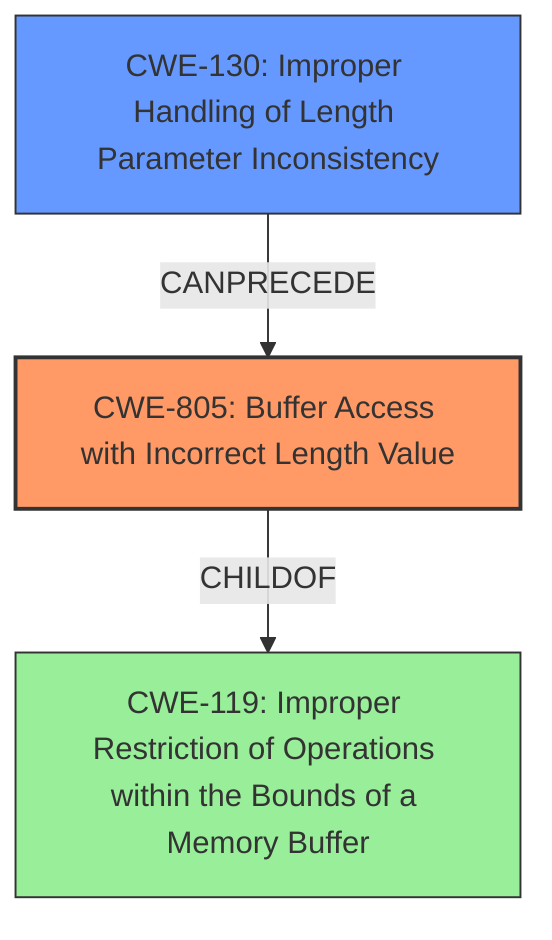

# Final Resolution for CVE-2021-20589

# Summary

| CWE ID  | CWE Name                                       | Confidence | CWE Abstraction Level | CWE Vulnerability Mapping Label | CWE-Vulnerability Mapping Notes |
|---------|------------------------------------------------|------------|-----------------------|---------------------------------|-------------------------------|
| CWE-805 | Buffer Access with Incorrect Length Value       | 1.00       | Base                  | Primary                         | Allowed                       |
| CWE-130 | Improper Handling of Length Parameter Inconsistency | 0.75       | Base                  | Secondary                       | Allowed                       |

## Evidence and Confidence

*   **Confidence Score:** 0.95
*   **Evidence Strength:** HIGH

## Relationship Analysis
The primary CWE, CWE-805, is a base level CWE, making it sufficiently specific. It has a parent relationship with CWE-119, which is a class-level CWE, and using CWE-805 is more appropriate because it is more specific. CWE-130 can precede CWE-805, as improper handling of the length parameter can lead to incorrect buffer access.

## Vulnerability Chain
The vulnerability chain starts with the **improper handling of length parameter (CWE-130)** in MODBUS/TCP packets. This leads to the use of an **incorrect length value (CWE-805)** when accessing a buffer. Consequently, the system attempts to read or write data outside the intended buffer boundaries, which could cause the communication function to stop.

## Summary of Analysis
The initial analysis and criticism are both well-reasoned and accurate. The primary CWE, CWE-805, is clearly supported by the vulnerability description, which explicitly states "buffer access with incorrect length value". The choice of CWE-805 is further reinforced by the CVE reference summary.

The decision to include CWE-130 as a secondary CWE is also justified, as the vulnerability involves improper handling of length values within MODBUS/TCP packets, as highlighted in the CVE reference summary.

The analysis correctly dismisses CWE-119 as too general and acknowledges that more specific CWEs, like CWE-805, are preferred.

The assessment is based on the provided evidence from the vulnerability description and CVE reference materials.
The graph relationships influenced the final selection by confirming that CWE-805 is a more specific and appropriate choice than its parent, CWE-119.

The selected CWEs are at the optimal level of specificity because they accurately capture the root cause (CWE-805) and contributing factor (CWE-130) of the vulnerability, based on the available evidence.