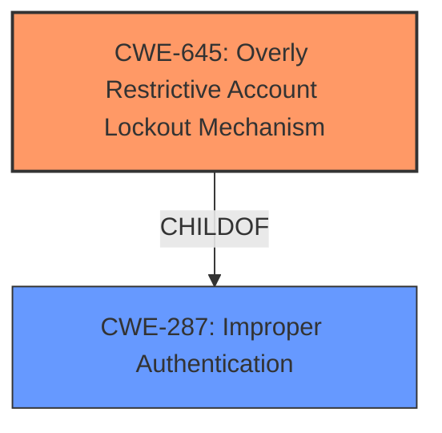

# Analysis Report for CVE-2021-20598

# Vulnerability Analysis Report: CVE-2021-20598

## Description

Overly Restrictive Account Lockout Mechanism vulnerability in Mitsubishi Electric MELSEC iQ-R series CPU modules (R08/16/32/120SFCPU all versions, R08/16/32/120PSFCPU all versions) allows a remote unauthenticated attacker to lockout a legitimate user by continuously trying login with incorrect password.

## Vulnerability Description Key Phrases

**Rootcause:** Overly Restrictive Account Lockout Mechanism
**Impact:** lockout legitimate user
**Vector:** continuously trying login with incorrect password
**Attacker:** remote unauthenticated attacker
**Product:** Mitsubishi Electric MELSEC iQ-R series CPU modules
**Version:** all versions

## Analysis (with Relationship Data)

# Summary
| CWE ID | CWE Name | Confidence | CWE Abstraction Level | CWE Vulnerability Mapping Label | CWE-Vulnerability Mapping Notes |
|---|---|---|---|---|---|
| CWE-645 | Overly Restrictive Account Lockout Mechanism | 1.0 | Base | Primary | Allowed |

## Evidence and Confidence

*   **Confidence Score:** 1.0
*   **Evidence Strength:** HIGH

- **Analysis and Justification:**
  - *Explanation:* The vulnerability description explicitly states an "**Overly Restrictive Account Lockout Mechanism**," which perfectly aligns with CWE-645 (Overly Restrictive Account Lockout Mechanism). The vulnerability allows an unauthenticated attacker to lockout legitimate users by continuously attempting logins with incorrect passwords, leading to a denial-of-service. The CVE Reference Links Content Summary reinforces this, identifying the root cause as an "**Overly Restrictive Account Lockout Mechanism (CWE-645)**".
  - *Relationship Analysis:* CWE-645 is a Base level CWE, which is the preferred level of abstraction. There are no direct relationships identified for CWE-645.

- **Confidence Score:**
  - Confidence: 1.0 (High confidence due to direct statement of root cause and supporting CVE reference summary)

## Criticism of Analysis

Okay, here's a review of the provided analysis, incorporating the full CWE specifications:

**Overall Assessment:**

The analysis correctly identifies CWE-645 (Overly Restrictive Account Lockout Mechanism) as the primary vulnerability. The confidence score of 1.0 is justified, given the explicit mention of the mechanism in the vulnerability description and the CVE summary. The analysis is clear, concise, and well-supported.

**Detailed Review:**

*   **CWE-645 Mapping:**

    *   **Correctness:** The mapping to CWE-645 is accurate and appropriate. The description of CWE-645 perfectly matches the vulnerability: "The product contains an account lockout protection mechanism, but the mechanism is too restrictive and can be triggered too easily, which allows attackers to deny service to legitimate users by causing their accounts to be locked out."
    *   **Abstraction Level:** The analysis correctly notes that CWE-645 is a Base level CWE, which is the preferred level of abstraction for vulnerability mapping.
    *   **Mapping Guidance Adherence:** The analysis adheres to the mapping guidance provided by CWE. It acknowledges that both the name and description were carefully considered to ensure an appropriate fit.
    *   **Relationships:** The analysis notes that CWE-645 is a child of CWE-287 (Improper Authentication). While true, CWE-287 is a Class-level CWE and the analysis is correct in NOT assigning CWE-287 as the primary vulnerability for this reason.

*   **Evidence and Confidence:**

    *   The provided reasoning for the confidence score of 1.0 is valid. The direct statement in the vulnerability description and the support from the CVE summary provide strong evidence.

*   **CWE Examples from Database:**

    *   The inclusion of CVE-2021-20598 as an example for CWE-645 is excellent, as it's the very CVE being analyzed. This further reinforces the correctness of the mapping.

*   **Mitigations:**

    *   The analysis doesn't explicitly discuss the potential mitigations listed in the CWE-645 specification. While not strictly required, mentioning these could add further value to the analysis.
    *   **Mitigation 1:** "Implement more intelligent password throttling mechanisms such as those which take IP address into account, in addition to the login name."  This is a relevant mitigation that the developers could consider.
    *   **Mitigation 2:** "Implement a lockout timeout that grows as the number of incorrect login attempts goes up, eventually resulting in a complete lockout." This could be another valuable consideration.
    *   **Mitigation 3:** "Consider alternatives to account lockout that would still be effective against password brute force attacks, such as presenting the user machine with a puzzle to solve (makes it do some computation)." CAPTCHAs or similar mechanisms could be considered.

*   **Top Combined Retriever Results:** While the top 10 combined results from the retriever results are interesting, it is important to choose the CWE that best describes the root cause of the vulnerability, as the analysis did.

    *   CWE-307 (Improper Restriction of Excessive Authentication Attempts) is somewhat related, but it's more about the *lack* of restriction, whereas CWE-645 is about a restriction that's *too* severe.  In other words, CWE-307 would be relevant if there was *no* lockout mechanism, or the attacker could attempt unlimited logins, and CWE-645 is relevant because a DOS can occur due to a legitimate user being locked out after only a few attempts.
    *   The other CWEs are even less relevant in describing the root cause.

**Recommendations:**

1.  **Mitigation Discussion:** Briefly mention the potential mitigations outlined in the CWE-645 specification. This demonstrates a comprehensive understanding of the vulnerability and provides actionable recommendations.
2.  **Relationship Consideration:** While the analysis correctly avoided using the Class level CWE-287 as the primary mapping, it could briefly mention that CWE-645 is a child of CWE-287 (Improper Authentication), showing the broader context of the vulnerability.

**Revised Summary Table (Incorporating Recommendations):**

| CWE ID | CWE Name | Confidence | CWE Abstraction Level | CWE Vulnerability Mapping Label | CWE-Vulnerability Mapping Notes |
|---|---|---|---|---|---|
| CWE-645 | Overly Restrictive Account Lockout Mechanism | 1.0 | Base | Primary | Allowed. Child of CWE-287 (Improper Authentication). Consider mitigations such as IP-based throttling, growing lockout timeouts, or alternatives to account lockout (e.g., CAPTCHAs). |

**Conclusion:**

The analysis is very good and correctly identifies the primary CWE. Incorporating the minor recommendations above would further enhance its completeness and usefulness. The high confidence level assigned is well-justified.

## Final Resolution

# Summary
| CWE ID | CWE Name | Confidence | CWE Abstraction Level | CWE Vulnerability Mapping Label | CWE-Vulnerability Mapping Notes |
|---|---|---|---|---|---|
| CWE-645 | Overly Restrictive Account Lockout Mechanism | 1.0 | Base | Primary | Allowed |

## Evidence and Confidence

*   **Confidence Score:** 1.0
*   **Evidence Strength:** HIGH

## Relationship Analysis
The primary CWE, CWE-645 (**Overly Restrictive Account Lockout Mechanism**), is a Base level CWE, which is the preferred level of abstraction for mapping. CWE-645 is a child of CWE-287 (**Improper Authentication**), which is a Class-level CWE. Selecting the Base level CWE provides more specificity.

## Vulnerability Chain
The vulnerability chain starts with the **Overly Restrictive Account Lockout Mechanism** (CWE-645). An unauthenticated attacker can exploit this by continuously attempting logins with incorrect passwords. This leads to legitimate users being locked out of their accounts, resulting in a denial-of-service.

## Summary of Analysis
The initial analysis correctly identified CWE-645 (**Overly Restrictive Account Lockout Mechanism**) as the primary **WEAKNESS**. The vulnerability description explicitly states that there is an "**Overly Restrictive Account Lockout Mechanism**," and the CVE Reference Links Content Summary reinforces this by identifying the **ROOTCAUSE** as "**Overly Restrictive Account Lockout Mechanism (CWE-645)**".

The relationship analysis confirms that selecting the Base level CWE provides more specificity than using the Class level CWE-287 (**Improper Authentication**).

The high confidence level of 1.0 is justified based on the direct evidence from the vulnerability description and the CVE summary.

*Report generated on 2025-03-17 00:17:18*
