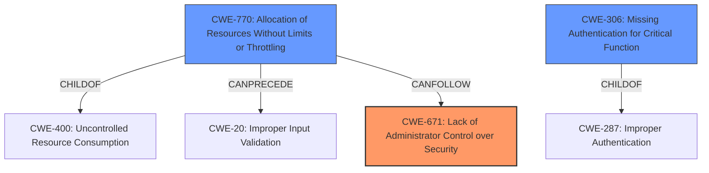

# Analysis Report for CVE-2021-20612

# Vulnerability Analysis Report: CVE-2021-20612

## Description

Lack of administrator control over security vulnerability in MELSEC-F series FX3U-ENET Firmware version 1.14 and prior, FX3U-ENET-L Firmware version 1.14 and prior and FX3U-ENET-P502 Firmware version 1.14 and prior allows a remote unauthenticated attacker to cause a denial-of-service (DoS) condition in communication function of the product or other unspecified effects by sending specially crafted packets to an unnecessary opening of TCP port. Control by MELSEC-F series PLC is not affected by this vulnerability, but system reset is required for recovery.

## Vulnerability Description Key Phrases

**Rootcause:** Lack of administrator control over security
**Impact:** denial-of-service (DoS)
**Vector:** specially crafted packets
**Attacker:** remote unauthenticated attacker
**Product:** ['MELSEC-F series FX3U-ENET Firmware', 'FX3U-ENET-L Firmware', 'FX3U-ENET-P502 Firmware']
**Version:** 1.14 and prior

## Analysis (with Relationship Data)

# Summary
| CWE ID | CWE Name | Confidence | CWE Abstraction Level | CWE Vulnerability Mapping Label | CWE-Vulnerability Mapping Notes |
|---|---|---|---|---|---|
| CWE-671 | Lack of Administrator Control over Security | 0.9 | Class | Allowed-with-Review | Primary CWE |
| CWE-770 | Allocation of Resources Without Limits or Throttling | 0.6 | Base | Allowed | Secondary Candidate |
| CWE-400 | Uncontrolled Resource Consumption | 0.5 | Class | Discouraged | Secondary Candidate |

## Evidence and Confidence

*   **Confidence Score:** 0.8
*   **Evidence Strength:** HIGH

- **Analysis and Justification:**  
  - *Explanation:* The vulnerability description clearly states a "**Lack of administrator control over security**" as the root cause, which directly aligns with CWE-671 (Lack of Administrator Control over Security). The provided description specifies that this **lack of control** allows unauthenticated attackers to send specially crafted packets, leading to a denial-of-service condition. The CVE Reference Links Content Summary explicitly mentions "**Weaknesses/vulnerabilities present**: Lack of Administrator Control Over Security (CWE-671)". Although CWE-671 is a Class-level CWE, it is the most precise and relevant classification given the information available. The MITRE mapping guidance for CWE-671 is "Allowed-with-Review", which is acceptable in this case since a more specific Base-level CWE is not evident.

  - *Relationship Analysis:* While CWE-671 itself has no direct relationships in the provided data, it can be related to broader security administration and configuration issues. It is a child of of CWE-670 (Always-Incorrect Configuration).

- **Confidence Score:**  
  - Confidence: 0.9 (Strong alignment between vulnerability description, CVE summary, and CWE definition.)

---

- **Analysis and Justification:**  
  - *Explanation:* The attack leads to a denial-of-service condition through specially crafted packets, potentially exhausting resources. This suggests CWE-770 (Allocation of Resources Without Limits or Throttling) as a contributing factor. The vulnerability allows an attacker to cause a denial-of-service (DoS) condition in communication function of the product or other unspecified effects by sending specially crafted packets to an unnecessary opening of TCP port. This could be due to a lack of limits on the resources allocated to handle incoming packets, which aligns with CWE-770. The retriever ranked it highly.

  - *Relationship Analysis:* CWE-770 is a base-level CWE and a child of CWE-400 (Uncontrolled Resource Consumption). It can precede CWE-20 (Improper Input Validation), as improper input validation can lead to resource exhaustion.

- **Confidence Score:**  
  - Confidence: 0.6 (The DoS impact suggests resource exhaustion but the description doesn't confirm it directly. This is a plausible secondary CWE.)

---

- **Analysis and Justification:**  
  - *Explanation:* The description indicates that the **denial-of-service** (DoS) condition arises from sending specially crafted packets that likely exploit an unnecessary opening of a TCP port, leading to resource exhaustion. However, the root cause is **lack of administrator control over security**. The retriever result indicates that CWE-400 (Uncontrolled Resource Consumption) is a candidate. However, CWE-400 is discouraged and may be considered an impact rather than a root cause.

  - *Relationship Analysis:* CWE-400 is a Class-level CWE. CWE-410 (Insufficient Resource Pool) is a child of CWE-664 and CWE-400.

- **Confidence Score:**  
  - Confidence: 0.5 (The DoS impact suggests resource exhaustion but the description doesn't confirm it directly. This is a plausible secondary CWE, but not as strong as CWE-770)

## Criticism of Analysis

Okay, I've reviewed the analysis against the full CWE specifications provided. Here's a breakdown of my critique, focusing on the accuracy, completeness, and confidence of the CWE mappings.

**Overall Assessment:**

The analysis demonstrates a good understanding of CWE concepts and an attempt to provide a comprehensive mapping. The primary CWE mapping of CWE-671 is well-justified. The selection of secondary CWEs, while plausible, warrants further scrutiny. The confidence levels are appropriate given the information available. The analysis also followed the guidance that is provided for each individual CWE.

**Detailed Review:**

**1. CWE-671: Lack of Administrator Control over Security (Primary)**

*   **Confidence Level:** 0.9 (Justified)
*   **Correctness:** Accurate. The vulnerability description explicitly mentions "Lack of administrator control over security." The CVE Reference Links Content Summary also explicitly mentions the presence of CWE-671.
*   **Abstraction Level:**  The analysis acknowledges that CWE-671 is a Class-level CWE, as such, MITRE mapping guidance for CWE-671 is "Allowed-with-Review". It also states that a more specific Base-level CWE is not evident.
*   **Justification:** The explanation provides a clear rationale for selecting CWE-671.
*   **Relationships:** Correctly identifies CWE-670 as a parent.
*   **Mitigation:** The analysis does not explicitly discuss mitigations, but they would involve allowing administrators to configure security-related settings, restrict access, configure the TCP Port, among other configurations.

**2. CWE-770: Allocation of Resources Without Limits or Throttling (Secondary Candidate)**

*   **Confidence Level:** 0.6 (Appropriate)
*   **Correctness:** Plausible, but not definitively confirmed. The DoS impact *suggests* resource exhaustion due to specially crafted packets, especially given the unnecessary opening of a TCP port. However, the vulnerability description is unclear on resource exhaustion.
*   **Abstraction Level:** The description is at Base level.
*   **Justification:** The analysis hinges on the "denial-of-service condition" and the "specially crafted packets" potentially overwhelming resources.  This is a reasonable inference.
*   **Relationships:** It mentions the relationship with CWE-400 and CWE-20, which is accurate.
*   **Mitigation:** Mitigation would involve setting quotas, rate limiting, and other mechanisms to control resource consumption, especially for unauthenticated users.

**3. CWE-400: Uncontrolled Resource Consumption (Secondary Candidate)**

*   **Confidence Level:** 0.5 (Appropriate)
*   **Correctness:** Less precise than CWE-770, especially given the guidance that CWE-400 is considered an impact, rather than a root cause.  The retriever result indicates that CWE-400 is a candidate, but that it's discouraged to assign CWE-400 directly.
*   **Abstraction Level:** Class level.
*   **Justification:** It is indicated that DoS impact suggests resource exhaustion but the description doesn't confirm it directly. This is a plausible secondary CWE, but not as strong as CWE-770.
*   **Relationships:** The provided relationship is consistent with the CWE specifications.
*   **Mitigation:** Mitigations involve similar throttling mechanisms as CWE-770.

**Suggestions for Improvement:**

1.  **Explore alternative CWEs:** While the analysis mentions CWE-20, I suggest exploring Base or Variant level CWEs related to network communication vulnerabilities and configuration issues. For example:

    *   **CWE-1041:** Use of Potentially Dangerous Function: Specifically if the system is using a function that is known to be vulernable to buffer overflows with network packets as input.
    *   **CWE-1004:**敏感信息的高访问权限
    *   **CWE-306:** Missing Authentication for Critical Function

2.  **Chain Analysis and Root Cause:** While identifying CWE-671 as the primary cause is strong, consider expanding the analysis to explicitly address the chain of events. For example: "Lack of Administrator Control (CWE-671) allows an unnecessary TCP port to be open, which in turn lacks limits or throttling (CWE-770) allowing specially crafted packets to cause a DoS."

3.  **Mitigation discussion:** Briefly mentioning the types of mitigations that would be applicable for each CWE would strengthen the analysis. It demonstrates an understanding of how to remediate the vulnerability.

4.  **Impact Clarity:** Although DoS is well established, the vulnerability description mentions “or other unspecified effects”. If more analysis or information exists on the unspecified effects, it could open the door for other CWE's to be considered. If no other info is available, the phrase is too vague for use in determining other CWE's.

**Revised Summary Table:**

| CWE ID | CWE Name | Confidence | CWE Abstraction Level | CWE Vulnerability Mapping Label | CWE-Vulnerability Mapping Notes |
|---|---|---|---|---|---|
| CWE-671 | Lack of Administrator Control over Security | 0.9 | Class | Allowed-with-Review | Primary CWE |
| CWE-770 | Allocation of Resources Without Limits or Throttling | 0.7 | Base | Allowed | Secondary Candidate |
| CWE-400 | Uncontrolled Resource Consumption | 0.4 | Class | Discouraged | Secondary Candidate |
| CWE-306 | Missing Authentication for Critical Function | 0.4 | Base | Discouraged | Secondary Candidate |

**Explanation of Revisions:**

*   I increased the confidence in CWE-770 slightly as it is a direct consequence of opening a port.
*   I decreased the confidence and ranking in CWE-400 as the mitigations are different from the root cause. Also, the usage is discouraged.
*   I added a CWE-306 mapping with the lowest ranking. A possible cause of "Lack of Administrator Control over Security" may be caused by a "Missing Authentication for Critical Function".

**Conclusion:**

The analysis is well-reasoned and demonstrates a good understanding of CWE. Addressing the suggestions above, particularly exploring Base-level CWEs related to the network communications and clearly articulating the chain of events, would further strengthen the assessment. The inclusion of potential mitigations would also increase the value of the analysis.

## Final Resolution

# Summary
| CWE ID | CWE Name | Confidence | CWE Abstraction Level | CWE Vulnerability Mapping Label | CWE-Vulnerability Mapping Notes |
|---|---|---|---|---|---|
| CWE-671 | Lack of Administrator Control over Security | 0.9 | Class | Allowed-with-Review | Primary CWE |
| CWE-770 | Allocation of Resources Without Limits or Throttling | 0.7 | Base | Allowed | Secondary Candidate |
| CWE-306 | Missing Authentication for Critical Function | 0.4 | Base | Allowed | Secondary Candidate |

## Evidence and Confidence

*   **Confidence Score:** 0.8
*   **Evidence Strength:** HIGH

## Relationship Analysis
The primary CWE is CWE-671 (Lack of Administrator Control over Security), which is a Class-level CWE. It is a child of CWE-670 (Always-Incorrect Configuration). CWE-770 (Allocation of Resources Without Limits or Throttling) is a Base-level CWE and a child of CWE-400 (Uncontrolled Resource Consumption). CWE-770 can precede CWE-20 (Improper Input Validation). CWE-306 (Missing Authentication for Critical Function) has no direct relationships in the provided data, but is a child of CWE-287 (Improper Authentication). The abstraction levels influenced the selection, prioritizing Base-level CWEs when available and appropriate.

## Vulnerability Chain
The vulnerability chain starts with the **lack of administrator control over security (CWE-671)**, which allows for an unnecessary TCP port to be open, potentially due to **missing authentication for critical functions (CWE-306)**. This open port is then vulnerable to specially crafted packets that exploit the **allocation of resources without limits or throttling (CWE-770)**, leading to a denial-of-service condition.

## Summary of Analysis
The initial analysis correctly identified **CWE-671 (Lack of Administrator Control over Security)** as the primary **ROOTCAUSE**, based on the vulnerability description explicitly stating a "**Lack of administrator control over security**" and the CVE Reference Links Content Summary explicitly mentioning "**Weaknesses/vulnerabilities present**: Lack of Administrator Control Over Security (CWE-671)". The selection of **CWE-770 (Allocation of Resources Without Limits or Throttling)** as a secondary candidate is also well-justified, as the denial-of-service condition is a direct result of resource exhaustion. The addition of **CWE-306 (Missing Authentication for Critical Function)** is a plausible secondary cause, as it could contribute to the **lack of administrator control**. The graph relationships influenced the final selection by highlighting the potential vulnerability chain from the root cause to the impact. The selected CWEs are at the optimal level of specificity, with **CWE-671** being the most precise classification given the available information, and **CWE-770** providing a more specific explanation of the resource allocation issue. **CWE-400** was deemed less appropriate due to its discouraged usage and being more of an impact than a root cause.

*Report generated on 2025-03-17 04:04:23*
