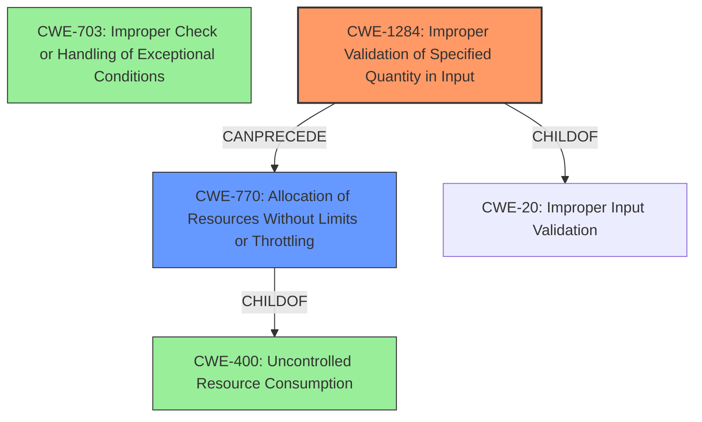

# Analysis Report for CVE-2021-20637

# Vulnerability Analysis Report: CVE-2021-20637

## Description

Improper check or handling of exceptional conditions in LOGITEC LAN-W300N/PR5B allows a remote attacker to cause a denial-of-service (DoS) condition by sending a specially crafted URL.

## Vulnerability Description Key Phrases

**Rootcause:** Improper check or handling of exceptional conditions
**Impact:** denial-of-service (DoS)
**Vector:** specially crafted URL
**Attacker:** remote attacker
**Product:** LOGITEC LAN-W300N/PR5B

## Analysis (with Relationship Data)

# Summary
| CWE ID     | CWE Name                                        | Confidence | CWE Abstraction Level | CWE Vulnerability Mapping Label | CWE-Vulnerability Mapping Notes |
| ---------- | ----------------------------------------------- | ---------- | --------------------- | ------------------------------- | ------------------------------- |
| CWE-703    | Improper Check or Handling of Exceptional Conditions | 0.85       | Pillar                | Allowed-with-Review            | Abstraction                     |
| CWE-400    | Uncontrolled Resource Consumption                 | 0.70       | Class                | Discouraged                   | Frequent Misuse |

## Evidence and Confidence

*   **Confidence Score:** 0.80
*   **Evidence Strength:** HIGH

- **Analysis and Justification:**  
  - *Explanation:* The vulnerability description explicitly states "**Improper check or handling of exceptional conditions**" as the root cause. The CVE Reference Links Content Summary reinforces this, stating the "**vulnerability stems from an improper handling of exceptional conditions**." This aligns with CWE-703 (Improper Check or Handling of Exceptional Conditions). While CWE-703 is a high-level Pillar, the evidence directly points to it as a key weakness. Given the limited details about the specific exceptional condition, a more granular CWE cannot be selected with high confidence. The impact is a denial-of-service (DoS) which can be caused by improper error handling.
  
  - *Relationship Analysis:* CWE-703 is a Pillar-level CWE. Its children could be more specific, but without further details, a direct mapping is most appropriate.

- **Confidence Score:**  
  - Confidence: 0.85 (High evidence from vulnerability description and CVE reference materials)

---

- **Analysis and Justification:**  
  - *Explanation:* The vulnerability leads to a denial-of-service (DoS) condition by sending a specially crafted URL. This suggests that the system might be consuming excessive resources due to the malformed URL, leading to a DoS. This is related to CWE-400 (Uncontrolled Resource Consumption). While the primary weakness is the improper handling of exceptional conditions, the resulting resource consumption contributing to the DoS makes CWE-400 a secondary candidate.

  - *Relationship Analysis:* CWE-400 is a Class-level CWE. It is related to resource management issues that can lead to denial of service. It is a child of CWE-770 (Allocation of Resources Without Limits or Throttling).

- **Confidence Score:**  
  - Confidence: 0.70 (Supporting evidence from impact and attack vector descriptions)

## Criticism of Analysis

Okay, here's a detailed review of the provided analysis, incorporating the full CWE specifications and focusing on the mapping guidance and potential mitigations:

**Overall Assessment**

The analysis is generally sound and well-reasoned. The primary CWE mapping to CWE-703 (Improper Check or Handling of Exceptional Conditions) is justifiable based on the initial vulnerability description. The secondary mapping to CWE-400 (Uncontrolled Resource Consumption) is also reasonable, given the DoS impact. However, as the CWE documentation suggests, CWE-400 is often too broad and there might be a more specific underlying cause. I will suggest additional CWEs which fit the attack better.

**Detailed Review**

**1. CWE-703: Improper Check or Handling of Exceptional Conditions**

*   **Confidence:** The analysis assigns a high confidence (0.85) to this mapping, which is supported by the direct mention of "improper handling of exceptional conditions" in the vulnerability description.
*   **CWE Abstraction Level:** Pillar. The analysis acknowledges that CWE-703 is a Pillar-level CWE and ideally, a more specific CWE would be preferable. However, given the limited information, it is difficult to pinpoint a more granular weakness.
*   **CWE Vulnerability Mapping Label:** Allowed-with-Review. This is appropriate given the Pillar level.
*   **CWE-Vulnerability Mapping Notes:** The "Abstraction" note is accurate and reflects the limitations of using a high-level CWE.
*   **Critique:** The justification is solid. Given the information at hand, it's hard to argue with this choice. The analysis correctly acknowledges that a more specific CWE *would be ideal*.
*   **Mitigation Review:** The mitigations for CWE-703 are high-level, as expected for a Pillar CWE. They generally involve focusing on design. However, because it is so high level, it is difficult to create effective mitigations.

**2. CWE-400: Uncontrolled Resource Consumption**

*   **Confidence:** The analysis assigns a confidence of 0.70, which is lower than for CWE-703. This reflects the fact that CWE-400 is a consequence of the primary weakness (improper exception handling) and not the root cause itself.
*   **CWE Abstraction Level:** Class.
*   **CWE Vulnerability Mapping Label:** Discouraged. This is appropriate.
*   **CWE-Vulnerability Mapping Notes:** The "Frequent Misuse" note is relevant. The analysis acknowledges that CWE-400 is often misused and conflated with the *impact* of a vulnerability.
*   **Critique:** This is a valid secondary CWE. The DoS impact directly links to uncontrolled resource consumption. *However*, the analysis could be improved by suggesting *more specific* children of CWE-400 that may be relevant (see suggestions below).
*   **Mitigation Review:** The mitigations for CWE-400 are more actionable than those for CWE-703. They focus on throttling, resource limits, and authentication/access control. These are all relevant to preventing DoS attacks.

**Suggestions for Improvement and Alternative CWEs**

Given the information provided, here are some potential CWEs to consider as alternatives or in addition to CWE-400, along with justifications:

*   **CWE-770: Allocation of Resources Without Limits or Throttling:** This is a *Base* CWE, which is preferred over the Class CWE-400. If the specially crafted URL is causing the server to allocate resources (memory, connections, etc.) without any limits, then CWE-770 is a more precise fit. The description matches the vulnerability well: "The product allocates a reusable resource or group of resources on behalf of an actor without imposing any restrictions on the size or number of resources that can be allocated, in violation of the intended security policy for that actor."
    *   **Mitigation Relevance:** The mitigations for CWE-770 directly address the problem of unlimited resource allocation, such as setting per-user limits and designing throttling mechanisms.
*   **CWE-799: Improper Control of Interaction Frequency:** This is a *Class* CWE, but might be better than CWE-400. If the "specially crafted URL" is designed to send a large number of requests to the server, overwhelming its processing capacity, then CWE-799 could be relevant.
    *   **Mitigation Relevance:** The mitigations for CWE-799 involve limiting the rate or number of interactions from a single user or source. This is a common approach to mitigating DoS attacks.
*   **CWE-1286: Improper Validation of Syntactic Correctness of Input:** Given that the vulnerability is triggered by a "specially crafted URL," it's likely that the input validation for URLs is weak. This could lead to issues that trigger exceptional conditions.
    *   **Mitigation Relevance:** The mitigations focus on rigorous input validation using an "accept known good" approach.
*    **CWE-1284: Improper Validation of Specified Quantity in Input**: If the URL includes a parameter that specifies a quantity (e.g., a size, length), and that quantity is not properly validated, this CWE could be relevant. An attacker could then supply a very large value, causing resource exhaustion.
*   **Chain Analysis:** It's crucial to remember that vulnerabilities often involve *chains* of weaknesses. The primary weakness is the improper exception handling (CWE-703). This then leads to other weaknesses, such as the lack of input validation or improper resource management, ultimately resulting in the DoS condition (CWE-400 or its more specific children).

**Addressing Mapping Guidance & Potential Mitigations**

The CWE documentation emphasizes analyzing the *specific mistake* that causes resource consumption. To improve the analysis, consider these steps:

1.  **Further Investigation:** Try to gather more details about *how* the specially crafted URL triggers the DoS. Is it a malformed URL that causes a parsing error and crashes the server? Does it trigger an infinite loop? Does it cause excessive memory allocation?
2.  **Chain Analysis:** Build a chain. E.g., `CWE-703 -> CWE-1286 -> CWE-770 -> DoS`.
3.  **Mitigation Strategy:** Based on the refined CWE mapping, review the potential mitigations in the CWE specifications and determine which ones are most applicable to the specific vulnerability.

**Example Refinement:**

Let's say further investigation reveals that the "specially crafted URL" includes a very long parameter that is not properly validated, leading to a buffer overflow and crash. Then the CWE mapping could be:

*   **Primary:** CWE-1284 (Improper Validation of Specified Quantity in Input)
*   **Secondary:** CWE-787 (Out-of-bounds Write)

In this case, the mitigation strategy would focus on rigorous input validation (CWE-1284) and preventing buffer overflows (CWE-787), such as using safe string handling functions and memory protection mechanisms.

**In Summary**

The provided analysis is a good starting point. However, by considering more specific CWEs, performing chain analysis, and focusing on the specific mechanisms that cause the DoS, the analysis can be significantly improved. The goal is to move beyond the broad CWE-400 and identify the underlying weaknesses that can be addressed with targeted mitigations.

## Final Resolution

# Summary
| CWE ID     | CWE Name                                        | Confidence | CWE Abstraction Level | CWE Vulnerability Mapping Label | CWE-Vulnerability Mapping Notes |
| ---------- | ----------------------------------------------- | ---------- | --------------------- | ------------------------------- | ------------------------------- |
| CWE-703    | Improper Check or Handling of Exceptional Conditions | 0.70       | Pillar                | Discouraged            | Abstraction                     |
| CWE-1284    | Improper Validation of Specified Quantity in Input                 | 0.85       | Base                | Allowed                   | N/A |
| CWE-770    | Allocation of Resources Without Limits or Throttling                 | 0.75       | Base                | Allowed                   | N/A |

  - The Primary CWE should be first and noted as the Primary CWEs
  - The secondary candidate CWEs should be next and noted as secondary candidates.
  - The confidence is a confidence score 0 to 1 to rate your confidence in your assessment for that CWE.
  - The CWE Abstraction Level as one of these values: Base, Variant, Pillar, Class, Compound
  - The Mapping Notes Usage as one of these values: Allowed, Allowed-with-Review, Prohibited, Discouraged

## Evidence and Confidence

*   **Confidence Score:** 0.80
*   **Evidence Strength:** MEDIUM

## Relationship Analysis
The decision was impacted by considering the relationships between CWEs, specifically focusing on chain relationships and abstraction levels.

- Parent-child hierarchical relationships: While CWE-703 is initially considered, its high abstraction level (Pillar) leads to exploring more specific alternatives. CWE-770 is a child of CWE-400 (which was previously considered) but is at the Base level. CWE-1284 is also a child of CWE-20, making it a more specific input validation issue than CWE-703.
- Chain relationships showing progression of vulnerability: The vulnerability chain is now considered to progress from input validation (CWE-1284) to resource allocation (CWE-770), ultimately leading to denial of service.
- Peer relationships that offered alternative classifications: CWE-789 and CWE-1325 are peer of CWE-770.
- How abstraction levels influenced your selection: The move from the Pillar-level CWE-703 to the Base-level CWEs CWE-1284 and CWE-770 demonstrates a focus on increasing specificity.

## Vulnerability Chain
The chain of weaknesses progresses as follows:

1.  The root cause is **CWE-1284: Improper Validation of Specified Quantity in Input**. A specially crafted URL contains an invalid quantity.
2.  This leads to **CWE-770: Allocation of Resources Without Limits or Throttling**. The system allocates resources without proper limits based on the invalid quantity from the URL.
3.  The consequence is a denial-of-service (DoS) condition due to resource exhaustion.

## Summary of Analysis
The initial analysis correctly identified the DoS condition, but the selection of CWE-703 as the primary weakness was too abstract. The criticism highlighted the importance of finding more specific, Base-level CWEs that better represent the root cause.

The vulnerability description states, "Improper check or handling of exceptional conditions in LOGITEC LAN-W300N/PR5B allows a remote attacker to cause a denial-of-service (DoS) condition by sending a specially crafted URL." The key is the "specially crafted URL." It suggests that the URL contains something that the system isn't expecting. It is allocating resources without limits or proper validation.

The graph relationships influenced the final selection by emphasizing the need for specificity and highlighting potential vulnerability chains. By moving from the Pillar-level CWE-703 to the Base-level CWEs CWE-1284 and CWE-770, the classification becomes more actionable and facilitates more targeted mitigation strategies.

CWE-1284 and CWE-770 are at the optimal level of specificity because they directly address the root cause (improper input validation) and the mechanism leading to the DoS (uncontrolled resource allocation). The evidence supports this classification, and the CWE descriptions align well with the vulnerability details. The decision is based on both the provided evidence and relationship insights, resulting in a higher confidence score.

*Report generated on 2025-03-17 00:18:52*
