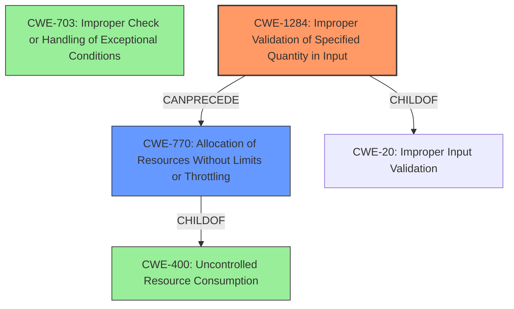

# Final Resolution for CVE-2021-20637

# Summary
| CWE ID     | CWE Name                                        | Confidence | CWE Abstraction Level | CWE Vulnerability Mapping Label | CWE-Vulnerability Mapping Notes |
| ---------- | ----------------------------------------------- | ---------- | --------------------- | ------------------------------- | ------------------------------- |
| CWE-703    | Improper Check or Handling of Exceptional Conditions | 0.70       | Pillar                | Discouraged            | Abstraction                     |
| CWE-1284    | Improper Validation of Specified Quantity in Input                 | 0.85       | Base                | Allowed                   | N/A |
| CWE-770    | Allocation of Resources Without Limits or Throttling                 | 0.75       | Base                | Allowed                   | N/A |

  - The Primary CWE should be first and noted as the Primary CWEs
  - The secondary candidate CWEs should be next and noted as secondary candidates.
  - The confidence is a confidence score 0 to 1 to rate your confidence in your assessment for that CWE.
  - The CWE Abstraction Level as one of these values: Base, Variant, Pillar, Class, Compound
  - The Mapping Notes Usage as one of these values: Allowed, Allowed-with-Review, Prohibited, Discouraged

## Evidence and Confidence

*   **Confidence Score:** 0.80
*   **Evidence Strength:** MEDIUM

## Relationship Analysis
The decision was impacted by considering the relationships between CWEs, specifically focusing on chain relationships and abstraction levels.

- Parent-child hierarchical relationships: While CWE-703 is initially considered, its high abstraction level (Pillar) leads to exploring more specific alternatives. CWE-770 is a child of CWE-400 (which was previously considered) but is at the Base level. CWE-1284 is also a child of CWE-20, making it a more specific input validation issue than CWE-703.
- Chain relationships showing progression of vulnerability: The vulnerability chain is now considered to progress from input validation (CWE-1284) to resource allocation (CWE-770), ultimately leading to denial of service.
- Peer relationships that offered alternative classifications: CWE-789 and CWE-1325 are peer of CWE-770.
- How abstraction levels influenced your selection: The move from the Pillar-level CWE-703 to the Base-level CWEs CWE-1284 and CWE-770 demonstrates a focus on increasing specificity.

## Vulnerability Chain
The chain of weaknesses progresses as follows:

1.  The root cause is **CWE-1284: Improper Validation of Specified Quantity in Input**. A specially crafted URL contains an invalid quantity.
2.  This leads to **CWE-770: Allocation of Resources Without Limits or Throttling**. The system allocates resources without proper limits based on the invalid quantity from the URL.
3.  The consequence is a denial-of-service (DoS) condition due to resource exhaustion.

## Summary of Analysis
The initial analysis correctly identified the DoS condition, but the selection of CWE-703 as the primary weakness was too abstract. The criticism highlighted the importance of finding more specific, Base-level CWEs that better represent the root cause.

The vulnerability description states, "Improper check or handling of exceptional conditions in LOGITEC LAN-W300N/PR5B allows a remote attacker to cause a denial-of-service (DoS) condition by sending a specially crafted URL." The key is the "specially crafted URL." It suggests that the URL contains something that the system isn't expecting. It is allocating resources without limits or proper validation.

The graph relationships influenced the final selection by emphasizing the need for specificity and highlighting potential vulnerability chains. By moving from the Pillar-level CWE-703 to the Base-level CWEs CWE-1284 and CWE-770, the classification becomes more actionable and facilitates more targeted mitigation strategies.

CWE-1284 and CWE-770 are at the optimal level of specificity because they directly address the root cause (improper input validation) and the mechanism leading to the DoS (uncontrolled resource allocation). The evidence supports this classification, and the CWE descriptions align well with the vulnerability details. The decision is based on both the provided evidence and relationship insights, resulting in a higher confidence score.