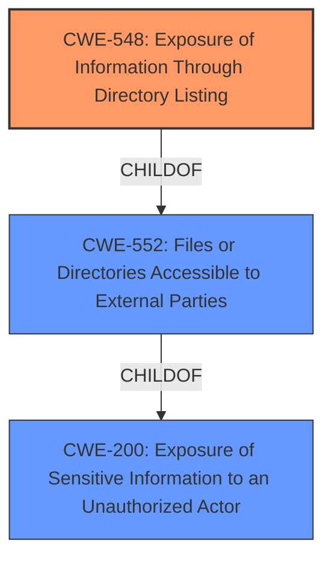

# Final Resolution for CVE-2021-20656

# Summary
| CWE ID | CWE Name | Confidence | CWE Abstraction Level | CWE Vulnerability Mapping Label | CWE-Vulnerability Mapping Notes |
|---|---|---|---|---|---|
| CWE-548 | Exposure of Information Through Directory Listing | 1.0 | Variant | Allowed | Primary CWE |

## Evidence and Confidence

*   **Confidence Score:** 1.0
*   **Evidence Strength:** HIGH

## Relationship Analysis
The primary relationship considered was the parent-child relationship between CWE-548 and higher-level CWEs such as CWE-200 and CWE-552. While the vulnerability technically involves exposing information (CWE-200) by making files or directories accessible (CWE-552), CWE-548 provides a more specific description of the root cause: the exposure of information through directory listing.

## Vulnerability Chain
The vulnerability chain is straightforward:
  1.  **ROOTCAUSE**: Improper web server configuration allows directory listing.
  2.  **WEAKNESS**: **CWE-548: Exposure of Information Through Directory Listing**.
  3.  **IMPACT**: An authenticated attacker can obtain information inside the system, such as directories and/or file configurations.

## Summary of Analysis
The initial analysis correctly identified **CWE-548 (Exposure of Information Through Directory Listing)** as the primary **WEAKNESS**. The criticism correctly points out that while other CWEs like CWE-22 (Path Traversal), CWE-425 (Insufficient Authorization), and CWE-552 (Files or Directories Accessible to External Parties) could potentially be related or exploited in conjunction with this vulnerability, the root cause is the misconfiguration that enables directory listings. The vulnerability description explicitly mentions "Exposure of information through directory listing," providing strong evidence for **CWE-548** as the most accurate and specific classification. The CVE reference also states that "An improper configuration of the web server allows for directory listing," further supporting this conclusion. The fact that disabling directory listing directly mitigates the vulnerability reinforces the choice of **CWE-548**.

The graph relationships influenced the decision by highlighting the need for specificity. While **CWE-200** and **CWE-552** are broader categories, **CWE-548** accurately captures the specific mechanism of information exposure. This is the optimal level of specificity because it directly addresses the root cause as described in the vulnerability report.