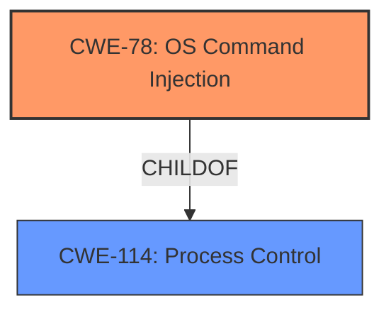

# Final Resolution for CVE-2021-20790

# Summary
| CWE ID | CWE Name | Confidence | CWE Abstraction Level | CWE Vulnerability Mapping Label | CWE-Vulnerability Mapping Notes |
|---|---|---|---|---|---|
| CWE-78 | Improper Neutralization of Special Elements used in an OS Command ('OS Command Injection') | 0.85 | Base | Primary CWE | Allowed |
| CWE-114 | Process Control | 0.70 | Class | Secondary Candidate | Allowed-with-Review |

## Evidence and Confidence

*   **Confidence Score:** 0.80
*   **Evidence Strength:** MEDIUM

## Relationship Analysis
The primary relationship that impacted my decision was the potential for **CWE-78 (OS Command Injection)** to be a more specific instantiation of **CWE-114 (Process Control)**. While **CWE-114** is a broader class encompassing various process control issues, the vulnerability description's mention of arbitrary command execution strongly suggests **CWE-78** as the root cause.

## Vulnerability Chain
The vulnerability chain starts with the application's failure to properly sanitize input, leading to **CWE-78 (OS Command Injection)**. This allows an attacker to inject arbitrary commands, resulting in **improper control of program execution (CWE-114)** and potentially leading to arbitrary code execution.

## Summary of Analysis
After reviewing the initial analysis, criticism, and available CWE information, my conclusion is to classify this vulnerability as primarily **CWE-78 (OS Command Injection)**, with **CWE-114 (Process Control)** as a secondary, higher-level classification.

The initial analysis correctly identified **CWE-114** as a potential primary weakness, given the general description of "improper control of program execution." However, the description also states the attacker can "execute an arbitrary command or code," which is a strong indicator of command injection.

The criticism highlighted the importance of specificity and suggested investigating whether any children of **CWE-114** are a better fit. It specifically suggested **CWE-73 (External Control of File Name or Path)** if the process control issue stems from externally-controlled paths. However, given that the attacker can execute commands, **CWE-78** is a more direct fit.

**CWE-78** is at the Base level of abstraction, which is preferred for root cause analysis. The vulnerability description's explicit mention of arbitrary command execution makes **CWE-78** the most accurate and specific classification. While **CWE-114** is still relevant as a broader category encompassing the impact of the vulnerability, **CWE-78** represents the root cause more precisely.

Therefore, the classification is based on both the provided evidence ("execute an arbitrary command or code") and the hierarchical relationship between **CWE-78** and **CWE-114**.