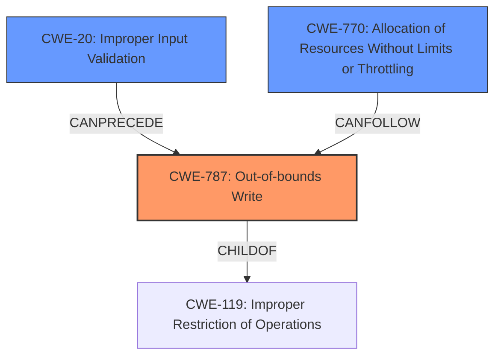

# Analysis Report for CVE-2021-20987

# Vulnerability Analysis Report: CVE-2021-20987

## Description

A denial of service and memory corruption vulnerability was found in Hilscher EtherNet/IP Core V2 prior to V2.13.0.21that may lead to code injection through network or make devices crash without recovery.

## Vulnerability Description Key Phrases

**Weakness:** denial of service and memory corruption
**Impact:** code injection
**Product:** Hilscher EtherNet/IP Core
**Version:** prior to V2.13.0.21

## Analysis (with Relationship Data)

# Summary
| CWE ID | CWE Name | Confidence | CWE Abstraction Level | CWE Vulnerability Mapping Label | CWE-Vulnerability Mapping Notes |
|---|---|---|---|---|---|
| CWE-787 | Out-of-bounds Write | 1.0 | Base | Primary | Allowed |
| CWE-770 | Allocation of Resources Without Limits or Throttling | 0.6 | Base | Secondary Candidate | Allowed |

## Evidence and Confidence

*   **Confidence Score:** 0.9
*   **Evidence Strength:** HIGH

- **Analysis and Justification:**
  - *Explanation:* The vulnerability description explicitly mentions "**denial of service and memory corruption**" which can lead to "code injection." The CVE Reference Links Content Summary clearly states the root cause as an "**Out-of-bounds Write (CWE-787)**," where the software writes data beyond the intended boundaries of a memory buffer. This aligns perfectly with the CWE-787 description: "The product writes data past the end, or before the beginning, of the intended buffer." Exploitation leads to DoS, RCE and Memory Corruption. CWE-787 is a Base level CWE, which is the preferred level of abstraction. The retriever results also list CWE-787 as the top candidate with the highest score. The MITRE mapping guidance for CWE-787 says Usage is Allowed.

  - *Relationship Analysis:* CWE-787 is a child of CWE-119 (Improper Restriction of Operations within the Bounds of a Memory Buffer), but CWE-787 is more specific, making it a better fit. CWE-787 can lead to CWE-824 (Access of Resource Using Inappropriate Type).

- **Confidence Score:**
  - *Example:* Confidence: 1.0 (Explicit mention of "out-of-bounds write" in the CVE summary)

---
- **Analysis and Justification:**
  - *Explanation:* The "**denial of service**" impact along with the possibility of code injection suggests that the vulnerability might be exploitable by exhausting resources. The retriever results list CWE-770 (Allocation of Resources Without Limits or Throttling) as a candidate. While the primary cause is an out-of-bounds write (CWE-787), an attacker might leverage this to trigger excessive resource allocation, contributing to the DoS. The description states that devices may crash without recovery which suggest a denial of service. CWE-770 is at the Base level of abstraction and the mapping guidance is Allowed.

  - *Relationship Analysis:* CWE-770 is a parent of CWE-789 (Uncontrolled Memory Allocation). CWE-770 can lead to CWE-20 (Improper Input Validation).

- **Confidence Score:**
  - *Example:* Confidence: 0.6 (The DoS impact is clear, but the direct link to uncontrolled resource allocation is not explicitly stated, hence the lower confidence.)

## Criticism of Analysis

Okay, I've reviewed the analysis and the full CWE specifications. Here's a breakdown of my critique, focusing on the accuracy, completeness, and justification of the CWE mappings.

**Overall Assessment**

The analysis is generally well-reasoned and provides good justification for the chosen CWEs. The confidence scores are appropriate. The inclusion of examples and potential mitigations from the CWE database is excellent. The analysis also correctly identifies parent-child relationships between CWEs. However, some minor refinements could be made.

**CWE-787: Out-of-bounds Write (Primary Mapping)**

*   **Confidence:** 1.0 - Appropriate. The CVE summary explicitly states an "out-of-bounds write", making this a direct and confident mapping.
*   **Justification:** The reasoning is clear and well-supported by the vulnerability description. The analysis correctly points to the core problem of writing beyond buffer boundaries. The retriever results support this selection.
*   **Abstraction Level:** Base - Correct. Using the Base level of abstraction is good practice, as recommended in the CWE mapping guidance.
*   **Relationship Analysis:** Mentioning the child relationship with CWE-119 and the potential relationship leading to CWE-824 is helpful.

**CWE-770: Allocation of Resources Without Limits or Throttling (Secondary Candidate)**

*   **Confidence:** 0.6 - Appropriate. The connection to DoS is plausible, but not as direct or explicit as the out-of-bounds write.
*   **Justification:** The reasoning is sound. The DoS impact, in conjunction with the potential for attacker-controlled input via the network, reasonably suggests that resource exhaustion could be a contributing factor. However, it's less certain than the direct out-of-bounds write. The phrase "devices may crash without recovery" supports a denial of service.
*   **Abstraction Level:** Base - Correct. The Base level is generally preferred.
*   **Relationship Analysis:** The listed parent and child relationships are valid and relevant.
*   **Example Consideration:** The provided examples for CWE-770 are helpful in understanding how this weakness manifests in other vulnerabilities.

**Suggestions for Improvement**

1.  **Chain Consideration:** Since there is network access and the vulnerability results from the data being used improperly, consider adding `CWE-20: Improper Input Validation` in the chain before `CWE-787` with an explanation as to how the input is not sanitized. The input may be used as part of an index for instance, which then leads to the Out-of-bounds Write. CWE-20 is generally discouraged, but since the description says code injection, there is likely some unsanitized input being used improperly.

2.  **Relationship to RCE**: The analysis could be strengthened by explicitly linking the out-of-bounds write (CWE-787) to the stated impact of remote code execution (RCE). A brief explanation of how an out-of-bounds write can lead to code injection would increase the confidence in the mapping. For example: "By overwriting critical function pointers or executable code in memory, an attacker could redirect execution flow to injected malicious code."

3.  **Differentiate Consumption:** Explain what type of resource is being exhausted in CWE-770. Is it memory (CWE-789)? Is it File descriptors (CWE-774)?
    *   The current description is very generic. Specifying this information would increase the confidence.

4. **Clarify CWE-770 Mitigation:** Suggesting that mitigation could include rate-limiting or setting resource quotas could strengthen the link to CWE-770.

**Revised Analysis with Suggestions**

```
# Analysis to Review
# Summary
| CWE ID | CWE Name | Confidence | CWE Abstraction Level | CWE Vulnerability Mapping Label | CWE-Vulnerability Mapping Notes |
|---|---|---|---|---|---|
| CWE-787 | Out-of-bounds Write | 1.0 | Base | Primary | Allowed |
| CWE-770 | Allocation of Resources Without Limits or Throttling | 0.6 | Base | Secondary Candidate | Allowed |
| CWE-207 | Improper Input Validation | 0.5 | Class | Chain Candidate | Discouraged |

## Evidence and Confidence

*   **Confidence Score:** 0.9
*   **Evidence Strength:** HIGH

- **Analysis and Justification:**
  - *Explanation:* The vulnerability description explicitly mentions "**denial of service and memory corruption**" which can lead to "code injection." The CVE Reference Links Content Summary clearly states the root cause as an "**Out-of-bounds Write (CWE-787)**," where the software writes data beyond the intended boundaries of a memory buffer. This aligns perfectly with the CWE-787 description: "The product writes data past the end, or before the beginning, of the intended buffer." Exploitation leads to DoS, RCE and Memory Corruption. CWE-787 is a Base level CWE, which is the preferred level of abstraction. The retriever results also list CWE-787 as the top candidate with the highest score. The MITRE mapping guidance for CWE-787 says Usage is Allowed. By overwriting critical function pointers or executable code in memory, an attacker could redirect execution flow to injected malicious code, enabling RCE.

  - *Relationship Analysis:* CWE-787 is a child of CWE-119 (Improper Restriction of Operations within the Bounds of a Memory Buffer), but CWE-787 is more specific, making it a better fit. CWE-787 can lead to CWE-824 (Access of Resource Using Inappropriate Type).

- **Confidence Score:**
  - *Example:* Confidence: 1.0 (Explicit mention of "out-of-bounds write" in the CVE summary)

---
- **Analysis and Justification:**
  - *Explanation:* The "**denial of service**" impact along with the possibility of code injection suggests that the vulnerability might be exploitable by exhausting resources, specifically memory. The retriever results list CWE-770 (Allocation of Resources Without Limits or Throttling) as a candidate. While the primary cause is an out-of-bounds write (CWE-787), an attacker might leverage this to trigger excessive resource allocation by repeatedly triggering the out-of-bounds write. This could lead to a denial of service if memory (CWE-789) or other resources become exhausted. The description states that devices may crash without recovery which suggest a denial of service. CWE-770 is at the Base level of abstraction and the mapping guidance is Allowed. Mitigation could include rate-limiting or setting resource quotas.

  - *Relationship Analysis:* CWE-770 is a parent of CWE-789 (Uncontrolled Memory Allocation). CWE-770 can lead to CWE-20 (Improper Input Validation).

- **Confidence Score:**
  - *Example:* Confidence: 0.6 (The DoS impact is clear, but the direct link to uncontrolled resource allocation is not explicitly stated, hence the lower confidence.)
---
- **Analysis and Justification:**
  - *Explanation:* There is network access. The vulnerability results from the data being used improperly. While the primary cause is out-of-bounds write (CWE-787), improper input validation (CWE-20) could be an underlying contributing factor. The unsanitized input may be used as part of an index for instance, which then leads to the Out-of-bounds Write. This makes it a chain candidate. The provided document also says the vulnerability may lead to code exposure.
  - *Relationship Analysis:* CWE-20 can lead to CWE-787
- **Confidence Score:**
  - *Example:* Confidence: 0.5 (The DoS impact is clear, but the direct link to uncontrolled resource allocation is not explicitly stated, hence the lower confidence.)
```

By incorporating these suggestions, the analysis becomes even more robust and informative.

## Final Resolution

# Summary
| CWE ID | CWE Name | Confidence | CWE Abstraction Level | CWE Vulnerability Mapping Label | CWE-Vulnerability Mapping Notes |
|---|---|---|---|---|---|
| CWE-787 | Out-of-bounds Write | 1.0 | Base | Primary | Allowed |
| CWE-20 | Improper Input Validation | 0.7 | Class | Secondary Candidate | Discouraged |
| CWE-770 | Allocation of Resources Without Limits or Throttling | 0.6 | Base | Secondary Candidate | Allowed |

## Evidence and Confidence

*   **Confidence Score:** 0.9
*   **Evidence Strength:** HIGH

## Relationship Analysis
The primary weakness is **CWE-787 (Out-of-bounds Write)**, which is a child of **CWE-119 (Improper Restriction of Operations within the Bounds of a Memory Buffer)**. This indicates that **CWE-787** is a more specific instance of a buffer overflow. The suggestion to include **CWE-20 (Improper Input Validation)** is valid, as network input is likely involved, making it a potential precursor to **CWE-787**. **CWE-770 (Allocation of Resources Without Limits or Throttling)** is considered as a possible contributor to the denial of service, especially if the out-of-bounds write can be triggered repeatedly.



## Vulnerability Chain
The vulnerability chain starts with potentially **improper input validation (CWE-20)** of network data. This leads to an **out-of-bounds write (CWE-787)**, causing memory corruption. This corruption can further lead to code injection and remote code execution. The **denial of service** impact is potentially exacerbated by **uncontrolled resource allocation (CWE-770)** if the attacker can repeatedly trigger the out-of-bounds write.

## Summary of Analysis
The analysis is based on the provided vulnerability description, which explicitly mentions "out-of-bounds write," "denial of service," and "code injection." The inclusion of **CWE-787** as the primary **ROOTCAUSE** is strongly supported by the CVE summary, which identifies it as the direct cause. The addition of **CWE-20** is justified because the vulnerability occurs through network access, making improper input validation a likely contributing factor. Although **CWE-20** is a Class-level CWE and generally discouraged, the report also mentions code exposure, which directly relates to unsanitized input. The choice of **CWE-787** as the primary CWE is at the optimal level of specificity (Base), as it directly describes the core flaw. The relationship analysis helped refine the chain and identify potential contributing factors like **CWE-20** and **CWE-770**. **CWE-770** is relevant because the devices crash without recovery, suggesting a **denial of service**.


*Report generated on 2025-03-16 16:09:21*
