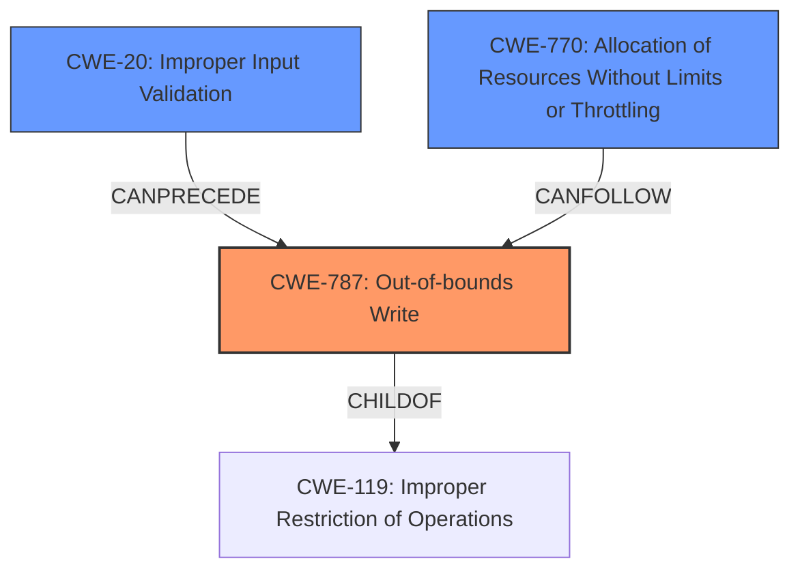

# Final Resolution for CVE-2021-20987

# Summary
| CWE ID | CWE Name | Confidence | CWE Abstraction Level | CWE Vulnerability Mapping Label | CWE-Vulnerability Mapping Notes |
|---|---|---|---|---|---|
| CWE-787 | Out-of-bounds Write | 1.0 | Base | Primary | Allowed |
| CWE-20 | Improper Input Validation | 0.7 | Class | Secondary Candidate | Discouraged |
| CWE-770 | Allocation of Resources Without Limits or Throttling | 0.6 | Base | Secondary Candidate | Allowed |

## Evidence and Confidence

*   **Confidence Score:** 0.9
*   **Evidence Strength:** HIGH

## Relationship Analysis
The primary weakness is **CWE-787 (Out-of-bounds Write)**, which is a child of **CWE-119 (Improper Restriction of Operations within the Bounds of a Memory Buffer)**. This indicates that **CWE-787** is a more specific instance of a buffer overflow. The suggestion to include **CWE-20 (Improper Input Validation)** is valid, as network input is likely involved, making it a potential precursor to **CWE-787**. **CWE-770 (Allocation of Resources Without Limits or Throttling)** is considered as a possible contributor to the denial of service, especially if the out-of-bounds write can be triggered repeatedly.

## Vulnerability Chain
The vulnerability chain starts with potentially **improper input validation (CWE-20)** of network data. This leads to an **out-of-bounds write (CWE-787)**, causing memory corruption. This corruption can further lead to code injection and remote code execution. The **denial of service** impact is potentially exacerbated by **uncontrolled resource allocation (CWE-770)** if the attacker can repeatedly trigger the out-of-bounds write.

## Summary of Analysis
The analysis is based on the provided vulnerability description, which explicitly mentions "out-of-bounds write," "denial of service," and "code injection." The inclusion of **CWE-787** as the primary **ROOTCAUSE** is strongly supported by the CVE summary, which identifies it as the direct cause. The addition of **CWE-20** is justified because the vulnerability occurs through network access, making improper input validation a likely contributing factor. Although **CWE-20** is a Class-level CWE and generally discouraged, the report also mentions code exposure, which directly relates to unsanitized input. The choice of **CWE-787** as the primary CWE is at the optimal level of specificity (Base), as it directly describes the core flaw. The relationship analysis helped refine the chain and identify potential contributing factors like **CWE-20** and **CWE-770**. **CWE-770** is relevant because the devices crash without recovery, suggesting a **denial of service**.