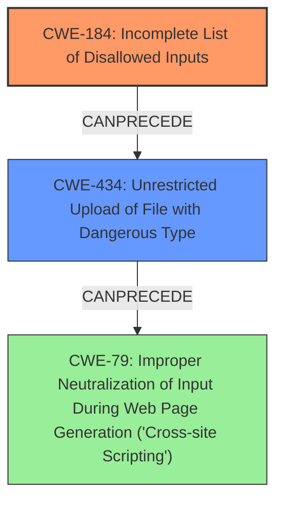

# Final Resolution for CVE-2021-21141

# Summary
| CWE ID | CWE Name | Confidence | CWE Abstraction Level | CWE Vulnerability Mapping Label | CWE-Vulnerability Mapping Notes |
|---|---|---|---|---|---|
| CWE-184 | Incomplete List of Disallowed Inputs | 0.85 | Base | Allowed | Primary CWE: The product implements a protection mechanism that relies on a list of inputs (or properties of inputs) that are not allowed by policy or otherwise require other action to neutralize before additional processing takes place, but the list is incomplete.|
| CWE-434 | Unrestricted Upload of File with Dangerous Type | 0.5 | Base | Allowed | Secondary Candidate: Possible consequence of CWE-184 due to bypass of file extension policy. |
| CWE-79 | Improper Neutralization of Input During Web Page Generation ('Cross-site Scripting') | 0.2 | Base | Allowed | Secondary Candidate: Remote possibility, only if uploaded content is displayed without sanitization. |

## Evidence and Confidence

*   **Confidence Score:** 0.8
*   **Evidence Strength:** MEDIUM

## Relationship Analysis
The primary relationship that impacted my decision was the chain relationship where CWE-184 can lead to CWE-434. CWE-79 was considered a very remote possibility and given a very low confidence. The abstraction levels also influenced the decision, favoring the base level CWE-184 as the root cause.

## Vulnerability Chain
The vulnerability chain starts with the **incomplete list of disallowed inputs (CWE-184)**. This allows an attacker to bypass the file extension policy. The next step is the **unrestricted upload of a file with a dangerous type (CWE-434)**, which is a consequence of the policy bypass. Finally, if the uploaded content is displayed without proper sanitization, it *could* lead to **cross-site scripting (CWE-79)**, but this is a remote possibility depending on the application's behavior.

## Summary of Analysis
The initial analysis correctly identified **CWE-184 (Incomplete List of Disallowed Inputs)** as the primary **ROOTCAUSE** due to "insufficient policy enforcement". The criticism provided valuable insights into strengthening the justification for the chosen CWEs and distinguishing between root causes and potential consequences. Specifically, the criticism highlighted that **CWE-434 (Unrestricted Upload of File with Dangerous Type)** and **CWE-79 (Improper Neutralization of Input During Web Page Generation ('Cross-site Scripting'))** were weaker mappings, with **CWE-434** being a possible consequence and **CWE-79** being a remote possibility.

The graph relationships influenced the final selection by emphasizing the chain relationship where **CWE-184** can lead to **CWE-434**. The abstraction levels also played a role, favoring the base level **CWE-184** as the **ROOTCAUSE**.

The vulnerability description explicitly mentions "insufficient policy enforcement," which directly supports **CWE-184**. The fact that the vulnerability allows bypassing a file extension policy implies that a list of disallowed extensions is incomplete, hence the selection of **CWE-184**.

The selected CWEs are at the optimal level of specificity because **CWE-184** directly addresses the **ROOTCAUSE** of the vulnerability. While **CWE-434** is a possible consequence, it's not the primary weakness.