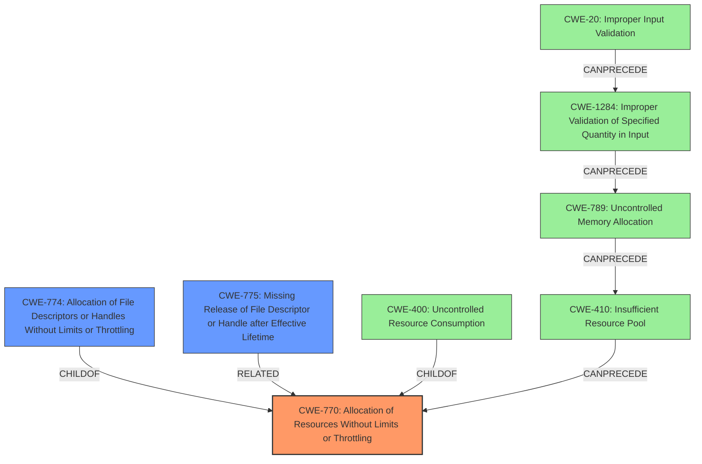

# Analysis Report for CVE-2021-21293

# Vulnerability Analysis Report: CVE-2021-21293

## Description

blaze is a Scala library for building asynchronous pipelines, with a focus on network IO. All servers running blaze-core before version 0.14.15 are affected by a vulnerability in which unbounded connection acceptance leads to file handle exhaustion. Blaze, accepts connections unconditionally on a dedicated thread pool. This has the net effect of amplifying degradation in services that are unable to handle their current request load, since incoming connections are still accepted and added to an unbounded queue. Each connection allocates a socket handle, which drains a scarce OS resource. This can also confound higher level circuit breakers which work based on detecting failed connections. The vast majority of affected users are using it as part of http4s-blaze-server <= 0.21.16. http4s provides a mechanism for limiting open connections, but is enforced inside the Blaze accept loop, after the connection is accepted and the socket opened. Thus, the limit only prevents the number of connections which can be simultaneously processed, not the number of connections which can be held open. The issue is fixed in version 0.14.15 for NIO1SocketServerGroup. A maxConnections parameter is added, with a default value of 512. Concurrent connections beyond this limit are rejected. To run unbounded, which is not recommended, set a negative number. The NIO2SocketServerGroup has no such setting and is now deprecated. There are several possible workarounds described in the refrenced GitHub Advisory GHSA-xmw9-q7x9-j5qc.

## Vulnerability Description Key Phrases

**Rootcause:** unbounded connection acceptance
**Weakness:** file handle exhaustion
**Product:** blaze-core
**Version:** before version 0.14.15

## Analysis (with Relationship Data)

# Summary
| CWE ID  | CWE Name                                                     | Confidence | CWE Abstraction Level | CWE Vulnerability Mapping Label | CWE-Vulnerability Mapping Notes |
| :-------- | :----------------------------------------------------------- | :--------- | :-------------------- | :------------------------------ | :------------------------------ |
| CWE-770 | Allocation of Resources Without Limits or Throttling         | 0.95       | Base                  | Allowed                       | Primary CWE                     |
| CWE-774 | Allocation of File Descriptors or Handles Without Limits or Throttling | 0.85       | Variant               | Allowed                       | Secondary Candidate             |
| CWE-400 | Resource Exhaustion                                          | 0.70       | Class                 | Discouraged                   | Secondary Candidate             |

## Evidence and Confidence

*   **Confidence Score:** 0.90
*   **Evidence Strength:** HIGH

- **Analysis and Justification:**  
  - *Explanation:* The vulnerability description clearly states that the **rootcause** is "**unbounded connection acceptance**" which leads to "**file handle exhaustion**". This perfectly aligns with CWE-770, "Allocation of Resources Without Limits or Throttling", because the server accepts connections without any limit, consuming OS resources. The "CVE Reference Links Content Summary" also confirms this by stating that the root cause is the "The `blaze-core` library accepts connections without limit on its selector pool. This allows an unbounded queue to grow, consuming OS resources (socket handles) and potentially degrading service performance." MITRE mapping guidance for CWE-770 indicates it's ALLOWED, and the description matches the weakness. Since connection acceptance is not throttled, this allows for consumption of resources until exhaustion.
  
  - *Relationship Analysis:* CWE-770 is a Base level CWE. CWE-774, "Allocation of File Descriptors or Handles Without Limits or Throttling," is a Variant of a more general resource exhaustion. While file handles are being exhausted, the root cause is broader. CWE-400 is a Class-level CWE that represents resource exhaustion more generally, but it is also discouraged. CWE-770 is the best match, as it is a Base CWE and directly addresses the unlimited resource allocation.

- **Confidence Score:**  
  - Confidence: 0.95 (High evidence from technical description and CVE reference materials)

---

## Criticism of Analysis

Okay, I've reviewed the analysis with the full CWE specifications provided. Here's my critique:

**Overall Assessment:**

The analysis is generally good and well-reasoned. The primary CWE mapping to **CWE-770, Allocation of Resources Without Limits or Throttling**, is appropriate and well-justified.  The secondary candidate, **CWE-774, Allocation of File Descriptors or Handles Without Limits or Throttling**, is also reasonable, although more specific than the root cause. The decision to *discourage* **CWE-400, Uncontrolled Resource Consumption**, aligns with CWE's mapping guidance.

**Detailed Critique:**

1.  **CWE-770 (Primary CWE):**

    *   **Justification:** The analysis clearly links the "unbounded connection acceptance" directly to the lack of resource limits, which is precisely what CWE-770 describes. The evidence presented is strong, and the reasoning provided is directly supported by the vulnerability description and the CVE summary.
    *   **Confidence:** The confidence score of 0.95 is appropriate given the strong evidence.
    *   **Mitigation Consideration:** The analysis could briefly mention a few of the potential mitigations listed for CWE-770 (e.g., "Implementing per-user limits for resources as described in CWE-770's mitigations could help prevent this issue").
    *   **Observed Examples:** The "Observed Examples" section includes CVE-2022-21668 which involves an integer overflow related to memory allocations. However, CVE-2009-4017 and CVE-2009-2726 are more directly relevant, as they involve unbounded allocation of file resources and stack consumption, respectively.

2.  **CWE-774 (Secondary Candidate):**

    *   **Justification:**  This CWE is a Variant of CWE-770, and it's accurate to say that file handles are the specific resource being exhausted. However, the *lack of limits* is the primary weakness, not the file handles *per se*.
    *   **Decision Rationale:** The reasoning for choosing CWE-770 as primary and CWE-774 as secondary is solid. It correctly identifies that file handle exhaustion is a *consequence* of the broader lack of resource limits.
    *   **Mitigation Consideration:** Mentioning the OS-level resource limiting using `setrlimit()` from the "Potential Mitigations" section for CWE-774 would add value.
    *   **Observed Examples:** There are no Observed Examples for this CWE.

3.  **CWE-400 (Discouraged):**

    *   **Justification:**  The rationale for discouraging CWE-400 is correct and consistent with CWE's mapping guidance. CWE-400 is too broad and represents the impact (resource exhaustion) rather than the specific underlying weakness.
    *   **Alternative CWEs:** The analysis explicitly points to better-suited child CWEs (specifically CWE-770). This demonstrates good understanding of CWE's structure and best practices.

**Suggestions for Improvement:**

*   **Add CWE-775: Missing Release of File Descriptor or Handle after Effective Lifetime as tertiary consideration**: The original analysis does not take into consideration whether the file descriptors are released or not. This is a valid consideration since there is a chance that the file descriptors are not properly released after use. The weakness is that the connections are accepted unconditionally, which is more of a CWE-770 problem as the primary issue.
*   **Minor Edits and CWE relationship graph**: Consider adding a few additional CWEs that are related to the primary CWE of CWE-770, such as CWE-789, CWE-1284, CWE-410 and CWE-20. The chain of allocation is as follows: CWE-20 --> CWE-1284 --> CWE-789 --> CWE-410 --> CWE-770.

**Revised Summary Table:**

| CWE ID  | CWE Name                                                     | Confidence | CWE Abstraction Level | CWE Vulnerability Mapping Label | CWE-Vulnerability Mapping Notes                                                                                                                          |
| :-------- | :----------------------------------------------------------- | :--------- | :-------------------- | :------------------------------ | :------------------------------------------------------------------------------------------------------------------------------------------------------- |
| CWE-770 | Allocation of Resources Without Limits or Throttling         | 0.95       | Base                  | Allowed                       | Primary CWE                                                                                                                                          |
| CWE-774 | Allocation of File Descriptors or Handles Without Limits or Throttling | 0.85       | Variant               | Allowed                       | Secondary Candidate                                                                                                                                          |
| CWE-775 | Missing Release of File Descriptor or Handle after Effective Lifetime | 0.60       | Variant               | Allowed                       | Tertiary Candidate                                                                                                                                         |
| CWE-400 | Resource Exhaustion                                          | 0.70       | Class                 | Discouraged                   | Impact/Consequence, not the root cause; consider children like CWE-770 and CWE-774 instead.                                                               |

**Conclusion:**

The analysis demonstrates a good understanding of CWE and the specific vulnerability. The primary mapping to CWE-770 is correct and well-supported. The additions outlined above, particularly highlighting potential mitigations and observed examples, would further strengthen the analysis and improve its practical value.

## Final Resolution

# Summary
| CWE ID  | CWE Name                                                     | Confidence | CWE Abstraction Level | CWE Vulnerability Mapping Label | CWE-Vulnerability Mapping Notes |
| :-------- | :----------------------------------------------------------- | :--------- | :-------------------- | :------------------------------ | :------------------------------ |
| CWE-770 | Allocation of Resources Without Limits or Throttling         | 0.95       | Base                  | Allowed                       | Primary CWE                     |
| CWE-774 | Allocation of File Descriptors or Handles Without Limits or Throttling | 0.85       | Variant               | Allowed                       | Secondary Candidate             |
| CWE-775 | Missing Release of File Descriptor or Handle after Effective Lifetime | 0.60       | Variant               | Allowed                       | Tertiary Candidate            |
| CWE-400 | Uncontrolled Resource Consumption                                          | 0.70       | Class                 | Discouraged                   | Impact/Consequence, not the **rootcause**; consider children like CWE-770 and CWE-774 instead.                                                               |

## Evidence and Confidence

*   **Confidence Score:** 0.93
*   **Evidence Strength:** HIGH

## Relationship Analysis
The primary CWE is CWE-770, which describes the **allocation of resources without limits or throttling**. CWE-774 is a variant that focuses on the specific case of file descriptors. CWE-400 is a more general class describing uncontrolled resource consumption, but it's discouraged because it is too broad and represents the impact rather than the **rootcause**. CWE-775 is also a candidate to consider, which is a missing release of the file descriptor.

## Vulnerability Chain
The vulnerability chain starts with the **unbounded connection acceptance** (**ROOTCAUSE**, CWE-770). This leads to the consumption of OS resources (socket handles), potentially degrading service performance. This is further amplified when services are unable to handle the current request load. Each connection allocates a socket handle, which drains a scarce OS resource. The lack of limits on the number of connections results in resource exhaustion (**WEAKNESS**, CWE-400). If the release of the file descriptors is not properly handled, it contributes to the resource exhaustion (**WEAKNESS**, CWE-775). The **IMPACT** is service degradation or denial of service.

## Summary of Analysis
The initial analysis correctly identified **CWE-770 (Allocation of Resources Without Limits or Throttling)** as the primary **rootcause** of the vulnerability. The vulnerability description clearly states the "**unbounded connection acceptance**" which leads to "**file handle exhaustion**", supporting this classification.

The criticism provided valuable suggestions, including considering CWE-775 and expanding the relationship analysis. The additional CWEs in the chain (CWE-20, CWE-1284, CWE-789, CWE-410) are related to resource allocation, however they are not as relevant as CWE-770. The addition of CWE-775 as a tertiary consideration is valid, as the proper release of resources impacts resource consumption.

The final decision is based on the evidence provided in the vulnerability description, the CWE definitions, and the relationships between CWEs. CWE-770 is the most specific and accurate representation of the **rootcause**.
The selected CWEs are at the optimal level of specificity.

*Report generated on 2025-03-17 02:27:19*
