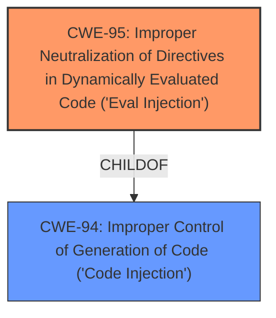

# Final Resolution for CVE-2021-21305

# Summary
| CWE ID | CWE Name | Confidence | CWE Abstraction Level | CWE Vulnerability Mapping Label | CWE-Vulnerability Mapping Notes |
|---|---|---|---|---|---|
| CWE-95 | Improper Neutralization of Directives in Dynamically Evaluated Code ('Eval Injection') | 0.95 | Variant | Allowed | Primary CWE: This CWE accurately describes the vulnerability where the `manipulate!` method uses `eval` on unsanitized input, leading to code execution. |
| CWE-94 | Improper Control of Generation of Code ('Code Injection') | 0.70 | Base | Allowed-with-Review | Secondary CWE: This CWE describes the general case of code injection, which is related to the eval injection. |

## Evidence and Confidence

*   **Confidence Score:** 0.95
*   **Evidence Strength:** HIGH

## Relationship Analysis
The primary relationship impacting the decision is the hierarchical relationship between CWE-94 [Improper Control of Generation of Code ('Code Injection')] and CWE-95 [Improper Neutralization of Directives in Dynamically Evaluated Code ('Eval Injection')]. CWE-95 is a variant of CWE-94. Given the explicit mention of `eval` in the vulnerability description ("The #manipulate! method inappropriately **evals** the content of mutation option(read/write), allowing attackers to craft a string that can be executed as a Ruby code"), selecting the more specific CWE-95 is warranted.

## Vulnerability Chain
The vulnerability chain starts with the lack of proper sanitization of input provided to the `#manipulate!` method. This input is then used in a dynamic evaluation (`eval`) context, leading to arbitrary code execution.

-   **Root Cause:** Improper sanitization of input to `#manipulate!` method.
-   **Weakness:** Use of `eval` on unsanitized input (CWE-95).
-   **Impact:** Remote Code Execution (RCE).

## Summary of Analysis
The initial analysis and the provided criticism both converge on the conclusion that **CWE-95: Improper Neutralization of Directives in Dynamically Evaluated Code ('Eval Injection')** is the most appropriate primary CWE. The vulnerability description explicitly states that the `#manipulate!` method uses `eval` on unsanitized input, leading to code execution. This direct relationship between the vulnerability and the CWE definition strengthens the confidence in this classification.

The graph relationship analysis further reinforces this decision, as CWE-95 is a more specific variant of CWE-94, and the vulnerability clearly involves dynamic evaluation.

The decision is based on direct evidence from the vulnerability description and the explicit mention of `eval`. The selection of CWE-95 is at the optimal level of specificity, as it directly reflects the technical cause of the vulnerability. While other CWEs such as CWE-78 [Improper Neutralization of Special Elements used in an OS Command ('OS Command Injection')] could potentially be related, the primary issue is the use of `eval`, making CWE-95 the most accurate classification. I do not see any evidence that the types of flaws can be further classified.

The confidence score remains high (0.95) due to the clear and direct relationship between the vulnerability and CWE-95.