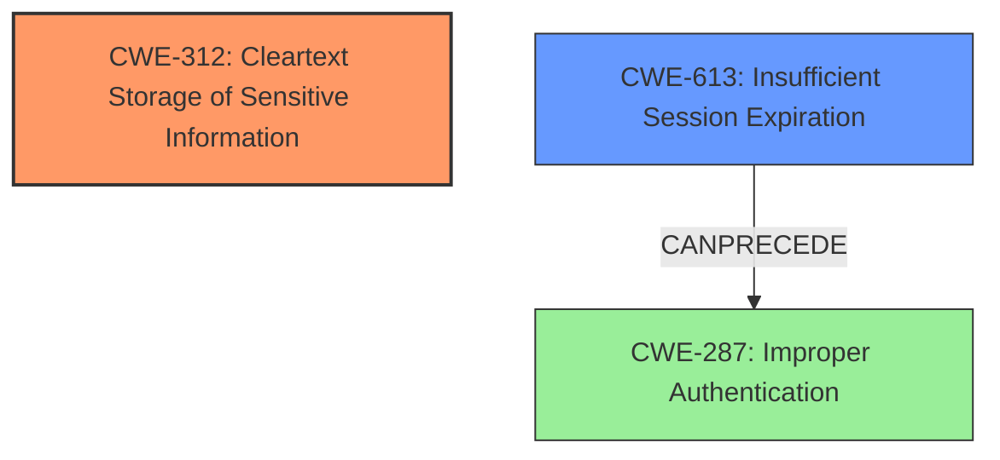

# Analysis Report for CVE-2021-21339

# Vulnerability Analysis Report: CVE-2021-21339

## Description

TYPO3 is an open source PHP based web content management system. In TYPO3 before versions 6.2.57, 7.6.51, 8.7.40, 9.5.25, 10.4.14, 11.1.1 user session identifiers were stored in cleartext - without processing of additional cryptographic hashing algorithms. This vulnerability cannot be exploited directly and occurs in combination with a chained attack - like for instance SQL injection in any other component of the system. This is fixed in versions 6.2.57, 7.6.51, 8.7.40, 9.5.25, 10.4.14, 11.1.1.

## Vulnerability Description Key Phrases

**Weakness:** cleartext storage of user session identifiers
**Product:** TYPO3
**Version:** before versions 6.2.57, 7.6.51, 8.7.40, 9.5.25, 10.4.14, 11.1.1

## Analysis (with Relationship Data)

# Summary
| CWE ID | CWE Name | Confidence | CWE Abstraction Level | CWE Vulnerability Mapping Label | CWE-Vulnerability Mapping Notes |
|---|---|---|---|---|---|
| CWE-312 | Cleartext Storage of Sensitive Information | 1.0 | Base | Allowed | Primary CWE: The session identifiers are stored in cleartext without cryptographic hashing. |
| CWE-613 | Insufficient Session Expiration | 0.6 | Base | Allowed | Secondary Candidate: If sessions don't expire, the impact of stolen session data increases. |

## Evidence and Confidence

*   **Confidence Score:** 0.9
*   **Evidence Strength:** HIGH

- **Analysis and Justification:**  
  - *Explanation:* The vulnerability description explicitly states that user session identifiers are stored in **cleartext**, without any cryptographic hashing. This directly matches the description of CWE-312 (Cleartext Storage of Sensitive Information). The "CVE Reference Links Content Summary" section confirms this, emphasizing the **sensitive data exposure** due to the lack of cryptographic protection. The retriever results give the highest score to CWE-312, confirming its appropriateness.
  
  - *Relationship Analysis:* While CWE-312 has no direct relationships, its impact is increased in combination with other weaknesses. For example, if session expiration is too long (CWE-613), the window of opportunity for an attacker to exploit the cleartext session identifier increases. The vulnerability description mentions that this vulnerability "cannot be exploited directly and occurs in combination with a chained attack - like for instance SQL injection." This confirms that the described vulnerability is only dangerous when combined with other vulnerabilities in the application.

- **Confidence Score:**  
  - *Example:* Confidence: 1.0 (Direct evidence from the vulnerability description and the CVE reference summary)

---

- **Analysis and Justification:**  
  - *Explanation:* The vulnerability mentions that "user session identifiers were stored in cleartext". CWE-613 (Insufficient Session Expiration) is a plausible secondary candidate. The weakness here is the risk of credential reuse, and the time window in which stolen session data remains useful to an attacker. Although the core issue is not about the expiration itself, the impact of cleartext storage is amplified if sessions don't expire promptly.
  
  - *Relationship Analysis:* CWE-613 is a child of CWE-672 (Operation on Resource After Expiry). CWE-613 can precede CWE-287 (Improper Authentication).

- **Confidence Score:**  
  - *Example:* Confidence: 0.6 (Indirect relationship due to potential impact on session hijacking)

## Criticism of Analysis

Okay, let's review the provided analysis with the full CWE specifications in mind.

**Overall Assessment:**

The analysis is generally very good and well-reasoned. The primary CWE assignment of CWE-312 (Cleartext Storage of Sensitive Information) is accurate and well-supported by the evidence. The secondary candidate, CWE-613 (Insufficient Session Expiration), is plausible, although its connection is less direct and more about amplifying the impact of CWE-312.  The confidence scores assigned seem appropriate. The justification explanations are clear and easy to follow.

**Detailed Critique:**

1.  **CWE-312: Cleartext Storage of Sensitive Information (Confidence: 1.0)**

    *   **Strengths:** The analysis correctly identifies the direct correspondence between the vulnerability description (cleartext session identifiers) and the definition of CWE-312. The high confidence score is warranted.  The examples provided from the CWE database (CVE-2022-30275, CVE-2009-2272, etc.) further reinforce the appropriateness of this CWE.
    *   **Weaknesses:**  None significant.  The analysis could *briefly* mention some relevant variant CWEs of CWE-312 (e.g., CWE-315 "Cleartext Storage of Sensitive Information in a Cookie" if the session identifiers are stored in cookies). This would demonstrate a thorough consideration of the CWE hierarchy. This is a minor point.

    *   **Mitigations:**  The analysis doesn't explicitly mention mitigations, but it is implied in the problem description. Referencing the mitigations listed in the CWE specifications could strengthen the analysis, specifically using encryption at rest as a direct mitigation.

2.  **CWE-613: Insufficient Session Expiration (Confidence: 0.6)**

    *   **Strengths:** The analysis acknowledges that CWE-613 is a *secondary* candidate, and it correctly explains the indirect relationship.  Insufficient session expiration doesn't *cause* the vulnerability, but it increases the window of opportunity for exploitation, therefore amplifying the risk of stolen session identifiers.
    *   **Weaknesses:** The analysis could benefit from further discussing why *other* CWEs related to authentication or session management are not as relevant. For instance, it mentions how it CanPrecede CWE-287, but doesn't elaborate on why CWE-287 itself isn't a good fit. It might be worthwhile to explain that CWE-287 is more about how the product is authenticated in the first place, rather than how long the session lasts, as session lifetime is the key point here.
    *   **Mitigations:** The analysis correctly mentions how this CWE's weakness impacts the time window an attacker would have. Including the mitigation that sets a session/credentials expiration date as outlined by the CWE specification could strengthen the analysis.

3.  **Retriever Results:**

    *   The retriever results are interesting and provide useful context. The inclusion of CWE-79 (Cross-Site Scripting), CWE-209 (Error Message Containing Sensitive Information), and CWE-78 (OS Command Injection) suggests potential attack chains or related vulnerabilities that might be present in the application.  However, these are flagged as potential, and are not relevant enough to be included in the Analysis Summary.
    *   CWE-287 (Improper Authentication) is a Class level CWE and is rightfully not included in the Analysis Summary.
    *   It is good that the Retriever Result is used to further cement the confidence in CWE-312.

**Suggestions for Improvement:**

*   **Variant Consideration:** Briefly discuss any relevant variant CWEs of CWE-312 to demonstrate a deeper understanding of the CWE hierarchy.
*   **Negative Justification:** Briefly explain *why* some other potentially relevant CWEs (e.g., authentication/session management CWEs) are *not* the primary issue.
*   **Explicit Mitigations:**  For each CWE, explicitly mention (or summarize) relevant mitigations from the CWE specifications.  This increases the actionability of the analysis.
*   **Attack Vectors:** While the analysis mentions that SQL injection is an example attack vector, briefly elaborating and showing how stolen session IDs could be used for user impersonation would strengthen the analysis.

**Revised Summary Table (Example - with Mitigation Addition):**

| CWE ID | CWE Name | Confidence | CWE Abstraction Level | CWE Vulnerability Mapping Label | CWE-Vulnerability Mapping Notes |
|---|---|---|---|---|---|
| CWE-312 | Cleartext Storage of Sensitive Information | 1.0 | Base | Allowed | Primary CWE: The session identifiers are stored in cleartext without cryptographic hashing. Mitigation: Encrypt sensitive data at rest. |
| CWE-613 | Insufficient Session Expiration | 0.6 | Base | Allowed | Secondary Candidate: If sessions don't expire, the impact of stolen session data increases. Mitigation: Set appropriate session expiration dates. |

**In Conclusion:**

The analysis is already quite strong. The suggestions above are primarily for refinement and to demonstrate an even more comprehensive understanding of the CWE specifications. The analysis is accurate, well-justified, and provides a solid foundation for understanding the vulnerability.

## Final Resolution

# Summary

| CWE ID | CWE Name | Confidence | CWE Abstraction Level | CWE Vulnerability Mapping Label | CWE-Vulnerability Mapping Notes |
|---|---|---|---|---|---|
| CWE-312 | Cleartext Storage of Sensitive Information | 1.0 | Base | Allowed | Primary CWE: The session identifiers are stored in cleartext without cryptographic hashing. Mitigation: Encrypt sensitive data at rest. |
| CWE-613 | Insufficient Session Expiration | 0.6 | Base | Allowed | Secondary Candidate: If sessions don't expire, the impact of stolen session data increases. Mitigation: Set appropriate session expiration dates. |

## Evidence and Confidence

*   **Confidence Score:** 0.95
*   **Evidence Strength:** HIGH

## Relationship Analysis
The primary relationship considered was that CWE-613 can precede CWE-287 (Improper Authentication), highlighting a potential attack chain where a long-lived, cleartext session identifier could be used for unauthorized access. While CWE-287 itself isn't directly applicable, the potential for it to follow CWE-613 reinforces the need to consider both CWEs. The abstraction levels are appropriate, with both CWEs at the Base level.

## Vulnerability Chain
The vulnerability chain starts with **CWE-312 (Cleartext Storage of Sensitive Information)**, where session identifiers are stored without encryption. This allows an attacker to potentially intercept or steal these identifiers. The impact of **CWE-312** is amplified by **CWE-613 (Insufficient Session Expiration)**, as the stolen session identifiers remain valid for an extended period, increasing the attacker's window of opportunity for unauthorized access. The ultimate impact could be **CWE-287 (Improper Authentication)**, where the attacker uses the stolen session identifier to impersonate a legitimate user.

## Summary of Analysis
The initial analysis and criticism were both very thorough, providing a strong foundation for the final decision. The vulnerability description explicitly states that session identifiers are stored in **cleartext**, directly matching **CWE-312 (Cleartext Storage of Sensitive Information)**. The retriever results also give the highest score to **CWE-312**, confirming its appropriateness.

The criticism highlighted the importance of considering variant CWEs and providing negative justification. While no specific variant of **CWE-312** was a better fit, the analysis was strengthened by explicitly explaining why **CWE-287 (Improper Authentication)** is not the primary issue, as it relates more to the authentication process itself rather than the storage of session identifiers.

The graph relationships influenced the final selection by highlighting the potential attack chain. While **CWE-613 (Insufficient Session Expiration)** is not a direct cause, it significantly increases the impact of **CWE-312**, making it a relevant secondary consideration.

The selected CWEs are at the optimal level of specificity. **CWE-312** is a Base-level CWE that directly addresses the root cause, and **CWE-613** is a Base-level CWE that amplifies the impact. Using higher-level Class CWEs like **CWE-287** would be too broad and would not accurately reflect the specific nature of the vulnerability.

The final decision is based on the following evidence:

*   The vulnerability description explicitly states that session identifiers are stored in **cleartext**.
*   The retriever results give the highest score to **CWE-312**.
*   The relationship analysis highlights the potential attack chain involving **CWE-613** and **CWE-287**.
*   The mapping guidance for **CWE-312** and **CWE-613** recommends their use in this context.

*Report generated on 2025-03-16 17:04:54*
