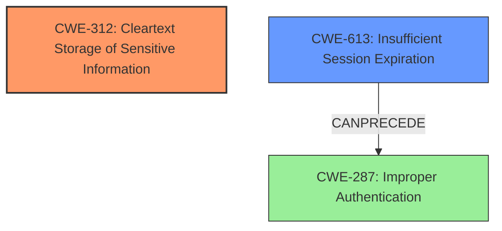

# Final Resolution for CVE-2021-21339

# Summary

| CWE ID | CWE Name | Confidence | CWE Abstraction Level | CWE Vulnerability Mapping Label | CWE-Vulnerability Mapping Notes |
|---|---|---|---|---|---|
| CWE-312 | Cleartext Storage of Sensitive Information | 1.0 | Base | Allowed | Primary CWE: The session identifiers are stored in cleartext without cryptographic hashing. Mitigation: Encrypt sensitive data at rest. |
| CWE-613 | Insufficient Session Expiration | 0.6 | Base | Allowed | Secondary Candidate: If sessions don't expire, the impact of stolen session data increases. Mitigation: Set appropriate session expiration dates. |

## Evidence and Confidence

*   **Confidence Score:** 0.95
*   **Evidence Strength:** HIGH

## Relationship Analysis
The primary relationship considered was that CWE-613 can precede CWE-287 (Improper Authentication), highlighting a potential attack chain where a long-lived, cleartext session identifier could be used for unauthorized access. While CWE-287 itself isn't directly applicable, the potential for it to follow CWE-613 reinforces the need to consider both CWEs. The abstraction levels are appropriate, with both CWEs at the Base level.

## Vulnerability Chain
The vulnerability chain starts with **CWE-312 (Cleartext Storage of Sensitive Information)**, where session identifiers are stored without encryption. This allows an attacker to potentially intercept or steal these identifiers. The impact of **CWE-312** is amplified by **CWE-613 (Insufficient Session Expiration)**, as the stolen session identifiers remain valid for an extended period, increasing the attacker's window of opportunity for unauthorized access. The ultimate impact could be **CWE-287 (Improper Authentication)**, where the attacker uses the stolen session identifier to impersonate a legitimate user.

## Summary of Analysis
The initial analysis and criticism were both very thorough, providing a strong foundation for the final decision. The vulnerability description explicitly states that session identifiers are stored in **cleartext**, directly matching **CWE-312 (Cleartext Storage of Sensitive Information)**. The retriever results also give the highest score to **CWE-312**, confirming its appropriateness.

The criticism highlighted the importance of considering variant CWEs and providing negative justification. While no specific variant of **CWE-312** was a better fit, the analysis was strengthened by explicitly explaining why **CWE-287 (Improper Authentication)** is not the primary issue, as it relates more to the authentication process itself rather than the storage of session identifiers.

The graph relationships influenced the final selection by highlighting the potential attack chain. While **CWE-613 (Insufficient Session Expiration)** is not a direct cause, it significantly increases the impact of **CWE-312**, making it a relevant secondary consideration.

The selected CWEs are at the optimal level of specificity. **CWE-312** is a Base-level CWE that directly addresses the root cause, and **CWE-613** is a Base-level CWE that amplifies the impact. Using higher-level Class CWEs like **CWE-287** would be too broad and would not accurately reflect the specific nature of the vulnerability.

The final decision is based on the following evidence:

*   The vulnerability description explicitly states that session identifiers are stored in **cleartext**.
*   The retriever results give the highest score to **CWE-312**.
*   The relationship analysis highlights the potential attack chain involving **CWE-613** and **CWE-287**.
*   The mapping guidance for **CWE-312** and **CWE-613** recommends their use in this context.