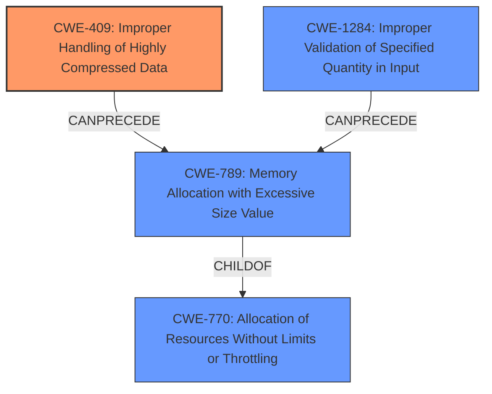

# Final Resolution for CVE-2021-21419

# Summary
| CWE ID | CWE Name | Confidence | CWE Abstraction Level | CWE Vulnerability Mapping Label | CWE-Vulnerability Mapping Notes |
|---|---|---|---|---|---|
| **CWE-409** | **Improper Handling of Highly Compressed Data (Data Amplification)** | 0.95 | Base | Allowed | Primary CWE. The vulnerability involves handling compressed data with a high compression ratio, leading to a large output and memory exhaustion. |
| **CWE-789** | **Memory Allocation with Excessive Size Value** | 0.90 | Variant | Allowed | Secondary candidate. Memory is allocated based on an untrusted size value without ensuring that the size is within expected limits, allowing arbitrary amounts of memory to be allocated. This is often a direct consequence of **CWE-409**. |
| **CWE-1284** | **Improper Validation of Specified Quantity in Input** | 0.85 | Base | Allowed | There is no validation of the size of the decompressed data before allocation. The quantity (size) isn't validated, which allows excessive allocation. |
| **CWE-770** | **Allocation of Resources Without Limits or Throttling** | 0.80 | Base | Allowed | Secondary candidate. The product allocates resources without imposing restrictions on the size or number of resources that can be allocated. While true, **CWE-409** and **CWE-789** are more precise. |

## Evidence and Confidence

*   **Confidence Score:** 0.93
*   **Evidence Strength:** HIGH

## Relationship Analysis
The primary weakness is **CWE-409 (Improper Handling of Highly Compressed Data)**, which directly leads to **data amplification**. This, in turn, results in **CWE-789 (Memory Allocation with Excessive Size Value)** due to the allocation of memory based on the amplified size without proper validation. **CWE-1284 (Improper Validation of Specified Quantity in Input)** is introduced because the size of the input (compressed or decompressed) isn't validated. **CWE-770 (Allocation of Resources Without Limits or Throttling)** is a broader category encompassing the lack of resource limits but is less specific than the others. The relationship can be visualized as follows:

## Vulnerability Chain
The vulnerability chain starts with a malicious actor sending a highly compressed data frame (**CWE-409**). Due to the lack of input validation on either the compressed size or the expected decompressed size (**CWE-1284**), the system proceeds to allocate memory based on the potentially excessive size (**CWE-789**). This allocation occurs without proper limits or throttling (**CWE-770**), leading to memory exhaustion and potentially a denial-of-service condition.

## Summary of Analysis
The initial analysis correctly identified **CWE-409**, **CWE-789**, and **CWE-770** as relevant weaknesses. The criticism provided valuable insights by suggesting the inclusion of **CWE-1284** to highlight the lack of input validation. The final decision incorporates this suggestion, increasing the confidence in the overall assessment.

The primary CWE, **CWE-409**, is chosen because the vulnerability description explicitly mentions highly compressed data leading to memory exhaustion. The CVE summary also mentions "data amplification," which aligns perfectly with **CWE-409**.

**CWE-789** is included because the amplified data results in excessive memory allocation. This is supported by the CVE summary mentioning "unbounded memory allocation."

**CWE-1284** is crucial because the root cause lies in the failure to validate the size of the input, whether compressed or decompressed. This lack of validation is a prerequisite for the excessive memory allocation.

**CWE-770** is kept as a secondary CWE because it represents the broader issue of resource allocation without limits, but the other CWEs provide more specific details about the vulnerability.

The selected CWEs are at the optimal level of specificity because they accurately describe the root cause, the contributing factors, and the resulting consequences of the vulnerability, based on the available evidence and relationship analysis. The selection is based on the vulnerability description: "A websocket peer may exhaust memory on Eventlet side by sending very large websocket frames. Malicious peer may exhaust memory on Eventlet side by sending highly compressed data frame." and CVE Reference Links Content Summary: "data amplification" and "unbounded memory allocation".