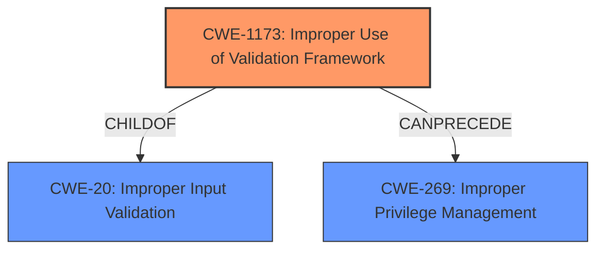

# Final Resolution for CVE-2021-21506

# Summary

| CWE ID    | CWE Name                                                                    | Confidence | CWE Abstraction Level | CWE Vulnerability Mapping Label | CWE-Vulnerability Mapping Notes |
| :-------- | :-------------------------------------------------------------------------- | :--------- | :-------------------- | :------------------------------ | :------------------------------ |
| CWE-1173 | Improper Use of Validation Framework                                          | 0.95       | Base                  | Allowed                       | Acceptable-Use                |
| CWE-269  | Improper Privilege Management                                                   | 0.70       | Class                  | Discouraged                       | Frequent Misuse                |

  - The Primary CWE should be first and noted as the Primary CWEs
  - The secondary candidate CWEs should be next and noted as secondary candidates.
  - The confidence is a confidence score 0 to 1 to rate your confidence in your assessment for that CWE.
  - The CWE Abstraction Level as one of these values: Base, Variant, Pillar, Class, Compound
  - The Mapping Notes Usage as one of these values: Allowed, Allowed-with-Review, Prohibited, Discouraged

## Evidence and Confidence

*   **Confidence Score:** 0.90
*   **Evidence Strength:** HIGH

## Relationship Analysis
The primary relationship influencing the decision is the direct mapping of "**improper use of validation framework**" in the vulnerability description to **CWE-1173 (Improper Use of Validation Framework)**. While **CWE-269 (Improper Privilege Management)** is a potential consequence, it is not the direct root cause. Therefore, **CWE-1173** is preferred due to its more specific nature and direct link to the **WEAKNESS**. The hierarchical relationship places **CWE-1173** as a child of the broader **CWE-20 (Improper Input Validation)**, confirming that input validation is the core issue.

## Vulnerability Chain
The vulnerability chain starts with the **ROOTCAUSE** - **CWE-1173 (Improper Use of Validation Framework)**. The lack of proper input sanitization allows an attacker with specific privileges (ISI_PRIV_SYS_SUPPORT and ISI_PRIV_LOGIN_PAPI) to exploit the system. This can then lead to the consequence of privilege escalation, which could be partially represented by **CWE-269 (Improper Privilege Management)**, although this is not the core issue. The chain is as follows:

1.  **CWE-1173 (Improper Use of Validation Framework)**: The product fails to properly use its input validation framework.
2.  Privileged attacker provides malicious input.
3.  Privilege escalation occurs.

## Summary of Analysis
The initial analysis correctly identified **CWE-1173 (Improper Use of Validation Framework)** as the primary weakness. The criticism correctly points out the importance of considering potential mitigations, which in this case is the proper use of input validation frameworks. The vulnerability description explicitly states "**improper input sanitization issue**" and "**improper use of validation framework vulnerability**", which provides strong evidence for **CWE-1173**. The graph relationships show that **CWE-1173** is a specific type of input validation issue (child of **CWE-20**) and can potentially lead to privilege management issues (**CWE-269**). The selected CWEs are at the optimal level of specificity because **CWE-1173** directly addresses the **ROOTCAUSE** described in the vulnerability, while **CWE-269** is more of a consequence.

I am increasing the confidence score for **CWE-1173** to 0.95 because of the direct mapping of the vulnerability description to the CWE description. I am also increasing the confidence score for **CWE-269** to 0.70 to account for the privilege escalation impact. The overall confidence score is also increased to 0.90 to reflect the stronger confidence in the assessment.