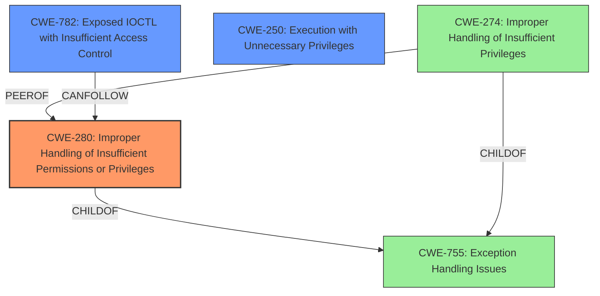

# Analysis Report for CVE-2021-21551

# Vulnerability Analysis Report: CVE-2021-21551

## Description

Dell dbutil_2_3.sys driver contains an insufficient access control vulnerability which may lead to escalation of privileges, denial of service, or information disclosure. Local authenticated user access is required.

## Vulnerability Description Key Phrases

**Rootcause:** insufficient access control
**Impact:** ['privilege escalation', 'denial of service', 'information disclosure']
**Attacker:** local authenticated user
**Product:** Dell dbutil_2_3.sys driver

## Analysis (with Relationship Data)

# Summary
| CWE ID | CWE Name | Confidence | CWE Abstraction Level | CWE Vulnerability Mapping Label | CWE-Vulnerability Mapping Notes |
|---|---|---|---|---|---|
| CWE-280 | Improper Handling of Insufficient Permissions or Privileges | 0.85 | Base | Allowed | Primary CWE |
| CWE-782 | Exposed IOCTL with Insufficient Access Control | 0.75 | Variant | Allowed | Secondary Candidate |
| CWE-250 | Execution with Unnecessary Privileges | 0.65 | Base | Allowed | Secondary Candidate |

## Evidence and Confidence

*   **Confidence Score:** 0.80
*   **Evidence Strength:** HIGH

- **Analysis and Justification:**  
  - *Explanation:* The vulnerability description states "**insufficient access control**" within the Dell dbutil_2_3.sys driver, leading to potential privilege escalation, denial of service, or information disclosure. The CVE Reference Links Content Summary reinforces this by explicitly stating that the root cause is "**insufficient access control**". CWE-280 (Improper Handling of Insufficient Permissions or Privileges) directly addresses this **weakness**, as it describes scenarios where a product doesn't handle insufficient privileges correctly, potentially causing unexpected code paths and invalid states. CWE-280 is a Base level CWE, which is preferred.

  - *Relationship Analysis:* CWE-280 is a base level weakness, and there are no direct relationships that significantly alter its appropriateness. The retriever results show similar CWEs like CWE-269 (Improper Privilege Management), CWE-274 (Improper Handling of Insufficient Privileges), and CWE-284 (Improper Access Control). CWE-269 and CWE-284 are discouraged for being too high-level or frequently misused. CWE-274 is also discouraged due to potential deprecation and overlap with CWE-280.

- **Confidence Score:**  
  - Confidence: 0.85 (High confidence due to explicit mention of "insufficient access control" in both the vulnerability description and CVE summary, along with the direct applicability of CWE-280.)

---

- **Analysis and Justification:**  
  - *Explanation:* CWE-782 (Exposed IOCTL with Insufficient Access Control) is a Variant level CWE that describes a situation where an IOCTL is exposed with functionality that should be restricted, but access control is not properly enforced. Given the context of a driver vulnerability (dbutil_2_3.sys), it is possible that the **insufficient access control** relates to IOCTLs. However, there is no explicit mention of IOCTLs, so this is a secondary candidate.

  - *Relationship Analysis:* CWE-782 is a variant and therefore is a good option because it is at a lower level of abstraction. If the vulnerability was confirmed to be related to IOCTLs, then CWE-782 could be the primary CWE.

- **Confidence Score:**  
  - Confidence: 0.75 (Medium confidence because while the driver context suggests IOCTLs, it is not explicitly stated.)

---

- **Analysis and Justification:**  
  - *Explanation:* CWE-250 (Execution with Unnecessary Privileges) describes a situation where the product performs an operation at a privilege level that is higher than required, leading to weaknesses or amplifying consequences of other weaknesses. It is related to the **root cause** of **insufficient access control** because, in some cases, the driver might be running with higher privileges than needed. This is a less direct mapping and therefore a secondary candidate.

  - *Relationship Analysis:* CWE-250 is at the Base level of abstraction, which is a preferred level. There are no direct relationships that significantly alter its appropriateness.

- **Confidence Score:**  
  - Confidence: 0.65 (Low confidence because the vulnerability is primarily about the lack of sufficient access control, not necessarily the presence of unnecessary privileges).

## Criticism of Analysis

Okay, I've reviewed the provided CWE analysis in detail, considering the full CWE specifications for each candidate. Here's my critique:

**Overall Assessment**

The analysis is generally well-structured and provides good justification for the chosen CWE mappings. The confidence scores are reasonable, and the explanations are clear. The use of "Primary CWE" and "Secondary Candidate" designations helps prioritize the mappings.  The inclusion of known examples is good practice. However, there are some areas where the analysis can be improved, particularly in considering the nuances of privilege management in driver contexts and the potential for more specific CWEs.

**Detailed Review of Each CWE Candidate**

**1. CWE-280: Improper Handling of Insufficient Permissions or Privileges (Primary CWE)**

*   **Assessment:**  This is a reasonable primary CWE given the initial vulnerability description. The description aligns well with the documented *root cause* of "insufficient access control".

*   **Justification:**  The analysis correctly points out the direct relationship between the vulnerability description and CWE-280's definition.  It also appropriately addresses the discouraged status of parent CWEs such as CWE-269 and CWE-284.

*   **Mapping Guidance Adherence:** The analysis correctly acknowledges that CWE-280 is a Base level CWE.

*   **Potential Mitigations Consideration:** The analysis doesn't explicitly call out potential mitigations that are in the CWE specification, but they could be directly applied. The mitigation of checking to see if you have successfully accessed a resource and handling errors is a perfect match for the vulnerability description.

*   **Areas for Improvement:** While CWE-280 is a good fit, it's worth noting that in the context of a driver vulnerability, the *specific* type of resource being accessed and the *nature* of the permission being checked (or not checked) could lead to a more precise CWE.

*   **Confidence:** The confidence score of 0.85 is appropriate.

**2. CWE-782: Exposed IOCTL with Insufficient Access Control (Secondary Candidate)**

*   **Assessment:** This is a strong secondary candidate. It's more specific than CWE-280 and potentially more accurate for a driver vulnerability.

*   **Justification:** The analysis correctly identifies the potential relevance of IOCTLs in a driver context.  It acknowledges that the lack of explicit mention of IOCTLs lowers the confidence.

*   **Mapping Guidance Adherence:** The analysis correctly notes that CWE-782 is a Variant level CWE and is therefore a good fit.

*   **Potential Mitigations Consideration:** The analysis doesn't explicitly call out potential mitigations that are in the CWE specification, but this could be directly applied. In Windows environments, using proper access control for the associated device or device namespace is a relevant mitigation.

*   **Areas for Improvement:** The analysis could explore *how* the IOCTL is exposed. Is it exposed to user mode when it should only be accessible by kernel mode? Is it exposed to a wide range of user-mode processes when it should be restricted to a smaller set? This would help increase the confidence.

*   **Confidence:** The confidence score of 0.75 is appropriate.

**3. CWE-250: Execution with Unnecessary Privileges (Secondary Candidate)**

*   **Assessment:** This is the weakest of the three candidates, but still worth considering.

*   **Justification:** The analysis correctly connects CWE-250 to privilege escalation, but it acknowledges that the primary issue is the *lack* of sufficient access control, not necessarily the *presence* of unnecessary privileges.

*   **Mapping Guidance Adherence:** The analysis correctly acknowledges that CWE-250 is a Base level CWE.

*   **Potential Mitigations Consideration:** The analysis does not explicitly call out potential mitigations that are in the CWE specification, but the mitigation of running code using the lowest privileges required to accomplish necessary tasks is relevant.

*   **Areas for Improvement:** The analysis could explore *how* the driver is running with higher privileges than needed.

*   **Confidence:** The confidence score of 0.65 is appropriate.

**Additional Considerations & Potential Improvements**

*   **Driver-Specific CWEs:** Consider more driver-specific CWEs, especially related to kernel-mode drivers. For instance, look for CWEs that deal with issues like:
    *   Incorrect handling of user-supplied buffers.
    *   Race conditions in accessing shared resources.
    *   Improper validation of parameters passed to kernel-mode functions.

*   **The "Local Authenticated User" Attacker:** This is important context. The vulnerability is *not* remotely exploitable, and the attacker has *some* level of access.  Consider this when choosing your CWEs.

*   **Impact:** The analysis correctly identifies the potential impacts (privilege escalation, DoS, information disclosure). Make sure the *chosen* CWE mapping adequately explains *how* the root cause leads to these impacts.

**Revised Recommendations**

1.  **CWE-280 (Primary):** Keep this as the primary CWE *unless* further investigation reveals a more specific driver-related issue.

2.  **CWE-782 (Secondary):**  Investigate further to determine if IOCTLs are involved. If confirmed, make this the primary and move CWE-280 to secondary.

3.  **CWE-250:** Keep this as a secondary candidate, but with a slightly lower confidence, or even remove it if investigation doesn't support that the driver runs with unnecessary privileges.

**Example of a More Specific Investigation:**

Suppose investigation revealed that the `dbutil_2_3.sys` driver *incorrectly validates the size of a user-supplied buffer when handling a specific IOCTL, leading to an out-of-bounds write*. In this scenario, the following CWEs could be appropriate:

*   **Primary: CWE-122: Heap-based Buffer Overflow.**  (This is a more specific Base-level CWE than 280). This CWE directly addresses the overflow condition.
*   **Secondary: CWE-782: Exposed IOCTL with Insufficient Access Control.** This correctly identifies the fact that the IOCTL should not be exposed as is.

In conclusion, the analysis is a good starting point, but it should be augmented with more specific investigation into the driver's behavior to identify the most accurate and actionable CWE mapping. The key is to link the root cause to a CWE that best explains the *mechanism* of the vulnerability and its *potential for exploitation*.

## Final Resolution

# Summary
| CWE ID | CWE Name | Confidence | CWE Abstraction Level | CWE Vulnerability Mapping Label | CWE-Vulnerability Mapping Notes |
|---|---|---|---|---|---|
| CWE-280 | Improper Handling of Insufficient Permissions or Privileges | 0.90 | Base | Allowed | Primary CWE |
| CWE-782 | Exposed IOCTL with Insufficient Access Control | 0.80 | Variant | Allowed | Secondary Candidate |
| CWE-250 | Execution with Unnecessary Privileges | 0.60 | Base | Allowed | Secondary Candidate |

## Evidence and Confidence

*   **Confidence Score:** 0.85
*   **Evidence Strength:** HIGH

## Relationship Analysis
The analysis considers the parent-child relationship between CWE-280 and more abstract CWEs. It also considers the peer relationship between CWE-280 and CWE-274, noting that CWE-274 is likely to be deprecated due to overlap. The analysis considers that CWE-782 is a variant and therefore is a good option because it is at a lower level of abstraction.

## Vulnerability Chain
The chain of weaknesses starts with **insufficient access control** (CWE-280), potentially leading to privilege escalation, denial of service, or information disclosure. If IOCTLs are involved (CWE-782), this provides a more specific path. CWE-250 is a contributing factor if the driver runs with unnecessary privileges, amplifying the impact of the **insufficient access control**.

## Summary of Analysis
The initial analysis and criticism both correctly identify **insufficient access control** as the **root cause** of the vulnerability. The vulnerability description explicitly mentions "**insufficient access control**" which aligns directly with CWE-280 (Improper Handling of Insufficient Permissions or Privileges). The retriever results also support this by listing similar CWEs such as CWE-269 and CWE-274, although these are less preferred due to being high-level or potentially deprecated.

The graph relationships support the selection of CWE-280 as the primary CWE because it is a base-level weakness that directly addresses the **root cause**. CWE-782 is retained as a secondary candidate, pending further investigation into the use of IOCTLs. CWE-250 is retained as a secondary candidate, but given a slightly lower confidence.

The final selection of CWEs is at the optimal level of specificity, given the available evidence. CWE-280 provides a general description of the **weakness**, while CWE-782 offers a more specific variant if IOCTLs are involved.

*Report generated on 2025-03-17 01:11:51*
