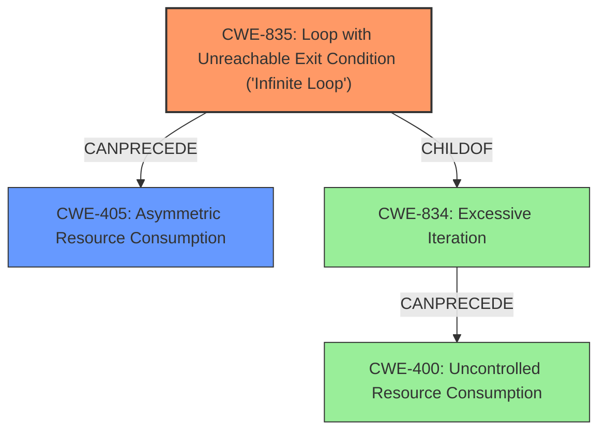

# Final Resolution for CVE-2021-21565

# Summary
| CWE ID | CWE Name | Confidence | CWE Abstraction Level | CWE Vulnerability Mapping Label | CWE-Vulnerability Mapping Notes |
|---|---|---|---|---|---|
| CWE-835 | Loop with Unreachable Exit Condition ('Infinite Loop') | 0.85 | Base | Primary | The **error condition triggers an infinite loop**, which consumes CPU resources and leads to a denial of service. |
| CWE-405 | Asymmetric Resource Consumption | 0.7 | Class | Secondary Candidate | The **infinite loop** results in excessive CPU consumption, which can be interpreted as uncontrolled resource consumption, specifically in an asymmetric manner. |

## Evidence and Confidence

*   **Confidence Score:** 0.8
*   **Evidence Strength:** HIGH

## Relationship Analysis
The analysis was refined based on the criticism to choose the most specific CWE.
  - The parent-child relationship between CWE-834 (Excessive Iteration) and CWE-835 (Loop with Unreachable Exit Condition) was crucial. Given that the vulnerability description states the error condition *may* be triggered preventing other SmartConnect DNS responses, it suggests a loop that doesn't exit which makes CWE-835 more appropriate than CWE-834.
  - The initial choice of CWE-400 (Uncontrolled Resource Consumption) was replaced with CWE-405 (Asymmetric Resource Consumption). CWE-405 captures the nature of the attack more accurately. An attacker can trigger the error condition with minimal effort, causing significant resource consumption on the server.
  - The abstraction levels influenced the selection by favoring the Base level CWE-835 over the Class level CWE-834, and the Class level CWE-405 over the Pillar level indirect parent CWE-400.

## Vulnerability Chain
The vulnerability chain starts with an error condition that is triggered and results in an infinite loop (**CWE-835**). This loop consumes excessive CPU resources, leading to a denial of service. Because the effort to trigger the condition is minimal compared to the resources consumed, it's classified as asymmetric resource consumption (**CWE-405**).

## Summary of Analysis
The initial analysis identified relevant CWEs, but the criticism highlighted the need for more specificity. The decision to switch from CWE-834 to CWE-835 was driven by the observation that the loop might be infinite based on "potentially preventing other SmartConnect DNS responses." The change from CWE-400 to CWE-405 was influenced by the mapping guidance discouraging the use of CWE-400 and the recognition that the attack is asymmetric. The final classification reflects the most accurate and specific representation of the **root cause** and its consequences, supported by both the vulnerability description and the CWE relationships. The selected CWEs are at the optimal level of specificity, addressing the specific nature of the **weakness** and its impact.