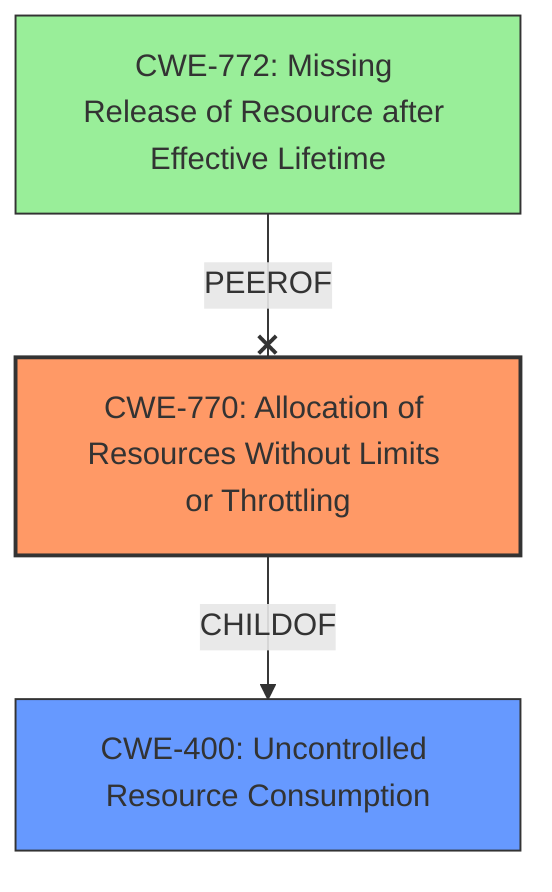

# Final Resolution for CVE-2021-21600

# Summary
| CWE ID | CWE Name | Confidence | CWE Abstraction Level | CWE Vulnerability Mapping Label | CWE-Vulnerability Mapping Notes |
|---|---|---|---|---|---|
| CWE-770 | Allocation of Resources Without Limits or Throttling | 0.85 | Base | Allowed | Primary CWE: The API service allocates resources (potentially memory and database connections) without sufficient quotas or throttling, allowing an authorized user to exhaust server resources, resulting in DoS. Mitigation should include rate limiting and per-user resource limits. |
| CWE-400 | Uncontrolled Resource Consumption | 0.70 | Class | Discouraged | Secondary Candidate: While matching the description, this is a higher-level CWE and less specific than CWE-770. |
| CWE-772 | Missing Release of Resource after Effective Lifetime | 0.50 | Base | Allowed | Alternate Candidate: If resources are not released after use. This would require further investigation to determine if this is the root cause. |

## Evidence and Confidence

*   **Confidence Score:** 0.80
*   **Evidence Strength:** HIGH

## Relationship Analysis
The analysis considered the parent-child relationship between CWE-400 (Class) and CWE-770 (Base), favoring the more specific Base CWE as recommended by CWE guidelines. The potential for a chain relationship involving a lack of input validation leading to excessive resource allocation was also considered. The relationship analysis influenced the decision to retain CWE-770 as the primary **WEAKNESS**, acknowledging its specificity compared to the more general CWE-400.

## Vulnerability Chain
The vulnerability chain starts with the **ROOTCAUSE**: **uncontrolled resource consumption**. The API service lacks proper limits or throttling mechanisms (CWE-770), allowing an authorized user to allocate excessive resources. This leads to resource exhaustion and ultimately a denial-of-service condition. A potential missing link is input validation, which, if absent, could amplify the resource consumption.

## Summary of Analysis
The initial analysis and criticism both converge on CWE-770 as the most appropriate primary CWE, given the vulnerability description and CWE guidelines. The assessment is heavily based on the provided evidence, particularly the statement "Uncontrolled resource consumption flaw in its API service" and the fact that CWE-770 is at the Base level of abstraction, which is preferred. As quoted from the initial analysis: "The vulnerability description explicitly states an "**uncontrolled resource consumption**" flaw in the API service of Dell EMC NetWorker. The CVE Reference Links Content Summary confirms this, stating "Uncontrolled resource consumption flaw in its API service" as the **ROOTCAUSE**."

The graph relationships, particularly the parent-child relationship between CWE-400 and CWE-770, reinforce the selection of the more specific CWE-770. The analysis considered CWE-772 as an alternative but acknowledged that further investigation would be needed to confirm if the **WEAKNESS** is due to missing resource release rather than uncontrolled allocation.

The selected CWEs are at the optimal level of specificity because CWE-770 directly addresses the uncontrolled allocation aspect of the vulnerability. While CWE-400 is a broader category, CWE-770 provides a more precise characterization of the **ROOTCAUSE**.