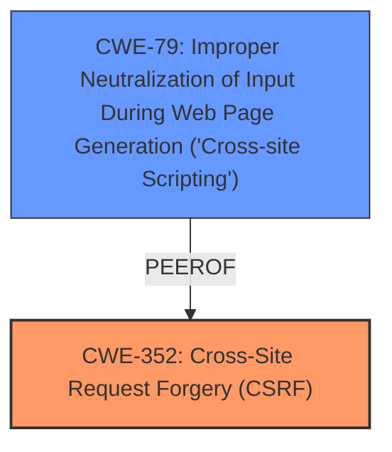

# Analysis Report for CVE-2021-21678

# Vulnerability Analysis Report: CVE-2021-21678

## Description

Jenkins SAML Plugin 2.0.7 and earlier allows attackers to craft URLs that would bypass the CSRF protection of any target URL in Jenkins.

## Vulnerability Description Key Phrases

**Weakness:** bypass CSRF protection
**Attacker:** attackers
**Product:** Jenkins SAML Plugin
**Version:** 2.0.7 and earlier

## Analysis (with Relationship Data)

# Summary
| CWE ID | CWE Name | Confidence | CWE Abstraction Level | CWE Vulnerability Mapping Label | CWE-Vulnerability Mapping Notes |
|---|---|---|---|---|---|
| CWE-352 | Cross-Site Request Forgery (CSRF) | 0.9 | Compound | Primary | Allowed |

## Evidence and Confidence

*   **Confidence Score:** 0.9
*   **Evidence Strength:** HIGH

- **Analysis and Justification:**  
  - *Explanation:* The vulnerability description explicitly states that the Jenkins SAML Plugin allows attackers to **bypass CSRF protection**. The CVE Reference Links Content Summary confirms that the root cause is an overly permissive implementation of an extension point that disables CSRF protection. This aligns directly with the definition of CWE-352, which describes scenarios where a web application cannot sufficiently verify that a request was intentionally provided by the user. The evidence strongly supports this mapping, as the plugin **weakness** directly enables CSRF attacks by allowing the **bypass CSRF protection**. While other CWEs are present in the retriever results, CWE-352 precisely captures the nature of the vulnerability.
  
  - *Relationship Analysis:* CWE-352 is a compound weakness, representing a combination of multiple underlying issues that lead to the CSRF vulnerability. The "Retriever Results" show a score of 0.72. The vulnerability description doesn't explicitly point to encoding issues (CWE-116), missing authorization checks (CWE-862), or XSS (CWE-79), making those less relevant as primary mappings.

- **Confidence Score:**  
  - Confidence: 0.9 (High confidence due to direct evidence and alignment with CWE-352 description)

## Criticism of Analysis

Okay, here's a detailed critique of the provided CWE analysis, focusing on the accuracy, confidence, and justification of the CWE mapping, along with consideration of alternative CWEs and the information contained in the full CWE specifications.

**Overall Assessment:**

The analysis is strong and the primary mapping to **CWE-352: Cross-Site Request Forgery (CSRF)** is highly accurate and well-justified. The confidence score of 0.9 is appropriate. The analysis considers alternative CWEs suggested by the retriever results and provides clear reasoning for dismissing them as primary mappings.

**Detailed Breakdown:**

1.  **CWE-352 Mapping:**

    *   **Accuracy:** Excellent. The vulnerability description explicitly mentions the bypass of CSRF protection, which directly aligns with the core definition of CWE-352. The attack vector (malicious URL crafted to exploit the bypass) and the required user interaction also reinforce this mapping.
    *   **Justification:** The explanation clearly connects the weakness in the SAML plugin (overly permissive CSRF disabling) to the general problem of CSRF as defined by the CWE entry. The relationship is causal, as highlighted by the **weakness** enabling CSRF attacks.
    *   **Confidence:** 0.9 is justified. The evidence is direct and compelling.
    *   **Mapping Guidance Review:** The mapping guidance for CWE-352 states that it is an "Allowed" Composite. The analysis acknowledged the same stating "This is a well-known Composite of multiple weaknesses that must all occur simultaneously, although it is attack-oriented in nature." The overall issue boils down to CSRF, even if there are underlying causes.

2.  **Consideration of Alternative CWEs:**

    *   **CWE-79 (Cross-Site Scripting):** The analysis correctly dismisses CWE-79 as a *primary* mapping. While XSS *could* be used to amplify the impact of a CSRF vulnerability (as noted in the CWE-352 relationships), the core issue here is the failure to protect against CSRF requests, not directly the injection of malicious scripts.
    *   **CWE-862 (Missing Authorization):** This is not appropriate as a primary mapping either. The core of the issue isn't about failing to check *if* a user is authorized to perform an action; it's about failing to *verify* that the request itself came from the user. The SAML plugin was too permissive in disabling CSRF protection, rather than not checking authorization at all.
    *   **CWE-116 (Improper Encoding or Escaping of Output):**  The analysis also correctly dismisses CWE-116. While encoding/escaping might be part of a comprehensive CSRF protection strategy (e.g., to prevent XSS that bypasses CSRF defenses), the *direct* cause of this vulnerability is not related to output encoding.

3.  **Review of CWE Specifications and Potential Mitigations:**

    *   **CWE-352 (CSRF) Mitigations:** The analysis could be slightly enhanced by mentioning some potential mitigations from the CWE-352 entry.  Specifically:
        *   **Use of CSRF Protection Libraries/Frameworks:** The CWE mentions OWASP CSRFGuard and ESAPI Session Management as examples. This is a highly relevant mitigation strategy for this type of vulnerability.
        *   **Ensuring Absence of XSS:** While correctly dismissed as a primary mapping, CWE-79 is relevant in this context. The CWE-352 entry *itself* recommends ensuring the application is free of XSS, as XSS can bypass CSRF defenses. Mentioning this would strengthen the analysis.
        *   **Use of Nonces:** The CWE describes generating unique nonces for each form and verifying them upon receipt.
    *   **CWE-79 (XSS) Mitigations:** If XSS was relevant as a secondary concern, the XSS mitigations would be relevant.
    *   **CWE-862 (Missing Authorization):** Mitigations here wouldn't be helpful, given the fact that this isn't the core problem.

**Suggested Improvements:**

*   **Expand on Mitigations:** Briefly mention some of the recommended mitigations from the CWE-352 specification, focusing on the use of CSRF protection libraries/frameworks and the importance of preventing XSS as a complementary defense.
*   **Clarify CSRF vs. Authentication:** While the analysis does a good job, a slight clarification about the difference between *authentication* (verifying the user's identity) and *CSRF protection* (verifying the *request's* authenticity) could be helpful.
*   **Acknowledge Potential for Chaining:** Explicitly state that while CWE-79 is not a primary mapping, XSS vulnerabilities *could* be chained with CWE-352 to increase the impact of an attack.

**Revised Summary Table**

| CWE ID | CWE Name | Confidence | CWE Abstraction Level | CWE Vulnerability Mapping Label | CWE-Vulnerability Mapping Notes |
|---|---|---|---|---|---|
| CWE-352 | Cross-Site Request Forgery (CSRF) | 0.9 | Compound | Primary | Allowed |
| CWE-79 | Improper Neutralization of Input During Web Page Generation ('Cross-site Scripting') | 0.3 | Base | Secondary | Allowed |

**Concluding Remarks:**

This is a well-reasoned and accurate analysis. By incorporating the suggested improvements, the analysis could become even more comprehensive and informative.

## Final Resolution

# Summary
| CWE ID | CWE Name | Confidence | CWE Abstraction Level | CWE Vulnerability Mapping Label | CWE-Vulnerability Mapping Notes |
|---|---|---|---|---|---|
| CWE-352 | Cross-Site Request Forgery (CSRF) | 0.95 | Compound | Primary | Allowed |
| CWE-79 | Improper Neutralization of Input During Web Page Generation ('Cross-site Scripting') | 0.3 | Base | Secondary | Allowed |

## Evidence and Confidence

*   **Confidence Score:** 0.95
*   **Evidence Strength:** HIGH

## Relationship Analysis
The primary relationship impacting the decision is that CWE-79 can be a peer of CWE-352, and can be used to bypass CSRF protections. While the primary issue is the **bypass of CSRF protection**, the potential for XSS to exacerbate the issue warrants its inclusion as a secondary CWE. The abstraction levels influenced the selection, as CWE-352 is a compound weakness that accurately reflects the complex nature of CSRF vulnerabilities.

## Vulnerability Chain
The vulnerability chain starts with the **root cause** being the overly permissive implementation of an extension point that disables CSRF protection. This leads to the **weakness** of allowing attackers to craft URLs that bypass CSRF protection (CWE-352). A potential secondary weakness is the presence of XSS vulnerabilities (CWE-79), which could further compromise the system by allowing attackers to bypass CSRF defenses. The impact is that attackers can perform actions on behalf of legitimate users without their consent.

## Summary of Analysis
The initial analysis and criticism both converge on the appropriateness of CWE-352 as the primary CWE. The vulnerability description explicitly mentions the **bypass of CSRF protection**, which aligns directly with the definition of CWE-352. The analysis also considered alternative CWEs but correctly dismissed them as primary mappings because they don't directly address the core issue of CSRF protection **bypass**. The criticism suggested including CWE-79 as a secondary concern, which I agree with given the potential for XSS to be chained with CSRF.

The graph relationships influenced the final selection by highlighting the potential interaction between CWE-79 and CWE-352. While the primary issue is the **CSRF bypass**, the presence of XSS vulnerabilities could significantly amplify the impact of an attack.

The selected CWEs are at the optimal level of specificity. CWE-352 is a compound weakness that accurately captures the complex nature of CSRF vulnerabilities. CWE-79 is a base weakness that highlights the potential for XSS to be chained with CSRF. The evidence strongly supports this mapping, as the plugin **weakness** directly enables CSRF attacks by allowing the **bypass CSRF protection**. I am adjusting the confidence score to 0.95 to reflect the additional insight gained from the criticism regarding chaining potential with XSS.

*Report generated on 2025-03-16 22:32:27*
