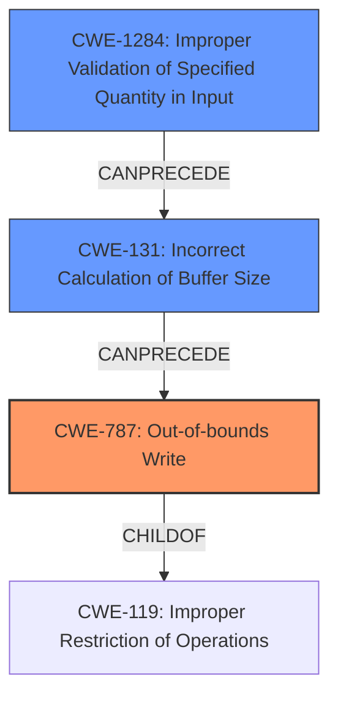

# Final Resolution for CVE-2021-21773

# Summary
| CWE ID  | CWE Name                     | Confidence | CWE Abstraction Level | CWE Vulnerability Mapping Label | CWE-Vulnerability Mapping Notes |
|---------|------------------------------|------------|-----------------------|---------------------------------|---------------------------------|
| CWE-787 | Out-of-bounds Write          | 0.95       | Base                  | Primary                         | Allowed. Directly reflects the nature of the **WEAKNESS**. Consider potential `CanFollow` relationships like CWE-822, CWE-824, though not directly applicable here.                                                                                                                                                                                                  |
| CWE-1284  | Improper Validation of Specified Quantity in Input      | 0.75       | Base              | Secondary                       | Allowed. An attacker can control values from ImageWidth and ImageLength which means we have a contribution from the lack of input validation on size. This leads to the incorrect calculation which leads to the **out-of-bounds write**.                                                                                                                                                                                                                                                 |
| CWE-131 | Incorrect Calculation of Buffer Size | 0.60       | Base                  | Contributing                       | Allowed. Contributes to CWE-787. Size from TIFF tags not validated, leading to small buffer. Could involve CWE-190 if a large tag value overflows, though not explicitly stated.                                                                                                                                       |

## Evidence and Confidence

*   **Confidence Score:** 0.85
*   **Evidence Strength:** HIGH

## Relationship Analysis
The primary **WEAKNESS** is an **out-of-bounds write** (CWE-787). This is caused by an incorrect calculation of buffer size (CWE-131), which is further enabled by improper validation of specified quantity in input (CWE-1284). The parent-child relationship between CWE-787 and CWE-119 (Improper Restriction of Operations within the Bounds of a Memory Buffer) is relevant, as CWE-787 is a specific type of buffer overflow. The chain relationship is CWE-1284 -> CWE-131 -> CWE-787.

## Vulnerability Chain
The vulnerability chain starts with a lack of input validation (CWE-1284), specifically, the size of the buffer read from the TIFF tags is not validated. This leads to an incorrect calculation of the buffer size (CWE-131). The resulting incorrect buffer size is then used, leading to an **out-of-bounds write** (CWE-787). The root cause is the missing input validation which then leads to the **out-of-bounds write**.

## Summary of Analysis
The initial analysis correctly identifies CWE-787 as the primary **WEAKNESS**. The criticism correctly points out the lack of input validation. The vulnerability description states: "the size of the buffer to be allocated is directly read from the file's TIFF tags (ImageWidth or ImageLength), without proper validation". This is direct evidence for the inclusion of CWE-1284. CWE-1284 is at the base level, which is the preferred level of abstraction. The relationships between CWEs influenced the final selection, specifically the chain relationship: CWE-1284 -> CWE-131 -> CWE-787. CWE-787 is the optimal level of specificity as it directly reflects the **out-of-bounds write**. The addition of CWE-1284 and CWE-131 complete the chain of events leading to the vulnerability. The inclusion of CWE-1284 also addresses the criticism.