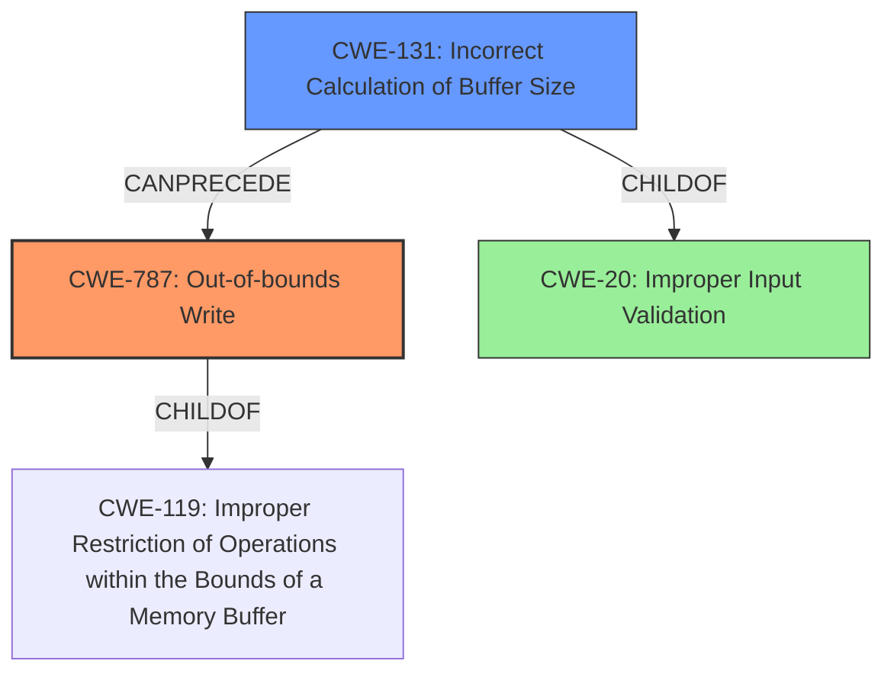

# Final Resolution for CVE-2021-21782

# Summary
| CWE ID | CWE Name | Confidence | CWE Abstraction Level | CWE Vulnerability Mapping Label | CWE-Vulnerability Mapping Notes |
|---|---|---|---|---|---|
| **CWE-787** | **Out-of-bounds Write** | 1.0 | Base | Allowed | The vulnerability involves writing data beyond the intended buffer boundaries, resulting from incorrect buffer allocation. Mitigations include safer memory management functions, robust bounds checking, and compiler-based detection. |
| CWE-131 | Incorrect Calculation of Buffer Size | 0.75 | Base | Allowed | The buffer size is incorrectly calculated based on an attacker-controlled value, leading to a buffer overflow. Mitigations include allocating based on maximum possible size, input validation, and safer integer handling.  |
| CWE-20 | Improper Input Validation | 0.25 | Class | Discouraged | The application fails to validate the XSIZE from the SGI Header, which is attacker controlled data. This contributes to the vulnerability, but is not the primary weakness. |

## Evidence and Confidence

*   **Confidence Score:** 0.95
*   **Evidence Strength:** HIGH

## Relationship Analysis
The primary relationship that impacts the decision is the chain relationship where **CWE-131** (Incorrect Calculation of Buffer Size) **CanPrecede** **CWE-787** (Out-of-bounds Write). The vulnerability starts with the incorrect calculation of the buffer size, which then leads to the out-of-bounds write. **CWE-787** is a child of **CWE-119** (Improper Restriction of Operations within the Bounds of a Memory Buffer), indicating a more general class of buffer-related errors. While **CWE-20** (Improper Input Validation) is a contributing factor, it is a more general class and less specific than the other two. The abstraction levels of Base for **CWE-787** and **CWE-131** are preferred for vulnerability mapping.

## Vulnerability Chain
The vulnerability chain is as follows:
1.  The attacker provides a malformed SGI file with a crafted XSIZE value in the header.
2.  The software incorrectly calculates the buffer size (**CWE-131**) based on the attacker-controlled XSIZE value, potentially leading to a zero-sized buffer.
3.  The software allocates a buffer with the incorrect size.
4.  The software writes data beyond the bounds of the allocated buffer (**CWE-787**), leading to memory corruption.
5.  The root cause is the failure to validate the XSIZE value (**CWE-20**), allowing an attacker to control the buffer size calculation.

## Summary of Analysis
The initial analysis and criticism both agree on **CWE-787** as the primary weakness due to the explicit **out-of-bounds write** vulnerability described. The evidence from the vulnerability description directly supports this classification. The analysis also correctly identifies **CWE-131** as a contributing factor, as the incorrect calculation of the buffer size is a necessary prerequisite for the **out-of-bounds write**. The addition of **CWE-20** as a tertiary classification highlights the lack of input validation on the attacker-controlled XSIZE value.

The graph relationships reinforce this decision, with **CWE-131 CanPrecede CWE-787**, demonstrating the chain of events. The abstraction levels of Base for **CWE-787** and **CWE-131** ensure that the classification is at the appropriate level of specificity.

The final decision is to classify the vulnerability as primarily **CWE-787** (**Out-of-bounds Write**), with **CWE-131** (Incorrect Calculation of Buffer Size) as a secondary contributing factor, and **CWE-20** (Improper Input Validation) as a tertiary contributing factor. This classification reflects the vulnerability chain and the optimal level of specificity based on the available evidence. The evidence used is: "An **out-of-bounds write** vulnerability exists in the SGI format buffer size processing functionality of Accusoft ImageGear 19.8. A specially crafted malformed file can lead to memory corruption."