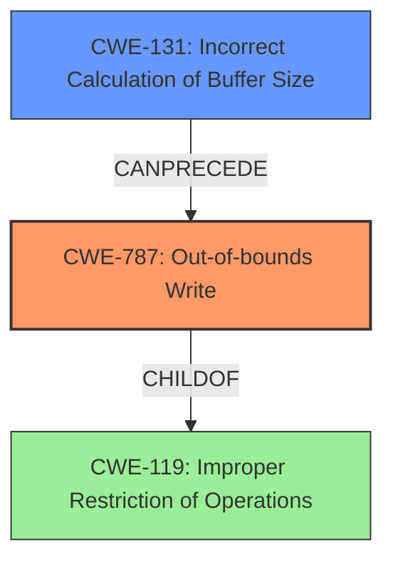

# Final Resolution for CVE-2021-21793

# Summary
| CWE ID | CWE Name | Confidence | CWE Abstraction Level | CWE Vulnerability Mapping Label | CWE-Vulnerability Mapping Notes |
|---|---|---|---|---|---|
| **CWE-787** | **Out-of-bounds Write** | 1.0 | Base | Allowed | Primary CWE. The **root cause** is an **out-of-bounds write**. |
| **CWE-131** | **Incorrect Calculation of Buffer Size** | 0.9 | Base | Allowed | Secondary CWE. The buffer size is **incorrectly calculated**, leading to the **out-of-bounds write**. |

## Evidence and Confidence

*   **Confidence Score:** 0.95
*   **Evidence Strength:** HIGH

## Relationship Analysis
The primary relationship influencing the selection is the "CanPrecede" relationship between **CWE-131 (Incorrect Calculation of Buffer Size)** and **CWE-787 (Out-of-bounds Write)**. **Incorrectly calculating the buffer size** leads directly to the possibility of writing beyond the allocated buffer's boundaries. While other CWEs like **CWE-119 (Improper Restriction of Operations within the Bounds of a Memory Buffer)** could be considered, **CWE-787** is more specific and thus more appropriate, as recommended by its mapping guidance. Both **CWE-131** and **CWE-787** are Base level CWEs which is the ideal abstraction level.

## Vulnerability Chain
The vulnerability chain starts with the **incorrect calculation of a buffer size (CWE-131)**. A small buffer (1 byte) is allocated when a value read from the file is null, indicating a missing size check when allocating a buffer for color table data. This leads to an **out-of-bounds write (CWE-787)** when a subsequent loop attempts to write more data than the buffer can hold. The final impact is **memory corruption**, as stated in the vulnerability description.

## Summary of Analysis
The initial analysis and criticism are well-reasoned and accurate. The primary assignment of **CWE-787 (Out-of-bounds Write)** is strongly supported by the vulnerability description, which explicitly states "out-of-bounds write." The secondary assignment of **CWE-131 (Incorrect Calculation of Buffer Size)** is justified by the CVE reference links content summary, which highlights the "incorrect buffer size calculation" as a contributing factor. The relationship between these two CWEs is clear: the **incorrect buffer size** directly leads to the **out-of-bounds write**.

The decision to exclude other potential CWEs like **CWE-119 (Improper Restriction of Operations within the Bounds of a Memory Buffer)** is also correct, as **CWE-787** provides a more specific and accurate description of the vulnerability. While **CWE-119** could broadly apply, the mapping guidance discourages its use when more specific CWEs are available.

The selected CWEs are at the optimal level of specificity, with both being at the Base level. This ensures that the classification is granular enough to accurately represent the **root cause** of the vulnerability while still being general enough to be applicable to a range of similar vulnerabilities. The vulnerability description "An **out-of-bounds write** vulnerability exists in the JPG `sof_nb_comp` header processing functionality of Accusoft ImageGear 19.8 and 19.9. A specially crafted malformed file can lead to **memory corruption**. An attacker can provide a malicious file to trigger this vulnerability" and CVE reference information regarding the **incorrect calculation of the buffer size** provides sufficient evidence.