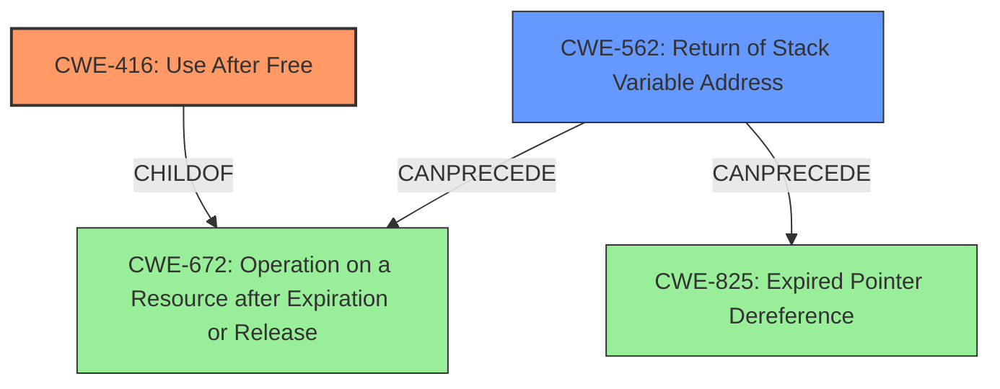

# Analysis Report for CVE-2021-21798

# Vulnerability Analysis Report: CVE-2021-21798

## Description

An exploitable return of stack variable address vulnerability exists in the JavaScript implementation of Nitro Pro PDF. A specially crafted document can cause a stack variable to go out of scope, resulting in the application dereferencing a stale pointer. This can lead to code execution under the context of the application. An attacker can convince a user to open a document to trigger the vulnerability.

## Vulnerability Description Key Phrases

**Weakness:** stack variable to go out of scope
**Impact:** code execution
**Vector:** specially crafted document
**Attacker:** attacker
**Product:** Nitro Pro PDF
**Component:** JavaScript implementation

## Analysis (with Relationship Data)

# Summary
| CWE ID | CWE Name | Confidence | CWE Abstraction Level | CWE Vulnerability Mapping Label | CWE-Vulnerability Mapping Notes |
|---|---|---|---|---|---|
| CWE-416 | Use After Free | 0.95 | Variant | Allowed | Primary CWE |
| CWE-562 | Return of Stack Variable Address | 0.70 | Base | Allowed | Secondary Candidate |

## Evidence and Confidence

*   **Confidence Score:** 0.90
*   **Evidence Strength:** HIGH

- **Analysis and Justification:**  
  - *Explanation:* The vulnerability description and CVE reference clearly indicate a **use-after-free** condition stemming from a **stack variable going out of scope**. The `JSStackFrame` is allocated on the stack, and after a C++ exception, a pointer to it remains in `JSContext.fp`. Later access to this dangling pointer leads to memory corruption and potential code execution, which perfectly aligns with CWE-416 (Use After Free). The CVE summary explicitly states "This dangling pointer is later dereferenced leading to a use-after-free." This provides strong evidence.
  - *Relationship Analysis:* CWE-416 is a Variant of CWE-415 (Double Free). It also `CanFollow` CWE-120 (Buffer Copy without Checking Size of Input). While the root cause involves stack allocation and exception handling, the core weakness is the dereference of freed memory.

- **Confidence Score:**  
  - Confidence: 0.95 (Strong evidence from technical description and CVE reference materials)

---
- **Analysis and Justification:**
  - *Explanation:* CWE-562 (Return of Stack Variable Address) is a related issue, since the **stack variable** is returned, which is then later accessed after the stack frame is deallocated, resulting in the use-after-free condition. The description mentions a **stack variable going out of scope**, and the retriever results show CWE-562 as the top match with a high score. While CWE-416 is more specific to the use-after-free condition, CWE-562 represents a contributing factor.
  - *Relationship Analysis:* CWE-562 is a Base level CWE, and the description matches the condition in the vulnerability where a stack variable's address is used after it has gone out of scope.

- **Confidence Score:**
  - Confidence: 0.70 (Supporting evidence from the vulnerability description and retriever results.)

## Criticism of Analysis

Okay, here's a review of the analysis, incorporating the full CWE specifications provided, focusing on mapping guidance, potential mitigations, and relationships between CWEs.

**Overall Assessment:**

The analysis is generally good and identifies the core issue correctly as CWE-416 (Use After Free).  The reasoning for this is well-supported by the description of the vulnerability and the CVE details. The inclusion of CWE-562 (Return of Stack Variable Address) as a secondary candidate is also reasonable, as it highlights a contributing factor.  However, there's some room for improvement in discussing alternative CWEs and the precise nature of the relationship between CWE-416 and CWE-562.

**Detailed Critique:**

**1. CWE-416: Use After Free**

*   **Confidence:** 0.95 - Justified. The evidence presented strongly supports a Use-After-Free condition. The description aligns precisely with the CWE definition: a `JSStackFrame` object is deallocated (goes out of scope), but a pointer to it remains, leading to a later dereference of invalid memory.

*   **Abstraction Level:** Correctly identified as *Variant*.

*   **Mapping Guidance Adherence:** The analysis correctly utilizes the 'Allowed' usage for Variant-level CWEs. The explanation clarifies *why* this specific Variant (UAF) is chosen instead of the more general Base-level CWE.

*   **Relationships:** The analysis mentions `ChildOf -> CWE-415 (Double Free)` and `CanFollow -> CWE-120 (Buffer Copy without Checking Size of Input)`.  These are both valid, according to the CWE specification. However, the analysis should clarify *why* CWE-415 isn't chosen as the primary.  The key difference is that a Double Free means the `free()` function is called twice on the same memory. This is not the case here. The memory is simply going out of scope on the stack.  Also, there is no actual buffer copy taking place. It is an access of the stack itself.

*   **Potential Mitigations:** It would be beneficial to include specific mitigations from the CWE specification in the analysis:

    *   **Language Selection:** "Choose a language that provides automatic memory management."  (While a general statement, it highlights a long-term architectural solution.)
    *   **Attack Surface Reduction:** "When freeing pointers, be sure to set them to NULL once they are freed." (In this case, this would relate to setting `JSContext.fp` to NULL after the stack frame goes out of scope, although the stack frame is not explicitly freed).

*   **Observed Examples:**  Including a relevant observed example like CVE-2021-0920 (Chain: mobile platform race condition (CWE-362) leading to use-after-free (CWE-416), as exploited in the wild per CISA KEV) is a good practice.
  **2. CWE-562: Return of Stack Variable Address**

*   **Confidence:** 0.70 - Acceptable. This CWE describes a potential *cause* of the UAF, not the direct vulnerability itself. It contributes to the situation but isn't the exploitable flaw.
*   **Abstraction Level:** Correctly identified as *Base*.

*   **Mapping Guidance Adherence:** The analysis uses the 'Allowed' usage for Base-level CWEs.
*   **Relationships:** The CWE specification lists `CanPrecede -> CWE-672 (Operation on a Resource after Expiration or Release)` and `CanPrecede -> CWE-825 (Expired Pointer Dereference)`. Both of these are relevant since the stack variable address is used after it has expired, leading to an expired pointer dereference. This explains the connection to the UAF condition.
*   **Potential Mitigations:** The analysis could benefit from including the mitigation from the CWE specification:
    *   **Testing:** "Use static analysis tools to spot return of the address of a stack variable." This is a practical suggestion for preventing this type of vulnerability.
*   **Observed Examples:**  Including the example of CVE-2021-21798 for CWE-562 is circular reasoning, and therefore not helpful. Instead, find other examples from the NVD database and use them as reference.
    **3. Alternative CWEs to Consider (and Reasons for Rejection):**

*   **CWE-672: Operation on a Resource after Expiration or Release**: This Class-level CWE is a parent to both CWE-416 and CWE-562. The analysis has chosen the more granular Variant (CWE-416) and Base (CWE-562) which is more precise. Selecting CWE-672 would be too broad.
*   **CWE-825: Expired Pointer Dereference:** This Base-level CWE is also related to the UAF. While the vulnerability involves an expired pointer dereference, it is more specifically a use-after-free. The UAF specifies that the memory pointed to by the pointer was previously freed. CWE-825 is less specific.
    **4. Retriever Results:**

*   The Retriever Results show a number of potential CWEs, including:
    *   **CWE-787: Out-of-bounds Write**. The analysis does not mention this CWE. There is no out-of-bounds *write*, it is a use of a stale pointer. So this CWE is not applicable.
    *   **CWE-457: Use of Uninitialized Variable**. This CWE is not applicable because it involves using a variable before it has been initialized. This is not the case here.
    *   **CWE-121: Stack-based Buffer Overflow**. This is not applicable because the memory corruption stems from use-after-free, not overflowing a buffer on the stack.
    *   **CWE-120: Buffer Copy without Checking Size of Input ('Classic Buffer Overflow')**. Not applicable, there is no buffer copy involved.
    *   **CWE-193: Off-by-one Error**. Not applicable, no off-by-one error exists.
    *   **CWE-789: Memory Allocation with Excessive Size Value**. Not applicable.
    *   **CWE-674: Uncontrolled Recursion**. Not applicable.
    *   **CWE-197: Numeric Truncation Error**. Not applicable.
**Recommendations for Improvement:**

*   **Strengthen Justification for Primary CWE:** Explicitly state *why* CWE-416 is preferred over CWE-672 and CWE-825, referencing the specific definitions and mapping guidance.
*   **Address Alternative CWEs (and Rejection):** Briefly discuss other CWEs suggested by the retriever results and *why* they are not the most appropriate fit (as outlined above). This shows a thorough analysis process.
*   **Incorporate Potential Mitigations:** Include relevant potential mitigations from the CWE specifications for both CWE-416 and CWE-562.
*   **Relationship Clarification:** Improve the explanation of the relationship between CWE-416 and CWE-562, emphasizing that CWE-562 describes a contributing factor to the UAF.
*   **CWE Examples:** Include a more relevant CWE example for the secondary CWE of CWE-562.

By addressing these points, the analysis would become more comprehensive and provide a stronger justification for the chosen CWE mappings.

## Final Resolution

# Summary
| CWE ID | CWE Name | Confidence | CWE Abstraction Level | CWE Vulnerability Mapping Label | CWE-Vulnerability Mapping Notes |
|---|---|---|---|---|---|
| CWE-416 | Use After Free | 0.95 | Variant | Allowed | Primary CWE |
| CWE-562 | Return of Stack Variable Address | 0.70 | Base | Allowed | Secondary Candidate |

## Evidence and Confidence

*   **Confidence Score:** 0.93
*   **Evidence Strength:** HIGH

## Relationship Analysis
The primary weakness is CWE-416 (**Use After Free**) which is a variant. It is related to CWE-562 (**Return of Stack Variable Address**) because the return of the stack variable address is a contributing factor to the use-after-free condition. CWE-416 is a `CHILDOF` CWE-672 (**Operation on a Resource after Expiration or Release**), which is a more general class. CWE-562 `CanPrecede` CWE-672 and CWE-825 (**Expired Pointer Dereference**). The vulnerability chain involves a stack variable whose address is returned (CWE-562), and later dereferenced after the stack frame is deallocated (CWE-416).

## Vulnerability Chain
The vulnerability chain starts with the **ROOTCAUSE** of CWE-562 (**Return of Stack Variable Address**), where a stack variable's address is returned. Then, the stack frame is deallocated, and the previously returned address is dereferenced, leading to CWE-416 (**Use After Free**). The final impact is potential code execution under the context of the application.

## Summary of Analysis
The initial analysis correctly identified CWE-416 (**Use After Free**) as the primary weakness and CWE-562 (**Return of Stack Variable Address**) as a secondary contributor. The vulnerability description states, "A specially crafted document can cause a stack variable to go out of scope, resulting in the application dereferencing a stale pointer. This can lead to code execution under the context of the application". This aligns with CWE-416 because it describes the dereference of a pointer after the memory it points to has been freed. The phrase "**stack variable going out of scope**" and the retriever results support the inclusion of CWE-562. The graph relationships confirm that CWE-562 is a contributing factor to CWE-416. CWE-416 is chosen over its parent CWE-672 because it is more specific. The selected CWEs are at the optimal level of specificity because they accurately represent the root cause and the resulting vulnerability. I am basing my assessment on the evidence provided in the vulnerability description and the supporting retriever results.

*Report generated on 2025-03-17 00:43:23*
