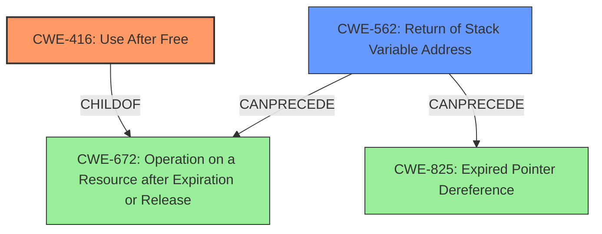

# Final Resolution for CVE-2021-21798

# Summary
| CWE ID | CWE Name | Confidence | CWE Abstraction Level | CWE Vulnerability Mapping Label | CWE-Vulnerability Mapping Notes |
|---|---|---|---|---|---|
| CWE-416 | Use After Free | 0.95 | Variant | Allowed | Primary CWE |
| CWE-562 | Return of Stack Variable Address | 0.70 | Base | Allowed | Secondary Candidate |

## Evidence and Confidence

*   **Confidence Score:** 0.93
*   **Evidence Strength:** HIGH

## Relationship Analysis
The primary weakness is CWE-416 (**Use After Free**) which is a variant. It is related to CWE-562 (**Return of Stack Variable Address**) because the return of the stack variable address is a contributing factor to the use-after-free condition. CWE-416 is a `CHILDOF` CWE-672 (**Operation on a Resource after Expiration or Release**), which is a more general class. CWE-562 `CanPrecede` CWE-672 and CWE-825 (**Expired Pointer Dereference**). The vulnerability chain involves a stack variable whose address is returned (CWE-562), and later dereferenced after the stack frame is deallocated (CWE-416).

## Vulnerability Chain
The vulnerability chain starts with the **ROOTCAUSE** of CWE-562 (**Return of Stack Variable Address**), where a stack variable's address is returned. Then, the stack frame is deallocated, and the previously returned address is dereferenced, leading to CWE-416 (**Use After Free**). The final impact is potential code execution under the context of the application.

## Summary of Analysis
The initial analysis correctly identified CWE-416 (**Use After Free**) as the primary weakness and CWE-562 (**Return of Stack Variable Address**) as a secondary contributor. The vulnerability description states, "A specially crafted document can cause a stack variable to go out of scope, resulting in the application dereferencing a stale pointer. This can lead to code execution under the context of the application". This aligns with CWE-416 because it describes the dereference of a pointer after the memory it points to has been freed. The phrase "**stack variable going out of scope**" and the retriever results support the inclusion of CWE-562. The graph relationships confirm that CWE-562 is a contributing factor to CWE-416. CWE-416 is chosen over its parent CWE-672 because it is more specific. The selected CWEs are at the optimal level of specificity because they accurately represent the root cause and the resulting vulnerability. I am basing my assessment on the evidence provided in the vulnerability description and the supporting retriever results.