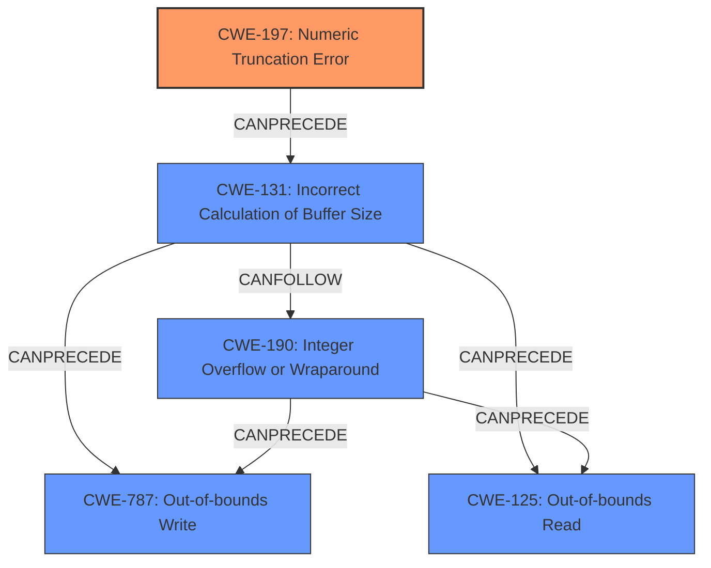

# Final Resolution for CVE-2021-21859

# Summary
| CWE ID | CWE Name | Confidence | CWE Abstraction Level | CWE Vulnerability Mapping Label | CWE-Vulnerability Mapping Notes |
|---|---|---|---|---|---|
| CWE-197 | Numeric Truncation Error | 0.95 | Base | Allowed | Primary CWE. The vulnerability is caused by an **integer truncation**.|
| CWE-131 | Incorrect Calculation of Buffer Size | 0.70 | Base | Allowed | Secondary candidate. Integer truncation can lead to an incorrect buffer size calculation |
| CWE-190 | Integer Overflow or Wraparound | 0.75 | Base | Allowed | Secondary candidate. The CVE reference links mention Integer Overflow as a related weakness in similar vulnerabilities, often stemming from an incorrect buffer size calculation. |
| CWE-787 | Out-of-bounds Write | 0.60 | Base | Allowed | Secondary candidate. The CVE reference links mention out-of-bounds write as a result of the integer truncation in similar vulnerabilities.|
| CWE-125 | Out-of-bounds Read | 0.60 | Base | Allowed | Secondary candidate. The CVE reference links mention out-of-bounds read as a result of the integer truncation in similar vulnerabilities. |

## Evidence and Confidence

*   **Confidence Score:** 0.90
*   **Evidence Strength:** HIGH

## Relationship Analysis
The primary **weakness** is **CWE-197 (Numeric Truncation Error)**. This can lead to **CWE-131 (Incorrect Calculation of Buffer Size)**, which in turn can result in **CWE-190 (Integer Overflow or Wraparound)**. The incorrect buffer size can lead to out-of-bounds reads (**CWE-125**) and writes (**CWE-787**). The relationship between these CWEs forms a chain where the **integer truncation** is the root cause, and the out-of-bounds access are the impacts. All selected CWEs are at the Base or Variant level of abstraction, providing appropriate granularity.

## Vulnerability Chain
The vulnerability chain starts with an **integer truncation** (**CWE-197**) in the `stri_box_read` function. This **truncation** leads to an incorrect calculation of the buffer size (**CWE-131**). The incorrect buffer size might lead to an integer overflow (**CWE-190**). This then results in an out-of-bounds read (**CWE-125**) or an out-of-bounds write (**CWE-787**) during MPEG-4 decoding, potentially leading to code execution.

## Summary of Analysis
The initial analysis and criticism both correctly identify **CWE-197 (Numeric Truncation Error)** as the primary **weakness**. The vulnerability description explicitly states "an exploitable **integer truncation** vulnerability". The inclusion of **CWE-131 (Incorrect Calculation of Buffer Size)** as a secondary CWE strengthens the analysis, as the **truncation** likely leads to an incorrect size calculation. The other secondary CWEs (**CWE-190, CWE-787, CWE-125**) are also justified based on the CVE reference links and their potential to arise from the **truncation** and incorrect buffer size. The graph relationships support this chain of events. The selected CWEs are at the optimal level of specificity, being Base or Variant level CWEs. The confidence score is high because of the direct mention of **integer truncation** in the vulnerability description.