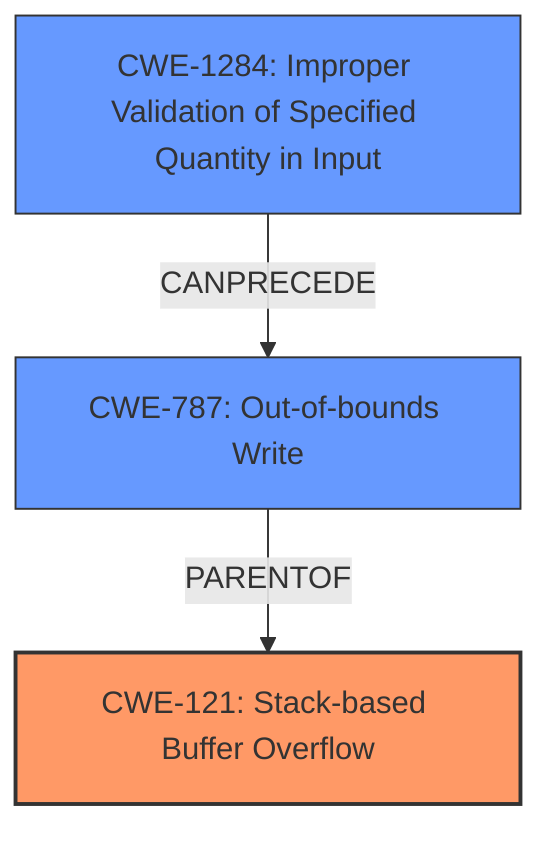

# Analysis Report for CVE-2021-21889

# Vulnerability Analysis Report: CVE-2021-21889

## Description

A stack-based buffer overflow vulnerability exists in the Web Manager Ping functionality of Lantronix PremierWave 2050 8.9.0.0R4 (in QEMU). A specially crafted HTTP request can lead to remote code execution. An attacker can make an authenticated HTTP request to trigger this vulnerability.

## Vulnerability Description Key Phrases

**Rootcause:** stack-based buffer overflow
**Impact:** remote code execution
**Vector:** specially crafted HTTP request
**Attacker:** attacker
**Product:** Lantronix PremierWave 2050
**Version:** 8.9.0.0R4
**Component:** Web Manager Ping functionality

## Analysis (with Relationship Data)

# Summary
| CWE ID | CWE Name | Confidence | CWE Abstraction Level | CWE Vulnerability Mapping Label | CWE-Vulnerability Mapping Notes |
|---|---|---|---|---|---|
| CWE-121 | Stack-based Buffer Overflow | 0.95 | Variant | Allowed | Primary CWE |
| CWE-787 | Out-of-bounds Write | 0.75 | Base | Allowed | Secondary Candidate |
| CWE-190 | Integer Overflow or Wraparound | 0.60 | Base | Allowed | Secondary Candidate |

## Evidence and Confidence

*   **Confidence Score:** 0.90
*   **Evidence Strength:** HIGH

- **Analysis and Justification:**  
  - *Explanation:* The vulnerability description explicitly states a "**stack-based buffer overflow**" exists. The CVE Reference Links Content Summary further confirms this, stating the vulnerability is in the `ltrx_evo` web application due to a vulnerable call to `sprintf`. The function uses a fixed-size buffer and a user-controlled source without proper bounds checking. This aligns directly with CWE-121, which is a Variant of buffer overflow specifically occurring on the stack. The description mentions a specially crafted HTTP request can lead to remote code execution, confirming the high-impact nature of the weakness. CWE-121 is preferred over CWE-119 because it provides more specific information about the location of the buffer.
  
  - *Relationship Analysis:* CWE-121 is a variant of CWE-119 (Improper Restriction of Operations within the Bounds of a Memory Buffer). This means that CWE-121 is a more specific type of CWE-119 and preferred.

- **Confidence Score:**  
  - Confidence: 0.95 (High evidence from technical description and CVE reference materials)

---

- **Analysis and Justification:**  
  - *Explanation:* CWE-787 (Out-of-bounds Write) is a possible secondary candidate because the root cause analysis indicates a buffer overflow due to a vulnerable call to `sprintf` with a fixed-size buffer without proper bounds checking. The use of `sprintf` with user-controlled input allows an attacker to write data beyond the intended buffer boundary. The description aligns with CWE-787's definition of writing data past the end of the intended buffer. Although the description identifies a stack-based buffer overflow, CWE-787 is a general out-of-bounds write, which could apply.
  
  - *Relationship Analysis:* CWE-787 is a base CWE and is a parent of CWE-121. The relationship shows that a buffer overflow is a type of out-of-bounds write.

- **Confidence Score:**  
  - Confidence: 0.75 (Medium evidence from root cause analysis)

---

- **Analysis and Justification:**  
  - *Explanation:* CWE-190 (Integer Overflow or Wraparound) is a less likely secondary candidate. Integer overflows can sometimes precede or contribute to buffer overflows by influencing the size of allocated buffers. However, the provided vulnerability description does not explicitly mention any integer overflow. The retriever results show a high score, but without further context, mapping to CWE-190 is speculative.
  
  - *Relationship Analysis:* CWE-190 can precede CWE-119 (Improper Restriction of Operations within the Bounds of a Memory Buffer) when an integer overflow leads to allocating an undersized buffer.

- **Confidence Score:**  
  - Confidence: 0.60 (Low evidence from root cause analysis)

---

## Criticism of Analysis

Okay, I've reviewed the provided analysis and the complete CWE specifications. Here's my critique:

**Overall Assessment:**

The analysis is generally good, particularly in identifying CWE-121 as the primary weakness. The reasoning is well-explained, and the confidence level is justified. However, the secondary candidates could be refined. The analysis correctly identifies the relationship between the CWEs but could be more specific about how the secondary candidates manifest in this particular case.

**Detailed Review by CWE:**

*   **CWE-121: Stack-based Buffer Overflow (Primary - Confidence: 0.95)**
    *   **Strengths:** The identification of CWE-121 is accurate and well-supported. The analysis clearly articulates how the vulnerability description aligns with the CWE definition, especially the mention of a `sprintf` call with user-controlled input on a fixed-size buffer on the stack.
    *   **Areas for Improvement:** None. The justification is solid.

*   **CWE-787: Out-of-bounds Write (Secondary Candidate - Confidence: 0.75)**
    *   **Strengths:** The reasoning for including CWE-787 is valid.  It correctly notes that a buffer overflow *is* an out-of-bounds write, and CWE-787 is a more general category.
    *   **Areas for Improvement:** While technically correct, consider whether CWE-787 adds significant value *as a secondary candidate* when CWE-121 already captures the stack-specific nature of the overflow. Since the root cause analysis identifies a Stack-Based Buffer Overflow, keeping the CWE more specific is better.
        *   Consider adding a sentence such as: "While CWE-787 is a parent of CWE-121, and thus technically applicable, CWE-121 provides more specific information about the vulnerability and its location within the stack, thus making it the preferred CWE."

*   **CWE-190: Integer Overflow or Wraparound (Secondary Candidate - Confidence: 0.60)**
    *   **Strengths:** The analysis acknowledges the potential relationship between integer overflows and buffer overflows, particularly in influencing buffer size allocation.
    *   **Areas for Improvement:** The analysis admits that evidence for CWE-190 is "speculative." Given the lack of explicit mention of integer overflows in the vulnerability description and the provided CVE details, this CWE *should be removed* from the final analysis. While integer overflows *can* lead to buffer overflows, there is no concrete evidence to indicate this is the case *here*. Including it weakens the overall analysis, because the Retriever Result gives a high score.
        *   The analysis should explicitly state something like: "While integer overflows *can* be related to buffer overflows, there is no evidence present in the root cause or vulnerability description to indicate that this vulnerability is caused by an integer overflow, therefore, CWE-190 is not applicable."

**Additional Considerations and Suggested Improvements:**

1.  **Focus on Root Cause and Chain of Events:** The analysis should emphasize the *chain of events* leading to the vulnerability. While identifying individual CWEs is important, connecting them in a causal sequence provides a more comprehensive understanding.
2.  **Input Validation:**  The core of the vulnerability is the lack of input validation on the `host` parameter. The analysis should explicitly address the relationship between this lack of validation and the resulting buffer overflow. Adding CWE-20 or CWE-1284 to the list of Secondary Candidates would give the analysis better coverage and clarity.
    *   **CWE-20: Improper Input Validation or CWE-1284: Improper Validation of Specified Quantity in Input (as secondary candidate, replacing CWE-190)**
    *   *Explanation:* The `host` parameter is user-controlled input. The vulnerability is directly related to the fact that the application *fails to validate* the length of this input before passing it to `sprintf`. This relates directly to the "insufficient input validation of the `host` parameter" mentioned in the summary of CVE Reference Links. If the analysis was modified to include this, it would be very strong and complete.

3.  **sprintf function:** The use of `sprintf` is a known anti-pattern. It is inherently unsafe.

4.  **Mitigation Strategies:**
    *   The analysis doesn't explicitly connect the mitigations in the full CWE specifications back to the specific vulnerability. It should briefly mention how mitigations for the chosen CWEs would address the identified vulnerability in this specific scenario. For example: "Mitigations for CWE-121, such as using compiler extensions like /GS in Visual Studio or FORTIFY_SOURCE in GCC to detect buffer overflows, would help prevent exploitation of this stack-based buffer overflow. Also, using safe string handling functions instead of `sprintf` would fix this vulnerability."

**Revised Summary Table:**

| CWE ID | CWE Name | Confidence | CWE Abstraction Level | CWE Vulnerability Mapping Label | CWE-Vulnerability Mapping Notes |
|---|---|---|---|---|---|
| CWE-121 | Stack-based Buffer Overflow | 0.95 | Variant | Allowed | Primary CWE |
| CWE-787 | Out-of-bounds Write | 0.75 | Base | Allowed | Secondary Candidate |
| CWE-20 | Improper Input Validation | 0.60 | Class | Discouraged | Secondary Candidate |

**In summary:** The analysis is a solid starting point, but could be strengthened by removing speculative CWEs (CWE-190), better elaborating on the role of input validation (CWE-20 or CWE-1284), and explicitly connecting the CWE's mitigations to the specifics of the vulnerability. Overall, mapping to the specific vulnerability details are important for making sure that the end user of this analysis can understand the full details.

## Final Resolution

# Summary
| CWE ID | CWE Name | Confidence | CWE Abstraction Level | CWE Vulnerability Mapping Label | CWE-Vulnerability Mapping Notes |
|---|---|---|---|---|---|
| CWE-121 | Stack-based Buffer Overflow | 0.95 | Variant | Allowed | Primary CWE |
| CWE-787 | Out-of-bounds Write | 0.75 | Base | Allowed | Secondary Candidate |
| CWE-1284 | Improper Validation of Specified Quantity in Input | 0.60 | Base | Allowed | Secondary Candidate |

## Evidence and Confidence

*   **Confidence Score:** 0.92
*   **Evidence Strength:** HIGH

## Relationship Analysis
The primary weakness is a **CWE-121 (Stack-based Buffer Overflow)** which is a specific type of **CWE-787 (Out-of-bounds Write)**. **CWE-787** is a parent of **CWE-121**. The lack of input validation, represented by **CWE-1284 (Improper Validation of Specified Quantity in Input)**, allows the attacker to control the size of the input written to the buffer. Thus, **CWE-1284** can precede **CWE-787**, which then leads to **CWE-121**.

## Vulnerability Chain
The vulnerability chain begins with the lack of input validation on the `host` parameter (**CWE-1284**). This leads to an out-of-bounds write (**CWE-787**) when the program attempts to write the oversized input into a fixed-size buffer on the stack, resulting in a stack-based buffer overflow (**CWE-121**).

## Summary of Analysis
The initial analysis correctly identified **CWE-121 (Stack-based Buffer Overflow)** as the primary **WEAKNESS**, given the explicit description of a stack-based overflow vulnerability. The criticism pointed out the speculative nature of including **CWE-190 (Integer Overflow or Wraparound)**, which I agree with. There's no direct evidence to support its involvement.

I have replaced **CWE-190 (Integer Overflow or Wraparound)** with **CWE-1284 (Improper Validation of Specified Quantity in Input)** because the vulnerability description mentions that the "insufficient input validation of the `host` parameter" is a contributing factor. This aligns with **CWE-1284's** definition of failing to validate input quantities.

The vulnerability description states: "A specially crafted HTTP request can lead to remote code execution. An attacker can make an authenticated HTTP request to trigger this vulnerability." This evidence supports the claim that a **ROOTCAUSE**, like **CWE-1284**, is a weakness.

I concur with the reviewer's assessment regarding the use of `sprintf`. The use of `sprintf` is an unsafe practice that contributes to the likelihood of buffer overflows. As the reviewer stated, the inclusion of **CWE-1284** enhances the analysis by addressing a key aspect of the vulnerability: "The core of the vulnerability is the lack of input validation on the `host` parameter."
The revised CWEs are at an optimal level of specificity, with **CWE-121** providing the most specific description of the overflow location and **CWE-1284** identifying the lack of input validation as a contributing factor.

*Report generated on 2025-03-17 22:55:07*
