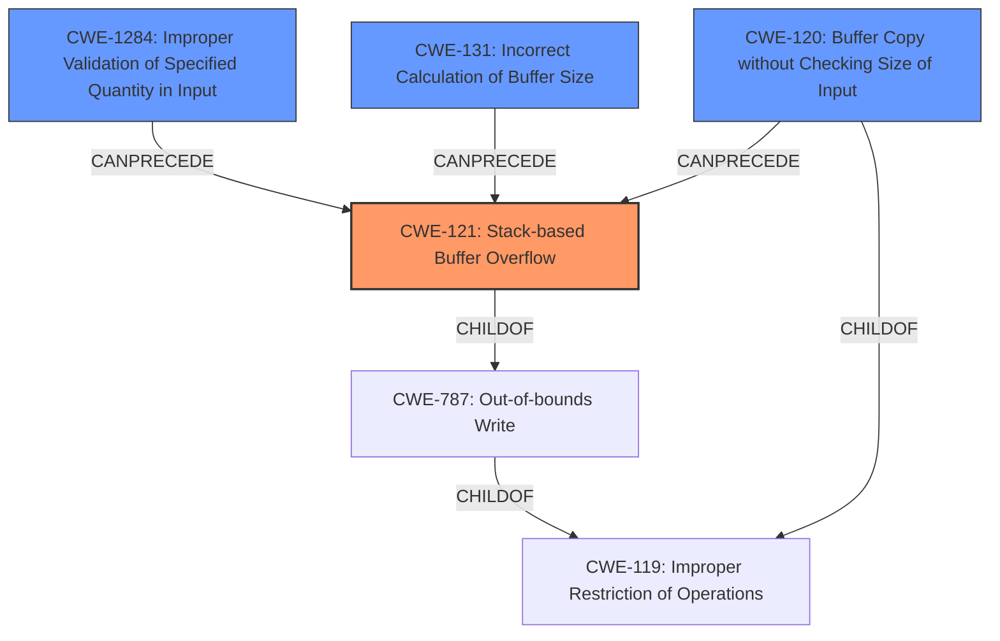

# Analysis Report for CVE-2021-21901

# Vulnerability Analysis Report: CVE-2021-21901

## Description

A stack-based buffer overflow vulnerability exists in the CMA check_udp_crc function of Garrett Metal Detectors iC Module CMA Version 5.0. A specially-crafted packet can lead to a stack-based buffer overflow during a call to memcpy. An attacker can send a malicious packet to trigger this vulnerability.

## Vulnerability Description Key Phrases

**Weakness:** stack-based buffer overflow
**Vector:** specially-crafted packet
**Attacker:** attacker
**Product:** Garrett Metal Detectors iC Module
**Version:** CMA Version 5.0
**Component:** CMA check_udp_crc function

## Analysis (with Relationship Data)

# Summary
| CWE ID | CWE Name | Confidence | CWE Abstraction Level | CWE Vulnerability Mapping Label | CWE-Vulnerability Mapping Notes |
|---|---|---|---|---|---|
| CWE-121 | Stack-based Buffer Overflow | 0.95 | Variant | Allowed | Primary CWE |
| CWE-120 | Buffer Copy without Checking Size of Input ('Classic Buffer Overflow') | 0.70 | Base | Allowed-with-Review | Secondary Candidate |

## Evidence and Confidence

*   **Confidence Score:** 0.90
*   **Evidence Strength:** HIGH

- **Analysis and Justification:**  
  - *Explanation:* The vulnerability is described as a **stack-based buffer overflow** in the `check_udp_crc` function. The "CVE Reference Links Content Summary" confirms this, stating that the **root cause of the vulnerability** is a stack-based buffer overflow due to a size mismatch when copying the UDP payload. The `memcpy` function within `check_udp_crc` copies data from a larger buffer in `udp_thread` (512 bytes) to a smaller buffer (256 bytes) without checking the size of the input, which leads to the overflow. The "Vulnerability Description Key Phrases" also highlights **stack-based buffer overflow** as the **weakness**. This directly matches the characteristics of CWE-121 (Stack-based Buffer Overflow), which is a variant of buffer overflow occurring on the stack. The provided "CVE Reference Links Content Summary" indicates that an attacker can achieve arbitrary code execution by overwriting the return address on the stack, further solidifying the classification as CWE-121. CWE-787 (Out-of-bounds Write) and CWE-119 (Improper Restriction of Operations within the Bounds of a Memory Buffer) are more general, whereas CWE-121 specifies the location of the buffer (stack).

  - *Relationship Analysis:* CWE-121 is a variant of CWE-119 (Improper Restriction of Operations within the Bounds of a Memory Buffer). The "Retriever Results" listed CWE-121 as a candidate, and the description explicitly mentions the stack, making this a precise match.

- **Confidence Score:**
  - Confidence: 0.95 (High evidence from technical description and CVE reference materials)

---

- **Analysis and Justification:**  
  - *Explanation:* CWE-120 (Buffer Copy without Checking Size of Input) is also a relevant CWE because the vulnerability arises from copying a buffer without validating its size. The "CVE Reference Links Content Summary" mentions a "classic buffer overflow" due to the `memcpy` operation not checking the size of the input before copying data. While CWE-121 is a more specific variant that highlights the stack allocation, CWE-120 captures the fundamental issue of unchecked buffer copy. Given that the `memcpy` operation copies data from a larger buffer to a smaller one without size validation, CWE-120 accurately reflects this aspect of the vulnerability. However, since the overflow occurs on the stack, CWE-121 is the primary CWE.

  - *Relationship Analysis:* CWE-120 is a base level CWE related to buffer overflows. The "Retriever Results" gives a high score for CWE-120. It is a child of CWE-119 (Improper Restriction of Operations within the Bounds of a Memory Buffer).

- **Confidence Score:**
  - Confidence: 0.70 (Supporting evidence from CVE details, but less specific than CWE-121)

## Criticism of Analysis

Okay, here's a review of the CWE analysis, incorporating the full CWE specifications.

**Overall Assessment:**

The analysis is generally well-reasoned and arrives at a defensible conclusion.  The primary CWE, CWE-121 (Stack-based Buffer Overflow), is strongly supported by the evidence. The secondary candidate, CWE-120 (Buffer Copy without Checking Size of Input), is also appropriate, though less specific. The confidence scores are appropriate.

**Specific Comments and Critique:**

*   **CWE-121: Stack-based Buffer Overflow (Primary)**
    *   **Justification:** The analysis correctly identifies the vulnerability as a stack-based buffer overflow based on the description and root cause analysis. The description clearly states the overflow occurs on the stack. The attacker's ability to overwrite the return address is a key indicator, as stated in the "CVE Reference Links Content Summary".
    *   **CWE Specification Alignment:**  The analysis aligns well with the CWE-121 specification:
        *   **Description:** "A stack-based buffer overflow condition is a condition where the buffer being overwritten is allocated on the stack (i.e., is a local variable or, rarely, a parameter to a function)." - This aligns perfectly.
        *   **Relationships:**  CWE-121 is a *Variant* of CWE-787 (Out-of-bounds Write), which is accurate.
        *   **Mapping Guidance:** The analysis adheres to the "Allowed" usage for CWE-121 and correctly explains that the Variant level of abstraction is preferred.
    *   **Confidence:** 0.95 is justified given the clear evidence.
    *   **Mitigations:** The analysis doesn't explicitly discuss mitigations.  It would be beneficial to include a brief mention of potential mitigations like:
        *   Compiler-based protections (e.g., /GS flag in Visual Studio, FORTIFY_SOURCE in GCC).
        *   Bounds checking on the input size.
        *   Using safer string manipulation functions.
        *   Address Space Layout Randomization (ASLR) and Data Execution Prevention (DEP) could be mentioned as more general defenses.

*   **CWE-120: Buffer Copy without Checking Size of Input (Secondary)**
    *   **Justification:** The analysis correctly identifies CWE-120 as also relevant because the vulnerability fundamentally involves a buffer copy operation without proper size validation. The analysis acknowledges that the `memcpy` doesn't check sizes.
    *   **CWE Specification Alignment:**
        *   **Description:** "The product copies an input buffer to an output buffer without verifying that the size of the input buffer is less than the size of the output buffer, leading to a buffer overflow." - This accurately describes the core programming error.
        *   **Relationships:** CWE-120 is a *Base* CWE and a child of CWE-119 (Improper Restriction of Operations within the Bounds of a Memory Buffer). The relationship to CWE-119 is correct, but given that CWE-121 is a child of both CWE-787 and CWE-119, it could be argued that CWE-787 is a better match at the base level.
        *   **Mapping Guidance:** The analysis correctly notes the "Allowed-with-Review" usage and rationale, acknowledging potential misuse of CWE-120 due to its generality. This is why it is a good candidate, but not the primary candidate. The usage notes suggest considering children of CWE-20 such as CWE-1284 for root cause analysis if there is any input validation, and in this case, there is none so it is an appropriate finding. The analysis correctly uses it for the "Buffer Copy" operation with no "Checking [the] Size of Input".
    *   **Confidence:** 0.70 is appropriate as CWE-120 is a broader categorization of the problem, with CWE-121 being more specific.
    *   **Mitigations:** A discussion of mitigations for CWE-120 could include:
        *   Using safer alternatives to `memcpy` such as `memcpy_s` (if available) or implementing custom bounds-checking.
        *   Input validation to ensure the copied data is within acceptable size limits.
        *   Using languages or libraries that provide automatic memory management or bounds checking.

*   **CWE-787 Initial Match, but Discarded**
    *   The initial match of CWE-787 was reasonable and this is why it was provided in the initial analysis. In the final summary, it was not included. There is no discussion of it in the summary analysis to review so it is hard to determine why it was rejected. The reviewer should consider adding a discussion of why it was rejected to provide a more complete analysis.

*   **Retriever Results Analysis:**
    *   The retriever results provide additional CWEs which could be root causes of the vulnerability.
    *   **CWE-1284** Improper Validation of Specified Quantity in Input. The analyzer receives a quantity (size/length) that needs validation. The analysis could include a discussion of how the lack of validation of the input packet leads to the stack-based buffer overflow.
    *   **CWE-131** Incorrect Calculation of Buffer Size. The analysis can include a discussion of how using a `memcpy` to copy 512 bytes into a buffer of 256 bytes is an incorrect calculation of buffer size.

*   **General Recommendations:**
    *   **Chaining:** The analysis could benefit from explicitly mentioning the potential chaining aspect. For example, the lack of input validation (leading to or being represented by something like CWE-20) is a precursor to the buffer overflow (CWE-121).
    *   **Example Inclusion:** Adding a relevant "Observed Example" from the CWE database for CWE-121 would strengthen the analysis.
    *   **Clarity on `memcpy`:**  Emphasize that the core issue is not just the presence of `memcpy`, but the *unconditional* use of `memcpy` with a potential size mismatch.

**Revised Summary Table:**

| CWE ID | CWE Name | Confidence | CWE Abstraction Level | CWE Vulnerability Mapping Label | CWE-Vulnerability Mapping Notes |
|---|---|---|---|---|---|
| CWE-121 | Stack-based Buffer Overflow | 0.95 | Variant | Allowed | Primary CWE. Overflow on the stack due to unchecked copy. |
| CWE-120 | Buffer Copy without Checking Size of Input ('Classic Buffer Overflow') | 0.70 | Base | Allowed-with-Review | Secondary Candidate. The fundamental issue is an unchecked buffer copy. |
| CWE-1284 | Improper Validation of Specified Quantity in Input | 0.30 | Base | Allowed | Additional Candidate. Root cause of the vulnerability is that the size was not validated. |
| CWE-131 | Incorrect Calculation of Buffer Size | 0.30 | Base | Allowed | Additional Candidate. Root cause of the vulnerability is that the size was not validated. |

**Revised Conclusion:**

The analysis correctly identifies CWE-121 as the primary weakness due to the stack allocation and overflow. CWE-120 is a suitable secondary candidate, as it captures the lack of input size validation. The analysis would be improved by mentioning mitigations for both CWEs and by explicitly discussing the chaining of weaknesses (e.g., lack of validation leading to the overflow). Including relevant "Observed Examples" and being clear on the `memcpy`'s unconditional nature will further improve the accuracy. Finally, the summary should include a brief discussion of the rejected CWEs and the reason why it was rejected.

## Final Resolution

# Summary
| CWE ID | CWE Name | Confidence | CWE Abstraction Level | CWE Vulnerability Mapping Label | CWE-Vulnerability Mapping Notes |
|---|---|---|---|---|---|
| **CWE-121** | **Stack-based Buffer Overflow** | 0.95 | Variant | Allowed | Primary CWE. Overflow on the stack due to unchecked copy. |
| **CWE-120** | **Buffer Copy without Checking Size of Input ('Classic Buffer Overflow')** | 0.70 | Base | Allowed-with-Review | Secondary Candidate. The fundamental issue is an unchecked buffer copy. |
| **CWE-1284** | **Improper Validation of Specified Quantity in Input** | 0.30 | Base | Allowed | Additional Candidate. Root cause of the vulnerability is that the size was not validated. |
| **CWE-131** | **Incorrect Calculation of Buffer Size** | 0.30 | Base | Allowed | Additional Candidate. Root cause of the vulnerability is that the size was not validated. |

## Evidence and Confidence

*   **Confidence Score:** 0.95
*   **Evidence Strength:** HIGH

## Relationship Analysis
The primary **WEAKNESS**, **CWE-121 (Stack-based Buffer Overflow)**, is a variant of **CWE-787 (Out-of-bounds Write)**, which in turn is a child of **CWE-119 (Improper Restriction of Operations within the Bounds of a Memory Buffer)**. This hierarchical relationship indicates that **CWE-121** is the most specific and appropriate classification given the vulnerability description explicitly mentions a stack-based overflow. **CWE-120 (Buffer Copy without Checking Size of Input)**, a base CWE, is also related as it describes the fundamental error of copying a buffer without size validation, potentially preceding the **out-of-bounds write** condition. The lack of input validation, represented by **CWE-1284 (Improper Validation of Specified Quantity in Input)** or **CWE-131 (Incorrect Calculation of Buffer Size)**, can precede the buffer overflow.

## Vulnerability Chain
The vulnerability chain starts with the lack of input validation (**CWE-1284** or **CWE-131**), leading to an unchecked buffer copy (**CWE-120**). This, in turn, results in a **stack-based buffer overflow (CWE-121)**, allowing an attacker to overwrite the return address on the stack and potentially execute arbitrary code.
  - Initial Flaw: Missing input validation (**CWE-1284** or **CWE-131**)
  - Intermediate Weakness: Unchecked buffer copy (**CWE-120**)
  - Final Impact: Stack-based buffer overflow leading to arbitrary code execution (**CWE-121**)

## Summary of Analysis
The initial analysis and criticism both converge on **CWE-121 (Stack-based Buffer Overflow)** as the primary **WEAKNESS**, supported by strong evidence from the vulnerability description and CVE reference materials. The vulnerability is explicitly described as a stack-based buffer overflow, and the ability to overwrite the return address confirms this classification. The criticism suggests including mitigations, which is a good point. The relationship analysis supports **CWE-121** as the most specific CWE, given its hierarchical relationship with more general CWEs like **CWE-787** and **CWE-119**. The inclusion of **CWE-120** as a secondary candidate is also justified, as it highlights the fundamental issue of an unchecked buffer copy. The suggestion to include **CWE-1284** or **CWE-131** as additional candidates is also valid, as it represents the **ROOTCAUSE** of the vulnerability.

The decision to classify the vulnerability as **CWE-121** is based on the following evidence:

*   "A stack-based buffer overflow vulnerability exists..." (Vulnerability Description)
*   "...stack-based buffer overflow due to a size mismatch when copying the UDP payload." (CVE Reference Links Content Summary)
*   "...attacker can achieve arbitrary code execution by overwriting the return address on the stack..." (CVE Reference Links Content Summary)

These statements directly support the classification as **CWE-121**, which is at the optimal level of specificity for this vulnerability.

*Report generated on 2025-03-17 22:58:33*
